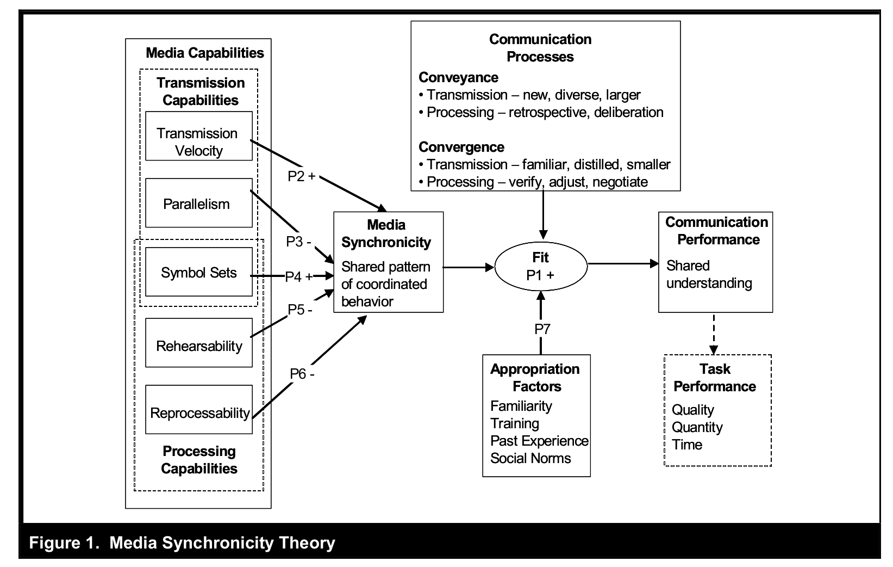

<!-- _class: lead -->

# Lecture 6 - Digital work in teams

# Communication

---

<!-- _class: overview_part_3 -->

---

## Choudhury et al. (2020): GitLab: work where you want, when you want

- What are the **main challenges** that need to be addressed in all-remote companies?
- What are the **key organizing principles** at GitLab?
- What are the **boundary conditions** for all-remote approaches?

<!--
Start: 10 Minutes to revisit your notes / compare with your neighbour

Exaplain p.3 / how it works:
- show the gitlab repository/merge requests (highligh > 100.000 merged)
- show decision rights: merge

Main challenges
- Professional isolation (lack of informal mentoring, inclugin **serendipituous** face-to-face interactions)
- Transparency of compensation (is cost-of-living adjustment fair?, finding out that one is paid less than coworkers can harm motivation) - GitLab somehow overcomes the "salary taboo"
- Building a cohesive organizational culture (selection/onboarding/socialization, mentoring)
- Maintaining a healthy work-life balance / avoiding emotional exhaustion
- Absence of colocation: may hinder organizational identification and the development of shared mental models (identification is important for motivation/effort, mental models: conducive oraganizational culture with strong norms/values)

Organizing principles
- Reduce coordination requirements (decomposability/minimum viable change, sigmergy: coordinate through the work product and environemnt, see what others are doing)
- Granting operational autonomy (not strategic autonomy)
- Input control ("selection at the gate" - select for abilities: structuring work days, digital skills,...)
-> Illustrate: control (the GitLab-CEO mentioned the differences between a consensus/hierarchical culture) - input (hiring), process (behavior: shared norms/mental models, process/documentation), output (progress reports/meetings ...)
- Detailed onboarding process
- Open and transparent documentation builds trust (remember: trust meta-analysis)

Boundary conditions
- Document-based/digital work (not work on physical goods)
- Visibility of the work process and outcome (for stigmergic coordination)
- Transparent compensation only works when contributions are easily observable
- Negative feedback loop: fewer "remote fit" workers <-> remote no longer perceived as special (incentive)
- Risks generated by transparency must be low (e.g., privacy concerns, regulatory requirements)

TBD: does it fit with the discussion/summary? - adopt a communication/collaboration/coordination perspective:
- asynchronous (convenient access without waiting across timezones)
- Transparent, accessible, linkable (contrary to e-mail, tacit group memory (ominous: we change the process / we use workarounds), links: within the docs and from outside)
- Collaboratively editable (-> comparison with Wikis) https://about.gitlab.com/handbook/handbook-usage/#wiki-handbooks-dont-scale

-->
---

Break

---

Learning objectives: 
- Appreciate different facets and situational consideration related to communication in teams (e.g., conflict, interruption, inclusion).
- Explain the selection of appropriate communication technologies based on extant theory (MST).

<!--
- Distinguish synchronous from asynchronous communication settings. / Distinguish forms of synchronous and asynchronous collaborative content creation and select appropriate technologies.
-->
---
# Communication at GitLab

In small groups (2-3), examine the [communication section](https://about.gitlab.com/handbook/communication/) in GitLab's handbook and take notes on
- the different communication settings
- best practices (potential challenges to keep in mind)

Major items to cover:
- [Effective and responsible communication guidelines](https://about.gitlab.com/handbook/communication/#effective--responsible-communication-guidelines)
- [Internal communication best practices](https://about.gitlab.com/handbook/communication/#top-tips-and-best-practices)
- [Video calls](https://about.gitlab.com/handbook/communication/#video-calls) and [E-Mail](https://about.gitlab.com/handbook/communication/#email)

Additional items (select the ones you are most interested in):
- [Slack](https://about.gitlab.com/handbook/communication/#managing-noise-and-creating-focus-in-slack), [direct messages](https://about.gitlab.com/handbook/communication/#avoid-direct-messages), [listening](https://about.gitlab.com/handbook/communication/#effective-listening), [meeting problems](https://about.gitlab.com/handbook/communication/#common-meeting-problems), or [video and presentation tips](https://about.gitlab.com/handbook/communication/#video-and-presentation-tips-with-lorraine-lee)

<!--
https://about.gitlab.com/handbook/communication/#smart-note-taking-in-meetings
https://about.gitlab.com/handbook/communication/#types-of-meetings

Have students read the communication section in the Gitlab handbook:
- split students in x groups
- analyze sections, summarize guidelines as well as most surprising and most useful point (briefly present to the class)
- share short abstract with GW, GW: create a summary and share for exams

# Communication settings

- Negotiate
- Converge
- Convey / present
- Learn/problem-solve (interactive vs. how-to)
- Cocreate (pair-program)
- Socialize
- Coordinate in small teams or broadcast

Discussion:

- Means of communication/best practices, policies/guidelines
- formalizing informal communication at Gitlab: examples
- Short educational videos/explanations
- Timing and choice of communication media (e.g., for conflicts)
- Symbol sets: screen sharing, virtual reality, direct collaboration on code
- synchronous: e.g., pair programming 
- Modes of collaboration (synchronous/asynchronous)
- Live session sharing (have students try it/visualstudio) - mention the Kude/ISR paper on pair programming?
- netiquette - be sensitive: all going well/busy time? (green/orange/red), meeting policy (remote meeting, ....)

- How to facilitate small-talk? Put something personal in the background. Ask for oppinions/help
- How to connect? Humor? "Employee of the month" - not taking oneself too seriously... share your shortcomings/be vulnerable

-  Balance: efficiency (answer questions once/reprocessability), conflict, misunderstandings (task/relation)
-->
---

# Communication and situational awareness

Endsley's cognitive model of **situational awareness** provides a useful framework to think about communication.

Situational awareness involves three levels:
- Perception of data and elements of the environment (communication partners)
- Comprehension of the meaning and significance of the situation (communication goals)
- Projection of future states and events (potential communication outcomes)

Decisions and actions (related to communication) create a feedback loop, affecting communication partners, and awareness of changing situations over time.

<!-- 
What can the communication outcomes be?
e.g., reduce ambiguity, rally support for a project, foster inclusion and trust, discover private information, make decisions, prevent and resolve conflicts

Individual and task/environment factors at play (stress/complexity/technology)

Key message:
- Communication media and practices should be adapted to the situtation (many facets to consider, many potential outcomes to anticipate)
- Theories of fit may be particularly suitable, as exemplified by Media Synchronicity Theory

propositions...
-->
---

---

## Media synchronicity theory (MST)

<!--

 don't start with media richness theory (maybe a bit too challenging/differences to MST are more difficult to understand) 
Task: too broad -> MST: communication processes at a micro-level
Media synchronicity theory (Dennis, Fuller, and Valacich, 2006): 
- An influential theory in IS (citations, best paper awards)
- The theory explains communication (and task) performance based on the fit between media synchronicity, communication processe, and appropriation factors

**TODO : start with the fit aspect**
[[DennisFullerValacich2006]]
-->

<!-- 
## MST: Communication processes

- Introduce the elements step-by-step:

 - Communication processes: conveyance vs. convergence, which are more specific/smaller than tasks (MRT). also distinguish transmission from processing

## MST: Media synchronicity

 - Media synchronicity: synchronous vs. asynchronous (definition)

## MST: Media synchronicity requirements

- Media synchronicity requirements for different communication processess (table 1, proposition P1) -> importance of **fit**

## MST: Appropriation factors

- Appropriation factors (**fit**)

## MST: Examples I

- **TODO : short exercise for the main concepts (communication processes, media synchronicity, appropriation factors, fit and communcation performance)**

## MST: Media characteristics

- Media characteristics: transmission and processing capabilities: construct figure 2 step-by-step (starting with the simple sender - medium - receiver model and then adding the different elements)

## MST: Examples II

- TODO : exercise: rate different communication media...

## MST: Summary

- refer back to HwangKettingerYi2015 and point out that DennisFullerValacich2006 stop at the hypothesis generation step (no empirical study)
- Derive implications
- TODO : application / exercise (short descriptions of scenarios, such as a team rejecting a certain application)
- TODO : collect and discuss best practices (e.g., signalling availability - are you red/orange/green?) / analyze based on MST (?) / don't cover conflict etc. too much - they are in lecture 7

https://convergencelabs.com/blog/2018/01/the-four-cs-communication-coordination-cooperation-and-collaboration/
https://coachbetter.tv/the-difference-between-communication-cooperation-coordination-collaboration/
# Homework

Read [external communication](https://about.gitlab.com/handbook/communication/#external-communication)
-->
---
# Material

Moorman, C. and Hinkfuss, K. (2023). Managing the cultural pitfalls of hybrid work. MIT Sloan Management Review. [link](https://sloanreview.mit.edu/article/managing-the-cultural-pitfalls-of-hybrid-work/)

<!--
Homework: 
read the product-development workflow in the gitlab handbook

## Exercise and homework

Preparation: do a git tutorial (provide short/longer and interactive ones) - be prepared for the in-depth session next week (have your questions ready)

## Materials

- [ ] TODO

check: Superbosses: How Exceptional Leaders Master the Flow of Talent
Give and Take: Why Helping Others Drives Our Success

TBD: communities-of-practice (e.g., wikipedia on CSCW: awareness)

alternative exercise:
TBD: maybe give students 2-3 cases, have brief discussion, have them read different papers (MRT,MST,interruptions,conflict,team-leadership,learning/onboarding), and then discuss the cases from the perspective of different theories
-->