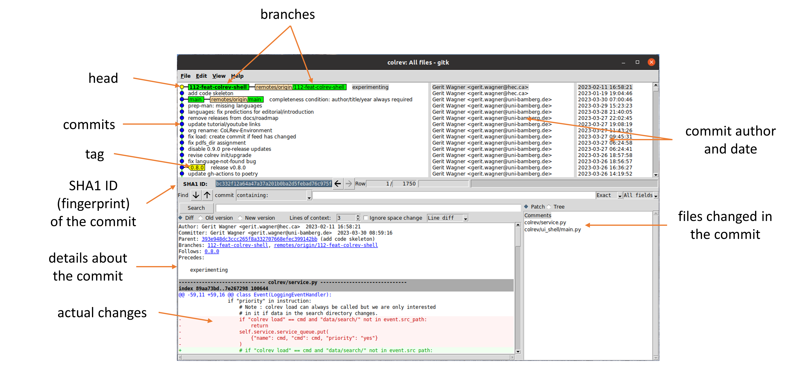
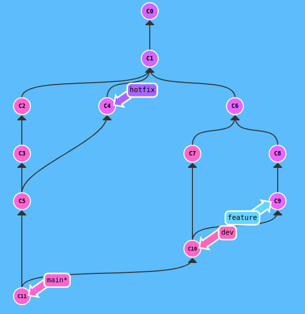
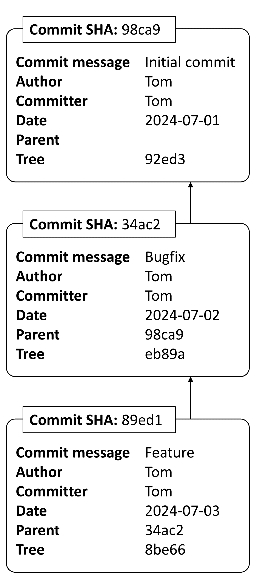

<!-- _class: lead -->

# Lecture 7 - Digital work in teams

# Collaborative content creation

---

<!-- _class: overview_part_3 -->

---
Learning objectives: 

- Appreciate the key differences between software packages for collaborative content creation.
- Understand the elements and operations of git.
- Use git to make a contribution to a shared project (repository).

---

# Modes of collaborative content creation

- In-person vs. remote
- Synchronous vs. asynchronous 

What are suitable software packages and how would you select one?

<!-- **TODO**: clarify that lock-systems don't work well (mostly for 3-5 people, otherwise, teams have very high coordination efforts/e.g., for sharepoint)

(e.g., live session/pair coding) 
(lock vs. merge)-->


---

# Focus session: Git


<!-- 
- Windows, Linux, Github, ...
- decentralized (vs. [centralized](https://git-scm.com/book/en/v2/Getting-Started-About-Version-Control))

- Give a brief overview/intro to git (its relevance/use cases; industry-driven, but battle-tested: Linux/diffusion)


## Git: working with versions

https://git-scm.com/book/en/v2/Getting-Started-What-is-Git%3F
- snapshots, not differences
- three states

- Live demo (interactive?) - on the CLI!
	- Create a repository
	- Understand the three areas (git status) and how to use them to create versions  (understand the hash trees/DAG)
	- Create and merge branches (understand that the data management is highly efficient, understand how to handle merges, understand the significance compared to other versioning systems)
	- Collaborate (push/pull, pull-request)
- summarize: when (not) to use git, git for collaborative code/content creation: use cases/applications (beyond software development)

-->

---

# Git: Distributed version control


Advantages:

- Every repository has a full version history
- Most operations run locally
- Reliable data handling, ensuring integrity and availability
- Efficient data management for versions and branches
- Scalable collaboration mechanisms for large teams and complex projects

Disadvantages:

- Need to learn and understand the system
- Not built for binary files or large media files

<!-- 
- most prevalent version control system, rapid adoption over the last decade
- large tech companies use git (e.g., Windows migrated)
- if you want to develop software today, there is no way around git.

you wouldn't want to version binary/media files.

no need to connect to a central server: can create versions, branches etc. (share if we decide to do so)


Create a cheat sheet


Examples:
https://github.com/git/git
https://github.com/tensorflow/tensorflow


# DEMO

figure displaying the git commit content (tree, ...): show at the end of practice session 1 (not at the beginning)


**TODO : interactively develop the conceptual chart at the blackboard (explain to students which operations lead to transitions between the states)**

Highlight: we focus on local repositories only in this part!

ASK for concentration

- How should a versioning system look like? - area where you have the project files that you work with, and a separate "version database". Git calls it the "working directory" and the git directory. It has operations to create new versions from the files in your working directory. And it also has operations to retrieve files from the "version database" or the "history". That's what we will focus on for now (local operations). [AREAS AUFZEICHNEN]
- Zusätzlich gibt es noch eine Staging Area [IN DER MITTE  EINZEICHNEN]. 
- Stellen Sie sich jetzt vor, dass wir unser Git-Projekt angelegt haben, es gibt also das working directory und das git directory. Und wir haben jetzt verschiedene Dateien erstellt, zB. Programmcode, tests, dokumentation, und notizen. [ADD FILES TO WORKING DIRECTORY].
- Die erste Frage, die sich stellt ist: wie lege ich eine neue Version an? Wir wollen also den Programmcode und die Tests in der neuen Version haben. Die Dokumentation ist noch nicht fertig und die Notizen sollen auch nicht in die Version. Und da kommt die Staging Area ins Spiel. Alles was in die nächste Version aufgenommen werden soll muss vorher in die Staging area, sozusagen markiert für die nächste Version bzw. den nächsten Commit.
- Also: alle Dateien sind erst einmal im Working directory und Sie können auswählen, was Sie in die Staging Area übernehmen. Das ist der "git add ..." befehl. Sie geben also "git add code.py" und "git add tests.py" ein und dann wandert die aktuelle Version der ausgewählten Dateien in die Staging area [KOPIE DER DATEIEN VERSCHIEBEN und GIT ADD AUF PFEIL SCHREIBEN].
- Um dann einen Commit aus den Dateien in der Staging Area zu erstellen geben wir einfach "git commit" ein [DATEIEN IN EINEN COMMIT KOMBINIEREN]. So einfach ist der Ablauf. Sie sehen, dass die STAGING AREA wieder leer ist und dass Sie die gleichen Dateien immer noch im Working Directory haben. Also gibt es jetzt keinen Unterschied zwischen den drei Bereichen.
- Sehen wir uns noch einmal die Staging Area an. Wofür ist die Staging Area nützlich? Ich könnte ja auch einfach sagen dass die Dateien gleich committed werden sollen. [IDEEN?] - die Staging Area gibt uns die Möglichkeit, Dateiänderungen gezielt auszuwählen. Wir hatten hier zB. auch die Notizen und die unfertige Dokumentation. Die liegen im gleichen Ordner, sollen aber nicht in den nächsten Commit. Wenn wir git add ... ausführen haben wir also die Möglichkeit, einzelne Dateien in die Staging Area aufzunehmen. Gerade bei Programmierprojekten probiert man ja häufig verschiedene Implementierungen aus und manche funktionieren und andere funktionieren nicht. Und wenn Sie beim Programmieren den Moment haben, wo Sie sagen - Yess! jetzt funktioniert es endlich! Dann sagen fügen Sie Ihre Änderungen in die Staging Area ein. Also git add.
- Dann kümmern sie sich vielleicht um die Codeformatierung, die zugehörigen Tests und die Dokumentation und fügen das auch step-by-step in die Staging area ein. Dh. wenn Sie an einer bestimmten Funktionalität arbeiten können Sie auch gut ein paar Stunden die Staging Area befüllen. Und wenn Sie dann das Gefühl haben - jetzt ist es perfekt, jetzt funktioniert es zuverlässig, die Tests und die Doku passt, dann gehen Sie auf git commit. Die Staging Area kann Ihnen also helfen, Code mit hoher Qualität zu schreiben. Außerdem wird es so auch viel einfacher, Dateiänderungen, die nicht zu dem Problem gehören, im working directory zu belassen und nicht in die neue Version aufzunehmen.
- Wir haben uns also die drei Bereiche angesehen und wie man Dateiänderungen in die Staging area übernimmt und einen neuen Commit anlegt. Gibt es dazu Fragen?
- Als nächstes sehen wir uns die entgegengesetzte Richtung an.
- Wenn Sie Änderungen im Working directory haben, die Sie nicht mehr brauchen sagen Sie einfach "git restore file". Dann bekommen Sie die Version, die aktuell in der Staging Area liegt. Wenn Sie Änderungen in der Staging Area zurücksetzen möchten, geben Sie "git restore --staged file" ein. Dann bekommen Sie den letzten aktuellen Versionsstand aus dem git repository und die Änderungen aus der Staging Area sind nur noch im Working Directory. [PFEILE UND OPERATIONS EINZEICHNEN].
- Jetzt kennen wir hier die Operationen in beide Richtungen: git add und commit bzw. git restore und git restore --staged.
- Sehen wir uns das Git repository, also die Versionshistorie genauer an.
- Wir hatten den ersten Commit schon einmal angelegt und wenn wir jetzt weiter entwickeln können wir einen weiteren Commit anlegen. In jedem Commit wird auch immer gleich festgehalten, welcher Commit der Vorgänger war. Also der "Parent" commit. Wenn Sie einen Git Client nutzen, dann wird Ihnen zu jedem Commit typischerweise nicht der vollständige Inhalt angezeigt, sondern die Änderungen, also das Delta zum Vorgänger. Das sehen Sie bspw. auf Github [zeigen]. Sie sehen auch, dass Git sehr viele Versionen effizient verwalten kann.

Recap: d.h. wir haben jetzt gesehen, dass Dateien oder Dateiänderungen in drei Zuständen sein können: im Working Directory, in der Staging area, und im Git repository. Sie kennen die Operationen, mit denen wir Änderungen für die nächste Version markieren können und die neue Version anlegen können (git add und commit).
Wir haben uns auch den entgegengesetzten Weg angesehen - git restore und git restore --staged.

Wenn wir uns jetzt ein größeres Softwareprojekt vorstellen, also beispielsweise den Linux-Kernel, dann werden da fast im Sekundentakt neue Versionen angelegt. Wenn wir da bei einer linearen Versionsgeschichte bleiben, dann wird das schnell chaotisch.
Beispiel: Ich ändere die USB-Treiber, Sie Ändern ein Transportprotokoll, und Sie arbeiten an einem neuen Dateisystem. Wenn das wahllos durcheinander läuft dann gibt es Abhängigkeiten und Fehler, die wir vermeiden wollen. Idealerweise wollen wir an unserem Code arbeiten, ohne, dass jemand anders uns da Änderungen einfügt, die gar nichts mit unserer Arbeit zu tun haben.
Dafür gibt Git uns die Möglichkeit, mit Branches zu arbeiten, also mit separaten Entwicklungszweigen. Ich kann einen Branch für meine USB-Treiber aufmachen, Sie arbeiten separate am Transportprotokoll. Die Änderungen werden immer nur in unserem Branch hinzugefügt und betreffen die anderen Entwickler nicht (ILLUSTRIEREN: ich habe einen usb-drivers branch, Sie einen transport-protocol branch, meine Änderungen werden hier hinzugefügt, Ihre Änderungen hier). 
- Branches sind lokal und effizient (um einen Branch anzulegen speichert Git eine Zeile - alte Versionskontrollsysteme haben gleich das gesamt Projekt kopiert)
- Explain HEAD (TO WHICH BRANCH should commits be added?) and git switch branch_name
- Explain merge (common ancestor required, ideally: fast-forward (very efficient compared to other systems), otherwise: raise merge conflict)

-->

---

# The three sections of a Git project


Files can reside in three states:

- **Untracked**/**Modified**: you have created or changed the file in the *working directory*, but have not committed it to your database yet.
- **Staged**: you have marked a modified file to be in the next commit.
- **Committed**: the file (changes) are stored in your database (the `.git` directory).

**Commit: a snapshot version of the whole project.**

<!-- 
This is the most important thing to know about Git!

Hogbin-Westby:
- working directory: what can be seen (in the file explorer)
- staging area: the difference of what is stored and what is seen (WHAT HAS BEEN MARKED FOR THE NEXT COMMIT)
- repository: what is stored
-->

---

<!-- 
TBD/do not cover?

    Demo:
    - setup a git repository, create a file (explain the working directory), add the changes (explain the staging area), create a commit
    - inspect the commit (the internal git objects / history):
    git log
    - commit ID (sha)
    - HEAD points to the main branch. (aha)
    git cat-file -p ENTER_COMMIT
    - go through the information (if any of that information changes, the fingerprint of the commit changes)
    - you see that git handles all objects (files, trees, commits) by their fingerprint.
    git cat-file -p (TREE)
    git cat-file -p (FILE)

    - if git handles everything through fingerprints, it checks whether the file or tree is already in the database.

---
-->

# Practice session

**Learning objective**: Understand and use git to develop software in teams.

<!-- **Preconditions**: 
- Git installed, username and email set (using the [software carpentry tutorial](https://librarycarpentry.org/lc-git/02-getting-started/index.html))
- SSH setup for Github (using the [software carpentry tutorial](https://librarycarpentry.org/lc-git/03-sharing/index.html)). The `ssh -T git@github.com` command runs successfully. -->

**To start**

- Form groups of three students
- Work through the following pages
- Create a "cheat sheet" summarizing the main commands

**Part 1**: Local changes (90 min)
**Part 2**: Branches (90 min)
<!-- **Part 3**: Remote collaboration (60 min) -->

<!--
Goal: figure out how to accomplish the tasks (the instructions are more detailed at the beginning, you need to remember the commands/use and annotate the git cheatsheet. You will have to use the commands again, know what they do and how the changes and commands are situated in the three areas)

groups: help each other!

-> cheatsheet: how you would internalize it. Ask yourself: if you were to answer the tasks without having the slide/explanation, what should you have on your brief cheatsheet/what should you be able to reproduce from memory? 


GW: Write the slide numbers on the board and help students who have not reached that number

we work with the cli!

https://swcarpentry.github.io/git-novice/
https://librarycarpentry.org/lc-git/
-->

---

In this tutorial, we work with an existing project. To download the example, open the `Git bash` (which should start at ``W:>``, your personal directory on the file server), and run the following commands:

```shell
git clone https://github.com/CoLRev-Environment/colrev
cd colrev                     # Enter the directory of the colrev project
```

**Check**: The clone command should print something like the following (with different numbers):

```
Cloning into 'colrev'...
remote: Enumerating objects: 22225, done.
remote: Counting objects: 100% (125/125), done.
remote: Compressing objects: 100% (98/98), done.
remote: Total 22225 (delta 41), reused 54 (delta 27), pack-reused 22100
Receiving objects: 100% (22225/22225), 10.11 MiB | 2.37 MiB/s, done.
Resolving deltas: 100% (18519/18519), done.
```
**Note**: You do not have to enter the explanation after the hashtag (#). To create an empty git project, you would run ``git init``.

---

Next, we check the current status of the project:

```shell
git status
```

This command provides an overview of the current state of the project and the files in the three sections. Therefore, you will need to run ``git status`` regularly.

**Check**: It should print something like the following:

```
On branch main
Your branch is up to date with 'origin/main'.

nothing to commit, working tree clean
```

The last line indicates that there are no changes in the staging area (nothing to commit). The working directory has the same content as the last version in the git respository (working tree clean).

---

Take a look at the files and directories that were retrieved as part of the CoLRev project.

Git stores its data in the `.git` directory. It can be instructive to explore how git handles data internally, but keep in mind that manual changes in the `.git` directory may break the repository.

**Note**: If you work on your own machine and Git is not yet configured, you need to run ``git config --global user.name "John Doe"`` and ``git config --global user.email johndoe@example.com`` to configure your user name and email.


<!-- 
We start with the setup of a git repository

Start with the slide, after 2 minutes: ask who has already completed the step/who needs help
Then: proceed: step-by-step with the following slides
-->

---

Next, we modify files (state: **untracked**/**modified**), mark them to be in the next commit (state: **staged**) and create the first version (state: **commited**). This corresponds to the three sections of a git project.

- Open the `README.md` file and add your name to the list of contributors (`# Contributors` section).

```
git status              # Check the `git status` between each command
```

- Open the `CONTRIBUTING.md` file and change it.

**Check**: The `git status` should now show two files with changes in the working directory (state: **modified**).

---

We decide that the changes in the `README.md` file should be staged for the next commit. The changes in the `CONTRIBUTING.md` file are no longer needed. Use the commands suggested by `git status` to accomplish this.

**Check**: The `git status` should now display 

```
On branch main
Your branch is up to date with 'origin/main'.

Changes to be committed:
  (use "git restore --staged <file>..." to unstage)
	modified:   README.md

```

This means that changes in the README.md are **staged** (to be committed).

---

To create the commit, we run

```
git commit -m 'add contributor'
```

The `-m 'add contributor'` adds a short summary message, which is expected for every commit.

**Check**: `git status` should reflect your expected state of files in the three git sections.

---

Sh***! We just committed changes containing a an error 🤯

To undo the last commit, we can simply run:

```
git reset --soft HEAD~1
```

You should now have the `README.md` file in the staging area again.

**Note**: the `HEAD~1` refers to the last commit.

**Check**: Run `git status` to see the changes.

---

We decide to discard our changes. Use the commands suggested by `git status` to do that.

**Check**: The git status should show the following:

```
On branch main
nothing to commit, working tree clean
```

<!-- 
```
                              # Manually create a REAMDE.md file in the project.
git status                    # Should show the README.md file as "untracked"
git add README.md             # Add the README.md file using the `git add` operation
git status                    # Should show the README.md file as a change "to be committed" (staged)
                              # Download the MIT license file from https://choosealicense.com/licenses/mit/
                              # Save it as `LICENSE` (filename) and 
git add .                     # add all changes to the staging area
git status                    # Should now show two files "to be committed" (staged)

git commit -m 'Initial comit' # Create the first commit (version of the project)
git status                    # Should show a clean working directory and staging area
```

---

-->
<!-- 

Instead of modifying the files manually, we can also apply patches (i.e., files containing changes):

```
git apply ../git-tutorial-example/setup.patch
git status                                   # See which files were changed
git add .                                    # Add all changes
git commit -m 'Add code'                     # Create the first commit (version of the project)
```

In the following, we work with patches to save time while creating changes that resemble a software development project. 

**Check**: The commands did not produce any error messages.

-->
<!-- 

For the next steps, download the code for [colrev](https://github.com/CoLRev-Ecosystem/colrev) as a zip file (through the `Code` button), extract the files and move them to your `colrev_project` directory*. Add all changes and create a new version. -->

---

Let's see the changes that were committed in the project.

To analyze the specific changes, open `gitk`:

```
gitk
```

- Check which files were added and modified by the last commit
- Check the code that was modified (increase and decrease lines of context in gitk)

The next page provides an overview of gitk (other Git GUIs have similar interface elements).

---



**Note**: More details about concepts like branches and head are provided in part 2 of this session.

<!-- 
gitk.png screenshot + add explanations similar to https://lostechies.com/joshuaflanagan/2010/09/03/use-gitk-to-understand-git/
-> highlight that versions are identified by their commit-ID/sha-fingerprint

TODO : create another version and check how gitk displays the unstaged/staged changes
 -->

---

Go to the [colrev](https://github.com/CoLRev-Ecosystem/colrev) project on GitHub and explore the version history.
- Navigate to `commits` and check which files were modified in the most recent version
- From the [main page](https://github.com/CoLRev-Ecosystem/colrev), navigate to `colrev/dataset.py` and click on `Blame` to see what revision and author last modified specific lines of code

**Check**: When was the `load_records_dict` function last modified?

<!-- 
Note : patches allow us to work with more substantial examples in the following
-->

---

It is good practice to create **atomic commits**, i.e., small changes that belong together. One should avoid large commits that modify many unrelated parts of the code base and pursue different objectives.

Analyze the following commits and discuss which ones are atomic and which ones combine changes that do not belong together (i.e., should be in separate commits):

 - [commit 1](https://github.com/CoLRev-Environment/colrev/commit/a0c9043784f9342136d2ab214513688769669199)
 - [commit 2](https://github.com/CoLRev-Environment/colrev/commit/5288e92083b6df546d7c8fd590df3e968a909114)
 - [commit 3](https://github.com/CoLRev-Environment/colrev/commit/ba08d4242f48ec96b4fa8cfd053ee3781e32231f)
 - [commit 4](https://github.com/CoLRev-Environment/colrev/commit/ce9850f805a140692866970c92557833e6befa0b)
 - [commit 5](https://github.com/CoLRev-Environment/colrev/commit/93fc7e851d2ba3fc95cc3190b6b71dc4a907c96b)

Also check the commit message (short summary at the beginning). Does the message clearly summarize the changes?

<!-- 
Solution:
- commit 1: atomic, ok.
- commit 2: relatively atomic, a few changes beyond compute_language(). may be improved.
- commit 3: many files changed. changes not related to each other. message refers to refactoring and testing, but the commit also adds functionality.
- commit 4: many files changed, but the changes belong together. ok.
- commit 5: atomic, ok.
It is ok to combine functionality, tests, and docs that belong together in one commit!
-->

---

To create atomic commits, you may need to **add specific lines of code that should go into a commit**, leaving other changes in the working directory.

The changes are provided in the `rec_dict.patch` file, which must be placed in the project's working directory. To apply it, run:

```
git apply rec_dict.patch                # Suggests to rename the method but also introduces unrelated changes.
git status                              # Different files were modified by the patch
gitk                                    # Check the changes that were introduced by the patch
```

In the following, we would like to add *only* the changes in lines related to the `load_records_dict` method and the `skip_notification` parameter (using `-p` for a partial `git add`):

```
git add -p colrev/dataset.py            # Add specific lines of code from the colrev/dataset.py
                                        # using y/n to add or skip (confirming with ENTER)
gitk                                    # Check whether the correct lines were added
```

Create a commit containing the relevant changes. Afterwards, discard the remaining changes.


<!--
**Check**: The working directory should be clean again.
 TODO : link to good commit messages -->

---

When writing code, we can make mistakes, or we may need to undo or modify previous changes. To undo changes, it is important to understand whether they are unstaged, staged, or committed.

To **undo unstaged or staged changes**, `git status` suggests the corresponding operations (`git restore <file>` and `git restore --staged <file>`). To see how `git restore` works:

- Modify the `README.md` file and add the changes to the staging area
- Undo the staged changes
- Undo the unstaged changes

**Check**: The working directory should be clean again.

---

To **undo committed changes**, there several options (some are available in gitk):

- Revert the commit, i.e., create a new commit to undo changes: `git revert COMMIT_SHA --no-edit`
- Undo the commit and leave the changes in the staging area: `git reset --soft COMMIT_SHA` (*)
- Stage changes, and run `git commit --amend` to modify the last commit (*)

If you have the time, try the different undo operations in the session.

(*) Important: only amend commits that are not yet shared with the team. Otherwise, revert is preferred.

<!-- 
HEAD~
shorthand for
HEAD~1

TODO : how to test/demonstrate undoing an error?
-> This would be important to practice!!!

**SEE HOGBIN-WESTBY CHAPTER**

---

**TODO**: include examples for undoing changes
-->

---

Recap: We have cloned a repository, added files to the working directory and staging area, created commits, applied patches, analyzed changes, and learned how to undo changes.

---

# Part 2: Branches and remote collaboration

<!-- 
DEMO (go back to the commit slide)
- parents: lines of development
- branches: two commits have the same parent
- merge: one commit has two parents
-> DAG (we don't travel back in time - so there are no cycles)

Branches: pointers (more efficient than referring to sha-comit-ids)
-> allow us to separate development (typically: main/dev/features; but: very flexible)

git branch (overview) / git checkout -b feature (-b not necessary for existing branches)
-> we can do "git checkout commit-id" (-> "detached head" state - we have not branch/name for the commits that would be created)

git merge

checkout: select a commit or branch and set the working directory accordingly (working directory should be clean)

-> HEAD to point to the currently selected branch/commit (easier: commit / merge without selecting the "reference branch")

example: git checkout main, git merge dev
-> merge: shared parent? fast forward? conflicts?

-> what would happen if we go to an early commit and change some of its content?
-> the content, the blob/tree-hash change, the commit hash change, the commit-ids of all following commits change
-> AVOID rewriting history (especially when commits/branches are shared)

-->

---


<!-- 
TBD: add reset/revert in demo!?

Important: we think about the version tree DAG.
The working directory/staging area should be clean (ideally)

Demo/Blackboard: Git branches
- commits with parents
- create branches (branch names) 

Demonstrate CLI:
- git branch (see all/which one is selected - also in git status)
- Create branch (git branch  dev_feature)
- switch (HEAD) to dev branch (git switch dev_features)


 -->

---

To learn and practice git branching, we use the interactive tutorial:

https://learngitbranching.js.org/?locale=de_DE

Complete the first two levels on branching, merging, and navigating in the git tree.

**NOTE**: You can type "undo" when you made a mistake.

<!-- 

-> afterwards: branching challenge : post challenge on the blackboard/add nodes/branchnames, after a while: erase the instructions (select commit/create branch)
-> for the challenge: use branch-names only (don't checkout individual commits into main)

ESC to skip explanation

-->

---

To continue practicing, create the following tree, which resembles a typical setup of git branches.



<!-- 
git commit
git commit
git checkout c1
git checkout-b hotfix
git commit
git checkout main
git merge hotfix
git checkout c1
git checkout -b dev
git commit
git commit
git checkout c6
git checkout -b feature
git commit
git commit
git checkout dev
git merge feature
git checkout main
git merge dev

-->

---

Recap: We have learned how to create and merge branches.

<!-- 
---

# Bonus part 2

- Create a fork of the [handbook](https://github.com/digital-work-lab/handbook)
- Give your team access to the fork (settings/collaborators)
- Develop contents
- Create a pull request (available in the original repository, not the fork)
- Assign the maintainer and respond to feedback
-->

---

# What's in a commit?




<!--
Author/date/message
Parent(s)
Tree-hash

-> file handling based on hashes/fingerprints. if one bit changes, the hash changes completely
-> illustrate in a commit-chain (all child commits change - problematic if we want to work on the same tree)
-> internal file handling: get ae9d898d7fa...
-> growth: adding a new commit/branch requires very little additional storage

Discuss/provide solutions for atomic commits

As soon as we have a git repository, we can see and modify everything in our copy.

Break
-->
---


Note: `git cat-file -p sha` shows the contents of a git object.

<!-- 
Explain "bullwhip" effect based on this and the previous slide (why rewriting history should be avoided)

note: size is not part of the commit?!
git cat-file -p ID

Demonstrate how 
git clone https://github.com/CoLRev-Environment/colrev
cd colrev
du -hs .
for branch in alpha{1..500}; do git checkout -b $branch; done;
du -hs .

-->


<!-- 
TBD: maybe use the hierarchy of evidence to clarify the challenges of assessing technology (almost no "scientific evidence", but overwhelming adoption in the industry...)

Start with a picture of files and directories
-> ask students about their experiences collaborating on files, the problems and their strategies (mentimeter?)

provide an overview of synchronous editing (live in the same editor, e.g., Word/atom?)
Asynchronous editing (e.g., last-saved-replaces, Locks /Sharepoint, git)

Git-demo (tech or organizational perspective?)

mention johnny decimal?
->
