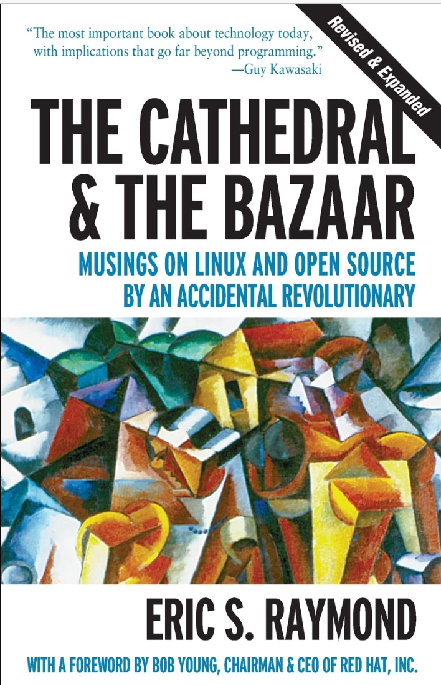

<!-- _class: lead -->

# Lecture 8 - Digital work in crowds

# Open-Source work

---

<!-- _class: overview_part_4 -->

---
Learning objectives: 

- Learn how to **use the collaboration features of Git**, including forks, pull requests, merges, and issues
- Apply them in a **realistic setting of multiple contributors** without requiring time to write code
- Familiarize with the **key elements of open-source project documentation**

<!-- 
- Describe the key concepts and processes of Open-Source projects.
- Follow Open-Source practices to contribute to a shared project.
- Explain how different technologies can help to organize Open-Source work.
-->

---

# The Open-Source Collaboration Game

Materials for this part are available [here](https://github.com/geritwagner/open-source-collaboration-game)

<!-- 
---

Sumary: Key concepts and processes

- Fork
- Pull request
- Maintainer
- ...
-->

---

Break

---
# Work in Open-Source projects

The well-known book of Raymond (1999), "The Cathedral and the Bazaar", compares two models of software development:

- The **Cathedral** model, in which an exclusive group of developers works on a project and releases it to the public.
- The **Bazaar** model, in which code is developed publicly, allowing anyone to contribute.

This distinction raises interesting questions on how effective work can be organized in the absence of hierarchical control.

<!-- 
Transition: Teams to Crowds (lecture)
-->
---
# Work in Open-Source projects (continued)

Raymond summarizes 19 lessons learned from open source software projects. These include:

- Every good work of software starts by scratching a developer's personal itch.
- Good programmers know what to write. Great ones know what to rewrite (and reuse).
- Plan to throw one (version) away; you will, anyhow
- Release early. Release often. And listen to your customers.
- Given a large enough beta-tester and co-developer base, almost every problem will be characterized quickly and the fix obvious to someone.
- The next best thing to having good ideas is recognizing good ideas from your users. Sometimes the latter is better.
<!-- 
Underlying: 
- Intrinsic motivation replacing extrinsic rewards (money)
- How to work with existing resources (code): the question shifts from the initial creation of code to the assessment, selection and reuse of existing code. Even ideation is crowd-sourced (see 11)
- Incremental work is useful to coordinating across development efforts.
- Linus law (8): assumption that every non-trivial program has bugs. The question shifts from the prevention of bugs to the detection and fixing of bugs. The fixing by the community is only possible when the code is open. This is particularly relevant for security issues.
-->
---

# Challenges in Open-Source work 

- The lack of hierarchical control can lead to conflicts and coordination problems
- Self-selection into tasks can be inefficient (e.g., for beginners, tasks that are not interesting)
- Establishing open, welcoming, and inclusive communities
- Values and goals may differ across contributors ("free as in beer" or "free as in free speech")

Open-Source projects implement measures to address these challenges:

- Licenses (e.g., GPL vs MIT), which are legal documents, but also signal shared norms and values
- A code of conduct, which defines acceptable behavior and sanctions for violations
- Governance structures, which define the roles and responsibilities of contributors
- Technologies and organizing best practices, which facilitate coordination and collaboration (e.g., issue labels identifying "good first issues" for beginners)

<!-- 

TODO : afterwards, we have a good basis to compare/evaluate open-source projects (commits/contributors/pull-requests/issues)

Self-selection: inefficient for beginners, for tasks that are not attractive, or tasks that are not visible, or tasks that are too challenging
Coordination problems: often addressed by forks (redundant work)

Need for code of conduct, ...

---

# Open-Source philosophy

values

---

# Open-Source challenges

Challenges?
- How to facilitate self-selection into tasks (especially beginners)
- Tone/code of conduct (refer to control theory - clan control)

- Mention possibility of multiple forks (intention to contribute to the original project vs. to create a new project)
- TBD: licenses (associated values)

-> methods / leadership / control questions

Later: add: The technologies and organizing best practices (solutions)

https://www.coursera.org/learn/open-source-software-development-methods#syllabus

https://whatthediff.ai/
https://github.com/marketplace/what-the-diff
-> AI / prompting to rewrite code / to summarize pull requests

-->
---

# Materials

Raymond, E. (1999). The cathedral and the bazaar. *Knowledge, Technology & Policy*, 12(3), 23-49.
