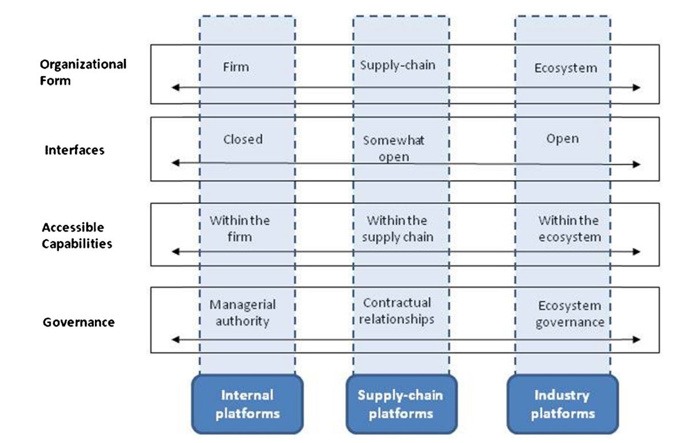

<!-- _class: lead -->

# Lecture 9 - Digital work in crowds

# Platformization and entrepreneurial work

---

<!-- _class: overview_part_4 -->

---

# Learning objectives:

- Identify and dissociate platforms supporting the work of digital entrepreneurs
- Explain the different procedures for sourcing from online markets 

---

# Platformization

Our focus: Digital platforms as two-sided online markets involving supply and demand-side users

- Platforms rely on network effects: the incremental benefit gained by each user for each new user that joins the platform
- Platforms generally decrease transaction costs (e.g., search costs, bargaining costs, etc.)
- Platforms lower the barrier for individuals to pursue entrepreneurial activity
 

<!-- 
Lower transaction costs

Not just for individuals but also for startups

TODO : check volume of "the platform economy"

https://digital-strategy.ec.europa.eu/de/policies/digital-services-act-package

https://www.perc.org.uk/project_posts/reflections-on-platform-cooperativism/
https://www.ft.com/content/6d2fe2a8-722c-11e7-93ff-99f383b09ff9
-->
---

# Classification of platforms

- Gawer (2014) distinguishes three types of (technology) platforms and illustrates their key differences
- We focus on digital platforms for entrepreneurial work: Entrepreneurs can use platforms as **demand-side actors** to orchestrate their value chain and they can use platforms as **supply-side actors** to sell their goods or services
- These platforms would be classified as industry platforms (ecosystems)

<!-- 
Examples:
- The "Black and Decker" platform (never heard of it - that's because it is just for Black and Decker/internal)
- The Boeing supply-chain platform that integrates with different suppliers (monitoring, scheduling, ... supply materials and parts)
- Google/Apple app stores

Distinctions: Gawer2014 table 2 (industry platforms: expecially digital entrepreneur context)

Freelancing, gig-work, entrepreneurship
micro-entrepreneurial: UN / Sustainable development goals (developing countries)

very broadly (from a digital entrepreneurship perspective): leverage resources like different forms of human labor (purely online and also in the real world, e.g., transportation etc.), computational services, capital, innovative ideas, actual design, expert knowledge  (push to the individual level at all market sides (supply and demand))
Many of those resources have become very easily accessible on different (crowdsourcing) platforms

C2C and non-commercial platforms, B2B platforms, **micro-entrepreneurial platforms** 
-->
---

# Entrepreneurial activities

<!-- 
Porter's value chain provides an overview of acitivities that may be orchestrated on digital platforms.

Digital leadership: orchestrating resources, entrepreneurial thinking (connect to the skills frameworks?)

- finance: as part of firm infrastructure
- innovation: somehow external (maybe add to technology)

Orchestrator perspective: for individual entrepreneurs, but also for start-ups/SMEs

Note: different for services, purely online/offline vs. hybrid value chains
-->

---

# Platformization: Crowdfunding

Traditional alternatives: Venture capital, loans, IPOs

Typical mechanism to raise capital on crowd-funding platforms:

- Sequential crowdfunding, with previous customers' decisions available
- Later customers make decisions on whether to back a project, they know their own valuations but also see the aggregate contribution made by previous customers
- Funds are transferred when a predefined threshold is met (all-or-nothing funding)

Example: [Kickstarter](https://help.kickstarter.com/hc/en-us/articles/115005028514-What-are-the-basics-)

<!-- 
All-or-nothing funding :why do platforms do that?
-> to keep satisfaction of customers high (avoid funding of projects that fail)

Kickstarter: potentially utilizing market evaluation/information from future buyers

all-or-nothing funding
https://help.kickstarter.com/hc/en-us/articles/115005047893-Why-is-funding-all-or-nothing-
-->

---

# Platformization: Innovation

Traditional alternatives: in-house innovation, innovation through external agencies

Typical mechanism to source from innovation platforms:

- A requester posts a task (e.g. logo design) and announces a monetary reward for the winning solution
- Contestants submit solutions on the platform
- The requester chooses the best solution(s) and awards the prize

Example: [Crowdspring](https://www.crowdspring.com/how-it-works/)

<!-- 
- note that innovation (e.g., design/creative work) is also needed for other downstream steps
- crowd-evaluation (option)

https://www.sciencedirect.com/science/article/abs/pii/S0377221719302218
-->
---

# Platformization: Micro-tasks

Traditional alternatives: internal employees or temporary workers

Typical mechanism to source from micro-task platforms:

- Requestors post tasks, requirements, and compensation
- Workers self-select into tasks (when requirements are met) and complete the work
- Requestors accept or reject the solution

Example: [Amazon Mechanical Turk](https://www.mturk.com/how-it-works)

---

# Platformization: Knowledge work services

Traditional alternatives: internal employees, consultants

Typical mechanism to source knowledge work services from platforms (buyer-determined reverse auctions):

- Clients post a project, including requirements, and compensation (hourly or fixed price)
- Workers submit applications
- Client interviews and selects one or multiple workers
- The execution of work is monitored by clients (continuously or at milestones)
- Project completion: submission of results, and mutual ratings

Example: [Upwork](https://www.upwork.com/resources/how-to-hire-freelancers)

<!-- 
We were trying to find somebody who had a combination of skills that nobody in their right mind should actually have.-->

---

# Platformization: Marketing

Traditional alternatives: Advertising via print, TV, etc.

Examples for marketing platforms:

- Google Ads
- Social media (influencers, sponsored ads)

<!-- 
Viral
-->
---

# Platformization: Supply side

Examples of platforms entrepreneurs use as supply-side actors:

- Physical goods: Ebay, Amazon, Etsy
- Digital goods: Apple/Android app store
- Services: Uber, AirBnB, Lieferando
- Online services: Upwork, 99Designs, Amazon Mechanical Turk

---
<!-- 

# Platformization: Infrastructural services

Payments, communication infrastructure, computational resources, web-hosting, identification of users (post-ident), ...

- Typically provided by third-party providers (e.g., Cloud-Computing)

---
-->

# Platform governance and regulation of platforms

In addition to supply and demand-side actors, the platform owner plays a critical mediating role (triadic relationship).

- In the *platform economy*, the most common form is centralized governance by a private company
- Other forms include platform cooperativism or decentralized governance (e.g., Blockchain)

Regulators increasingly recognize downsides of platforms, including the development of market monopolies, the violations of privacy laws, and the marginalization of workers. As a response to these challenges, corresponding legislation has been pushed, including the EU's Digital Services and Digital Markets Acts.

<!-- 
TODO :
- include example for platform cooperativism
- include illustration of the triadic relationship

antitrust laws

Platforms are here to stay, but they need to be regulated.
-->
---

# The role of platform owners

Platform owners take on multiple roles and facilitate activity between supply and demand-side users. They bundle the roles typically played by different market institutions (Khanna and Palepu, 2005):

- Information analysers that “collect and analyze information on producers and consumers in a given market”.
- Credibility enhancers that provide “third-party certification of the claims by suppliers or customers”.
- Aggregators that “provide low-cost matching and other value-added services for suppliers and customers through expertise and economies of scale”.
- Transaction facilitators that “provide a platform for exchange of information, goods, and services, provide support for consummating transactions”.
- Regulators that “create the appropriate regulatory and policy framework, and enforce it”.
- Adjudicators that “resolve disputes regarding law and private contracts”.

<!-- 
Khanna and Palepu (2005) identify six market institutions that are critical in emerging markets

Platform owners create their own "ecosystem" in which they play the role of the regulator, judiciary, and executive branch (based on the terms of service/as far as the law permits)
This dramatically lowers enforcement costs, in particular for demand-side users (may not always be fair)
-->

---

# Reading

- Skim the paper of Cutolo and Kenney (2021) on platform-dependent entrepreneurship
- Appreciate the clear structure, writing, and figures
- Summarize the key concepts of each subsection by reading as much as needed

Cutolo, D., & Kenney, M. (2021). Platform-dependent entrepreneurs: Power asymmetries, risks, and strategies in the platform economy. Academy of Management Perspectives, 35(4), 584-605.

<!--
- [ ] give students project descriptions and platform options -> ask where to post and why (argumentation based on researching the platform / maybe even suggest Toulmins argumentation theory to structure the arguments), what the key considerations would be

- [ ] TODO

startups etc.
e.g., virtual assistants (4hour work week) / ability to create the impression of a highly professional firm (e.g., phone service, website, ...)
-->

---

# Materials

Khanna, T., & Palepu, K. G. (2010). Winning in emerging markets: A road map for strategy and execution. *Harvard Business Press*.

Gawer, A. (2014). Bridging differing perspectives on technological platforms: Toward an integrative framework. *Research Policy*, 43(7), 1239-1249.