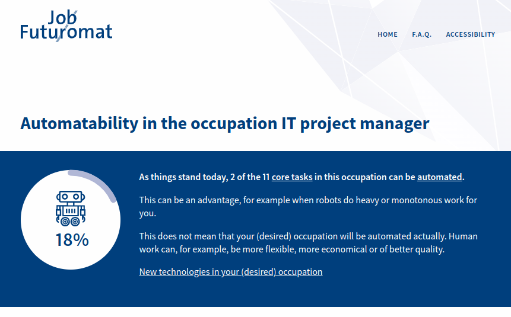

<!-- _class: lead -->

# Lecture 11 - Digital work and its futures

# Humans vs Machines

---

<!-- _class: overview_part_5 -->

---

# Warm-up question

- What is the future of human labor vis-à-vis machines?

<!-- 
- What are the key challenges in the future of work?

Simon Sinek: there's a lot in the air right now / nobody knows exactly where it will land
- example: remote work (people telling their managers that they've moved to Florida / Twitter calling back employees)

world economic forum:
https://www.youtube.com/watch?v=EuDnSqAo784

https://www.youtube.com/watch?v=JyTqt5G-phs

- Use videos to illustrate trends / get experts assessments

nice AI/automation/robotics examples (6 years old but interesting)
https://www.youtube.com/watch?v=dRw4d2Si8LA
-->

---

# Learning objectives

- Predict the replacement of human labor by machines in the near future using illustrative examples.
- Discuss possible futures at the intersection of AI-based and human work.

---

# Research on the replacement of human labor

- The concept of **jobs** is relatively complex, and involves multiple skills, steps, and interactions.

- The replacement of human labour is commonly studied at the the level of individual **tasks**. For this unit of analysis, requirements are more narrow, making it easier to compare the performance of humans and machines.

- Focusing on individual tasks raises critical questions:

    - Which skills are easy to substitute by machines?
    - How easily can different jobs be disaggregated into individual tasks?
    - How does human labour evolve when machines replace or augment tasks? 

<!-- 
Example of a nurse: quality of care, emotional, clinical, administration, collaboration/learning
Example of a radiological diagnosis: True or False.

Note : the same disaggregation questions were asked in the outsourcing context (basically lowering the cost of human labor)

part of the equation could be customer self-service
-->

---

# Highly substitutable tasks

Extant research has identified task properties associated with automation (Deranty and Corbin): 

- Repetitive, documented, and atomic tasks with a clear objective
- Large amounts of data available for analysis
- Automated enactment does not raise ethical concerns

<!--
also: MithasWhitaker2007 Table 2
 - Routine (low-context) environments
f-->

---

# Non-substitutable skills

In an [HBR article](https://hbr.org/2018/07/7-skills-that-arent-about-to-be-automated), Gustein and Sviokla suggest the following skills are hard to substitute by AI:

- Communication
- Context
- Emotional competence
- Teaching
- Connections
- An ethical compass

<!-- 
TODO : Analyze the paper and link it
-> TBD: discuss (e.g., teaching: MOOC?)

teaching: the authors refer more to on-the-job training
-->

---

# Non-substitutable skills: IT

Atasoy, Banker, and Pavlou use panel data from Turkey to analyze how IT skills impact labor market outcomes:

- Basic IT skills increase employment probability due to increased labor force participation and a higher probability of transitioning from unemployment to employment (after deciding to work)
- Advanced IT skills help workers earn higher wages and increases the probability that they are employed in higher-paid jobs.

<!--
Note: similar to digital (technical) skills (in the first lectures)
[[AtasoyBankerPavlou2021]]
-->

--- 

# Disaggregation of human labour

Mithas and Whitaker propose a **theory of service disaggregation**: High information intensity makes an occupation more amenable to disaggregation because the activities in such occupations can be codified, standardized, and modularized.

- **Codifiability**: The extent to which knowledge can be converted into a form suitable for transfer across economic agents.
- **Standardizability**: A common framework and vocabulary to define business processes.
- **Modularizability**: The decomposition of a product or service into components.

<!-- 
TODO : check Table 1 for examples
 
<->
"high information-intensity and high-skill occupations appear to be relatively less vulnerable to global disaggregation."
-->
---

# Substitution of jobs

The "Job-Futuromat" is based on a task (dis)aggregation approach:

<!-- 
- Man vs. machine (AI) discussions am Beispiel des [Job-Futuromat](https://job-futuromat.iab.de/) (Methode: Industrienahe Erhebung/Dekomposition in Kernanforderungen Analyse des Substituierbarkeitspotentials)
- IAB Substituierbarkeitspotentiale.pdf
-> give examples
 -->
---

Break

---

# Possible futures at the intersection of AI-based and human work

Possible futures of AI job replacement

<!-- https://www.coursera.org/learn/ai-business-future-of-work/lecture/WEV1z/a-theory-of-ai-job-replacement -->

---

# Future 1

- When most jobs have become automated..
- Human interaction will become the premium alternative
- Customers want to pay extra for having contact with a human representative
- Both AI and people will be employed at the same time for the same job

---

# Future 2

- Humans and machines have a complementary division of labor
- Computers will not be able to fully replicate human emotions
- Machines will carry out the repetitive tasks
- Humans would be supported by AI systems and become even more powerful

<!-- 
(uncanny valley)
-->
---

# Future 3

- A human-centric view of AI
- People retain full control over AI development
- Machines will be allowed to take over those industries, jobs or tasks that no human wants to engage with
- People can choose to work in those jobs that give them a sense of satisfaction or fulfillment
- All work will be done by machines

---

# Future 4

- A physical and cognitive integration of humans and machines
- People will be able to have body and mind enhancement
- Elon Musk: "A merger between biological and digital intelligence"
- The Neuralink project

---

# Future 5

- Machines completely dominate over humans
- Ray Kurzwall, Sam Harris
- Power of interconnected AI systems
- Imperfection of human behavior
- Gordon Briggs and Matthias Scheutz:  The case for robot disobedience
-Humans make mistakes in creating or mastering robots
- AI forms that are more complex than the software that produce them

<!--
AI industry leaders: threat:
https://www.nytimes.com/2023/05/30/technology/ai-threat-warning.html
AI in organizational work impacts society (e.g., Facebook/fake news...)

drone "apparently" attacking commander
https://www.theregister.com/2023/06/02/ai_drone_simulation/

# Societal discourse and regulatory measures

EU: responsible AI

Challenges: when to prefer AI or human decisions
- decision process: Cognitive biases vs. training data problems
- decision outcome: ethical, "optimal", ... 

AI - also: Quantum Computing -->

---

# Organizational scholars' perspectives on the future of work

Adam Grant: Professor of organizational psychology at Wharton
Malcolm Gladwell: Journalist and NYT best-selling author

[Future of Work Conference: Getting Uncomfortable with the Future](https://www.youtube.com/watch?v=jH7IvThAoH0)

<!-- 
Grant: influential management thinker, youngest tenured professor at Wharton, 4x Org science, Books, 7x best professor at Wharton (by students)....
Gladwell: Journalist with honorary doctorates and best-sellers: outliers was nr1 on the NYT best seller list for three months
-->

---

## Materials

Atasoy, H., Banker, R. D., & Pavlou, P. A. (2021). Information technology skills and labor market outcomes for workers. Information Systems Research, 32(2), 437-461.
Deranty, J. P., & Corbin, T. (2022). Artificial Intelligence and work: a critical review of recent research from the social sciences. AI & Society, 1-17.
Gustein, A. J., & Sviokla, J. (7). skills that aren’t about to be automated. Harvard Business Review.
Mithas, S., & Whitaker, J. (2007). Is the world flat or spiky? Information intensity, skills, and global service disaggregation. Information Systems Research, 18(3), 237-259.

<!--
TBD: blockchain networks/DAO and the implications/opportunities for the future of work (trust, disintermediation/direct interaction with objects)

ChatGPT:
- used as a coding co-pilot 
- Banned on UNSW campus
- example task for students: find the sources that led to a ChatGPT response
- potential pitfall: ChatGPT content is copyright licensed
- Blair Wang: potential way of addressing ChatGPT: include figures/diagrams (ChatGPT cannot do that yet), or require reflection related to the team

Check works of Tina Klüwer

Comparison: Humans vs. machines

[[JainPadmanabhanPavlouEtAl2018]]: ... the main intellectual advances will be made by men and computers working together in intimate association. (Licklider 1960)

Machines outperform humans in (most traditional economic measures)
- reliability (errors)
- cost of operation (think: production of intangible artefacts: cost of copying/... is close to zero)
- mechanical precision (surgeons)
- computational power
Humans outperform machines (more important when "basic needs" are met / Maslow?)
- compassion
- fairness
- democracy
- fulfillment
 
Futuromat: substituierbarkeit von Berufen
http://doku.iab.de/kurzber/2018/kb0418.pdf
-   Automatization (robots), industry 4.0 -> replace particular types of labor
- Machine capabilities: from powering the conveyor belt to surpassing surgeons in precision

- Types of digital work (classification)

- Digital work (Definition? - ggf. Begriff prägen? Bereiche klären: IT/Produktion/...?), Prozess, Verhalten, Technologie
- TBD: Competences for digital work (TBD),

-- Next chapters: implicitly: excell individually, excell in a team, excell with a crowd --> 
