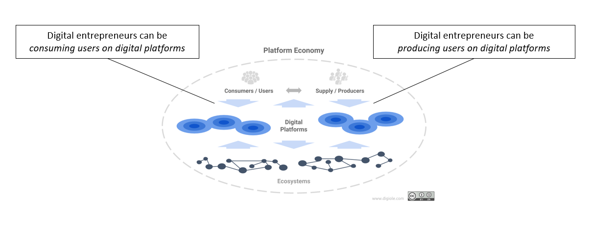
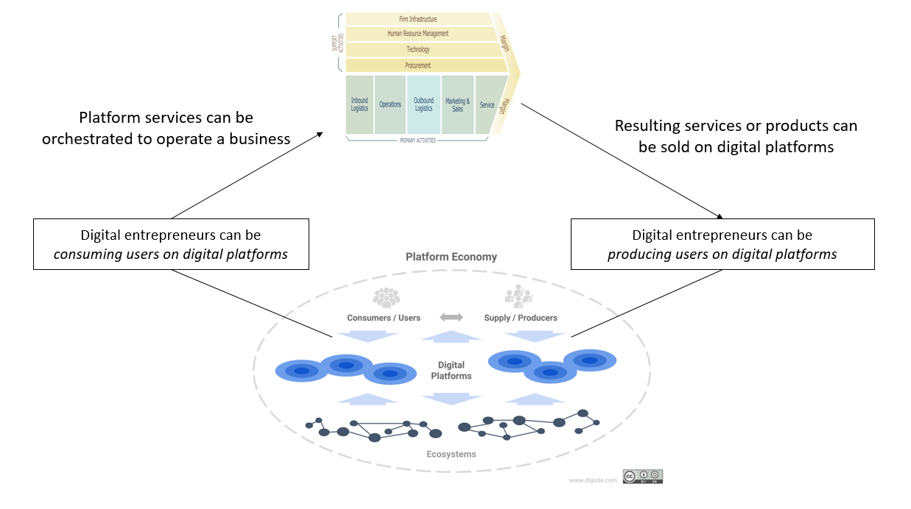
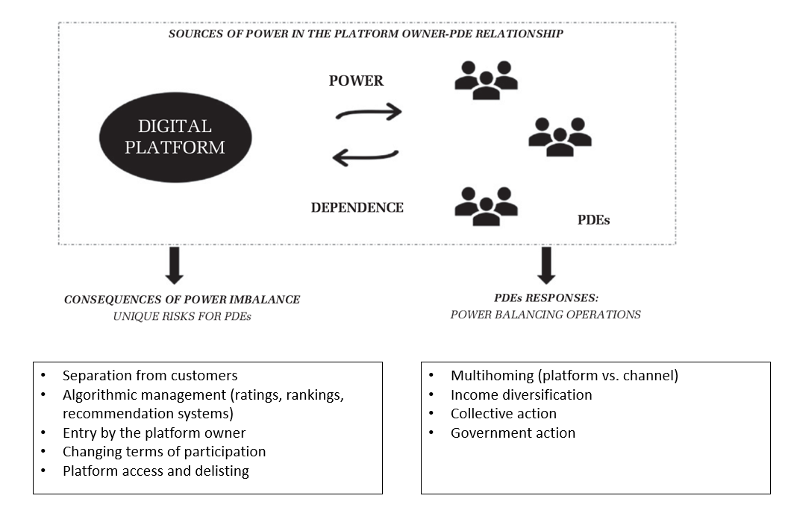
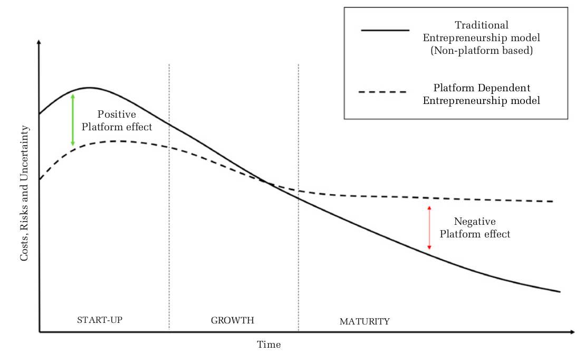

<!-- _class: lead -->

# Recap: Platformization and digital entrepreneurship

---

# Entrepreneurial work on digital platforms

---

# Entrepreneurial work on digital platforms

---

# Power-dependency: risks and responses

---

# Costs, risks, and uncertainty over time

In the long term, the cost, risks, and uncertainty for platform-dependent entprepreneurs may be higher compared to the traditional entrepreneurship model.

---

# Thank you

- For participating in the first round of "Introduction to Digital Work"
- For the discussions and excitement
- For your patience when things were not (yet) perfect

Keep in touch, keep up with digital work trends, and enjoy summer vacations!

<!-- 
Recap / typical exam questions

Mentimeter: welche methoden/inhalte haben dich am meisten interessiert? welche sind für deine berufliche Zukunft am hilfreichsten?

Explicitly formulate expectations for the exam:

- understand git status /areas
- do: operations in status areas
- do: create version trees
 -->