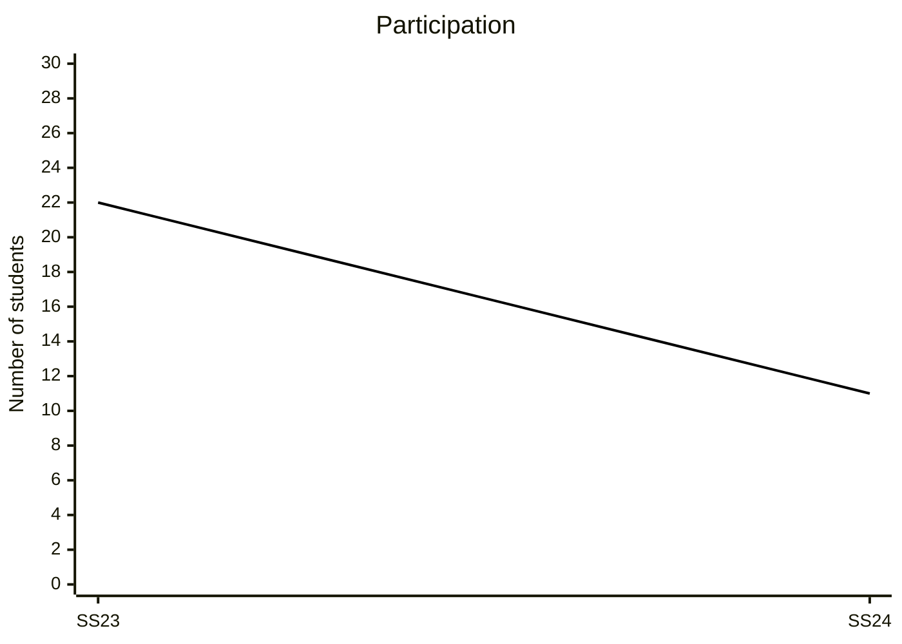

# Evaluations

{: .info }
> **Your Feedback Matters: Help Us Improve!**
> 
> We kindly invite you to participate in the upcoming course evaluation.
> Your feedback is voluntary and anonymous.
> There is no risk of disadvantage or negative consequences for you, regardless of the feedback you provide.
> So please feel free to be open and honest in your responses.
> Your participation helps us [improve the quality of our courses](https://digital-work-lab.github.io/handbook/docs/10-lab/10_processes/10.01.goals.html){: target="_blank"} (♻️), and we highly value your opinions.
> 
> Thank you for your time and honest feedback!

Results from our regular teaching evaluations are available [here](https://digital-work-lab.github.io/handbook/docs/30-teaching/30_processes/30.21.evaluations.html){: target="_blank"}.

{: .text-center}
```mermaid
%%{init: { "themeVariables": {"xyChart": {"plotColorPalette": "#000000", "plotLineWidth": 4} } }}%%
xychart-beta
    title "Student rating (overall)"
    x-axis [SS23, SS24]
    y-axis "Indicator (1-5)" 1 --> 5
    line [4.9, 4.7]
```

{: .text-center}

