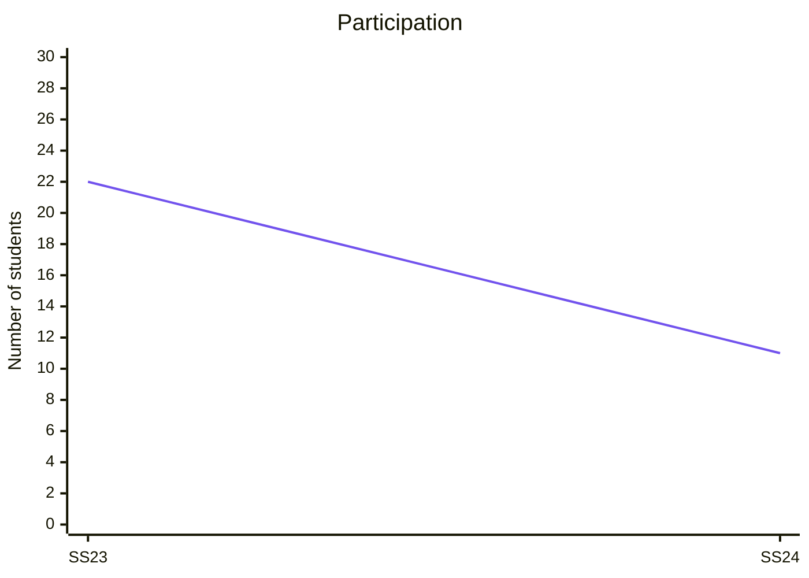

# Evaluations

{: .info }
> **Your Feedback Matters: Help Us Improve!**
> 
> We kindly invite you to participate in the upcoming course evaluation.
> Your feedback is voluntary and anonymous.
> There is no risk of disadvantage or negative consequences for you, regardless of the feedback you provide.
> So please feel free to be open and honest in your responses.
> Your participation helps us [improve the quality of our courses](https://digital-work-lab.github.io/handbook/docs/10-lab/10_processes/10.01.goals.html){: target="_blank"} (♻️), and we highly value your opinions.
> 
> Thank you for your time and honest feedback!

Results from our regular teaching evaluations are available [here](https://digital-work-lab.github.io/handbook/docs/30-teaching/30_processes/30.21.evaluations.html){: target="_blank"}.

{: .text-center}
```mermaid
%%{init: { "themeVariables": {"xyChart": {"plotColorPalette": "#7253ed", "plotLineWidth": 4} } }}%%
xychart-beta
    title "Student rating (overall)"
    x-axis [SS23, SS24]
    y-axis "Indicator (1-5)" 1 --> 5
    line [4.9, 4.7]
```

{: .text-center}


## What Our Students Say

We are delighted to share the feedback from students who have participated in our open source project in previous semesters. Their experiences and insights help us continually improve and ensure a valuable learning journey for all.

> "A good combination of practice and science. Studies and scientific models related to the topics are discussed, but practical tools and methods for digital work are also introduced. The practical elements are often directly relevant for further studies and digital work. For example, I now use the software Obsidian to organize my studies."

Note: the feedback is translated based on the [evaluations](https://digital-work-lab.github.io/handbook/docs/30-teaching/30_processes/30.21.evaluations.html#prior-evaluations){: target="_blank"}.