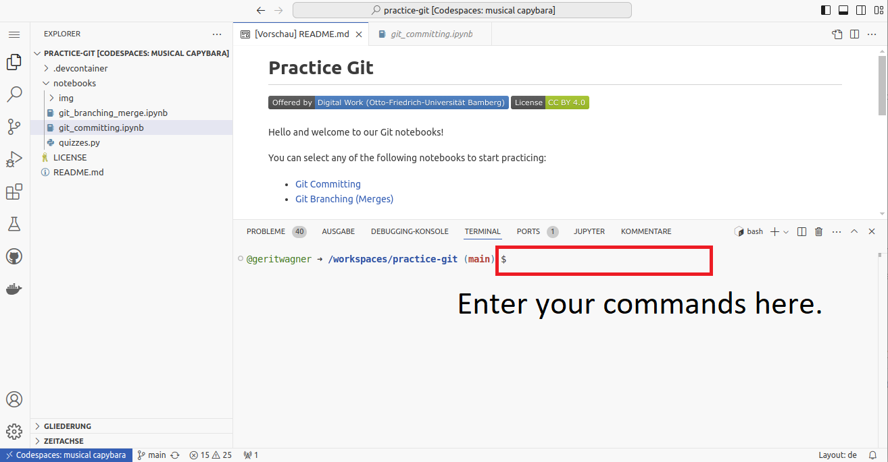

# Exercise: Git branching

-blue)


<p style="max-width: 730px; margin-left: 0; margin-right: 0; text-align: justify;">  The notebook builds on our peer-reviewed <a href="https://digital-work-lab.github.io/rethink-git-teaching/">pedagogical foundations</a>. The interactive visualization and tutorial are based on the amazing <a href="https://github.com/pcottle/learnGitBranching">learnGitBranching</a> repository.</p>

<p style="max-width: 730px; margin-left: 0; margin-right: 0; text-align: justify;">We    your <a href="https://github.com/digital-work-lab/digital-work-lecture/issues/new/choose" target="_blank">feedback</a> and <a href="https://github.com/digital-work-lab/digital-work-lecture/edit/main/exercises/git_branch/branching_exercise_notebook.md" target="_blank">suggestions</a> on this notebook!</p>

---

<div class="callout info">
 <strong>Concepts: Git branching</strong> <br><br>The slides explaining Git branching are <a href="../../output/07-collaborative-content-creation.html#9" target="_blank">here</a>.
</div>

With this notebook, you can practice branching in Git.

| Practice | Label                                       | Time (min) |
|----------|---------------------------------------------|------------|
|  1       | [Commit, branch, merge, rebase](#basics)    | 23         |
|  2       | [Branching strategies](#branch)             |  5         |
|  3       | [Merge methods](#merge)                     | 40         |
|  4       | [Wrap-up](#wrap-up)                         | 2          |
|          | **Overall**                                 | **70**     |

 We are here to help if errors or questions come up!

---

## Part 1: Commit, branch, merge, rebase <a id="basics"></a>

We have covered `git commit`, as well as `git branch`, `git switch`, and `git merge` operations in the lecture.

**Task**: To practice branching and manipulating the Git graph, complete level 1 (introduction) of the [learngitbranching](https://learngitbranching.js.org/?locale=en_EN) tutorial.

Hints:

- You can always type `undo` to undo the last command
- You can run `git commit` without specifying a commit message.

<!--
To start the tutorial, run the following code cell and confirm the environment.
from IPython.display import IFrame

IFrame('https://learngitbranching.js.org/', width=1400, height=800)
-->

### Optional Challenge

If you have completed Part 1 quickly, you may continue practicing with the following challenge.

**Task**: To continue practicing, create the following tree, which resembles a typical setup of Git branches. To do this, you can open [learngitbranching](https://learngitbranching.js.org/?locale=en_EN) in a separate window.


<div style="clear: both;"></div>

<br>

<details>

<summary>Solution</summary>

The following commands produce this particular graph:

<pre class="highlight">git commit
git commit
git commit
git checkout c1
git checkout-b hotfix
git commit
git checkout main
git merge hotfix
git checkout c1
git checkout -b dev
git commit
git commit
git checkout c6
git checkout -b feature
git commit
git commit
git checkout dev
git merge feature
git checkout main
git merge dev</pre>
</details>

<div class="page-break"></div>

## Part 2: Branching strategies <a id="branch"></a>

Analyze the Git graph with the different branches. Explain what happens as the project progresses.

<!--
- Branching strategies (have students examine repositories with different branching strategies)
-->


<div style="clear:both;"></div>

<details>

<summary>Solution</summary>

<ul>
  <li>The project has two parallel branches: <strong>Main</strong> and <strong>Develop</strong>. <strong>Main</strong> has stable releases and urgent hotfixes (e.g., to fix bugs).</li>
  <li>The <strong>Develop</strong> branch contains the development activity, more complex tasks are completed in separate <strong>Feature</strong> branches (one has been merged, another may be under development or be stalled.) Hotfixes are also integrated into the <strong>Develop</strong> branch.</li>
  <li>To release new versions, the developers create a branch from <strong>Develop</strong>, do some pre-release work, and eventually merge it into <strong>Main</strong>.</li>
  <li>This setup ensures that the <strong>Main</strong> branch is stable and unaffected by untested code.</li>
</ul>

</details>

## Part 3: Merge methods <a id="merge"></a>

This part focuses on different methods to integrate changes from one branch into another (aka. "merge methods").

When running `git merge other-branch`, there are two options:

- If two branches have <b>not diverged</b>, Git will perform a <b>fast-forward merge</b>:


- A more common case is when two branches have **diverged**, i.e., each branch has commits that the other branch does not have. In this case, Git will create a merge commit:


In addition to `git merge`, users also have the option to **rebase** changes.
This preserves a **linear** version history* in the target branch instead of cluttering it with an array of merge commits:

<!-- https://www.atlassian.com/git/tutorials/merging-vs-rebasing -->


<!-- 
- Squash the changes (not available as a learngitbranching animation)

Note: GitHub offers these options to merge pull requests:


-->

There is another option: to **squash** changes from another branch. This effectively combines all changes from the other branch in a single commit, which is added on top of the target branch.

We will now practice the different methods in a real Git repository.


**Task**: Start GitHub Codespaces from the [CoLRev repository](https://github.com/CoLRev-Environment/colrev) and set up the `quality_model_docs` branch, using the following commands.

```python
cd /workspaces/colrev
git checkout 108d278e8d01a65c5128c4a880247f0272896059
git switch -c quality_model_docs
# Remove the origin for better readability of the Git viewer
git remote remove origin
```

<div class="callout warning">
<strong>Important:</strong> Make sure to copy the commands and enter them in the shell as shown in the screenshot. It is not possible to run the cells in this notebook.
<div style="clear: both;"></div>

</div>

**Task**: Go through the following options, and run the commands. Take notes on the Git graph, i.e., the structure and IDs of commits, by completing the three Git graphs (you can open the page as a <a href="../../material/overview-task.pdf">PDF</a>):


To analyze the specific changes, open the Git GUI:


### Option 1: Merge commit


```python
git switch main
git reset --hard  6f4299bdb0551c680a97dbe04b39dee51bcd0556
git merge quality_model_docs
```

Wait until the Git viewer is refreshed to display the merge commit and extract the commit SHAs.

### Option 2: Rebase


```python
git switch main
git reset --hard  6f4299bdb0551c680a97dbe04b39dee51bcd0556
git switch quality_model_docs
git rebase main
git switch main
git merge quality_model_docs
```

### Option 3: Squash


```python
git switch main
git reset --hard  6f4299bdb0551c680a97dbe04b39dee51bcd0556
git merge --squash quality_model_docs
git commit -n -m 'update docs for quality_model'
```

**Task**: Compare the three Git graphs and the commit IDs. What are the differences between the three methods in terms of the contents of commits and their metadata?

<details>

<summary>Solution</summary>

<ul>
  <li>In method 1 (merge commit), there is one merge commit with two predecessors.</li>
  <li>In method 2 (rebase), the individual commits from the quality branch are "replayed" on top of the main branch.</li>
  <li>In method 3 (squash), all changes from the original quality branch are combined in a single commit, which is added on top of the main branch.</li>
  <li>The contents of the last commit are identical across all three methods.</li>
  <li>Each of the new commits has your account as the author and the current date.</li>
</ul>

<b>Note:</b> All three methods change the state of the <code>main</code> branch. None changes the state of the <code>quality</code> branch. The commit IDs in your solution will differ.


</details>

**Question**: Why does the merge commit always have a different ID if another student creates it or if you run the same commands a few seconds later?

<details>

<summary>Solution</summary>

The commit object always contains the commit author and date. If they differ, Git generates a different commit SHA from the content and metadata.

</details>

## Wrap-up  <a id="wrap-up"></a>

🎉🎈 You have completed the Git branching notebook - good work! 🎈🎉

In this notebook, we have learned

- To create a given Git graph using the `git commit`, `git branch`, `git switch`, and `git merge` commands
- To explain typical branching strategies
- The differences between merge commits, rebases, and squashed merges
