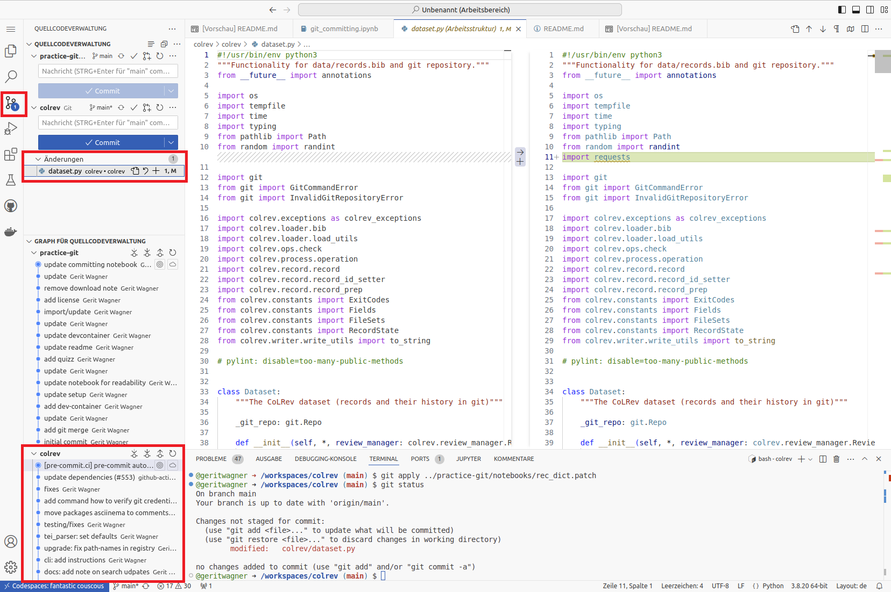

# Exercise notebook: Git committing

-blue)


  The notebook builds on our peer-reviewed <a href="https://digital-work-lab.github.io/rethink-git-teaching/">pedagogical foundations</a>.

We    your <a href="https://github.com/digital-work-lab/digital-work-lecture/issues/new/choose" target="_blank">feedback</a> and <a href="https://github.com/digital-work-lab/digital-work-lecture/edit/main/exercises/git_commit/commit_exercise_notebook.md" target="_blank">suggestions</a> on this notebook!

---

<div class="callout info">
<strong>Concepts: Git areas</strong> <br><br>The slides explaining the Git areas are <a href="../../output/07-collaborative-content-creation.html#13" target="_blank">here</a>.
</div>

<br>

With this notebook, you can practice committing changes in Git.

| Practice | Label                                             | Time (min) |
|----------|---------------------------------------------------|------------|
|  1       | [Clone the repository](#clone)                    | 5          |
|  2       | [Create, stage, and commit changes](#commit)      | 10         |
|  3       | [Undo committed changes](#undo)                   | 8          |
|  4       | [Create Atomic commits](#atomic)                  | 10         |
|  5       | [Undo changes (advanced)](#undo)                  | 5          |
|  6       | [Wrap-up](#wrap-up)                               |  2         |
|          | Overall                                           | 40         |

 We are here to help if errors or questions come up!

<br>

---

## Part 1: Set up <a id="clone"></a>

**Task**: Start GitHub Codespaces from the [CoLRev repository](https://github.com/CoLRev-Environment/colrev){: target="_blank"}.


**Note**: When starting the Codespace, the repository is **cloned** on a virtual machine (`git clone URL`). To create an empty git project, you would run `git init`.

<div class="callout warning">
<strong>Important:</strong> Make sure to copy the commands and enter them in the shell as shown in the screenshot. It is not possible to run the cells in this notebook.
<div style="clear: both;"></div>

</div>

The status command provides an overview of the current state of the project and the files in the three sections. Therefore, you will need to run `git status` regularly.

**Note**: The comments after the hashtag (#) are ignored.

```python
# Check the status of the project
git status
```

<details>

<summary>Check</summary>

<p>The <code>git status</code> command should print something like the following:</p>

<pre class="highlight">
<code>
On branch main
Your branch is up to date with 'origin/main'.

nothing to commit, working tree clean
</code>
</pre>

The last line indicates that there are no changes in the staging area (nothing to commit). The working directory has the same content as the last version in the git repository (working tree clean).

</details>

## Part 2: Create, stage, and commit changes <a id="commit"></a>

Next, we modify files (state: **untracked**/**modified**), mark them to be in the next commit (state: **staged**), and create the first version (state: **committed**). This corresponds to the three sections of a Git project.

**Task**: Open the `README.md` file in the colrev repository (`shift` + double click to open in a separate tab) and add your name to the project citation (`# Citing CoLRev`section).


```python
# Check the `git status` between each command
git status
```

**Task**: Open the `CONTRIBUTING.md` file and change it.

The `git status` should now show two files with changes in the working directory (state: **modified**)

We decide that the changes in the `README.md` file should be **staged** for the next commit. The changes in the `CONTRIBUTING.md` file are no longer needed.

**Task**: Use the commands suggested by `git status` to accomplish this.

This means that changes in the README.md are **staged** (to be committed).

<details>

<summary>Check</summary>

<p>The <code>git status</code> should now display:</p>

<pre class="highlight">
<code>
On branch main
Your branch is up to date with 'origin/main'.

Changes to be committed:
  (use "git restore --staged &lt;file&gt;..." to unstage)
	modified:   README.md
</code>
</pre>

</details>

To **commit** the changes, we run


```python
git commit -m 'add contributor'
```


The `-m 'add contributor'` adds a short summary message, which is expected for every commit.

<details>

<summary>Check</summary>

<code>git status</code> should reflect your expected state of files in the three Git sections.

</details>

## Part 3: Undo committed changes <a id="undo"></a>

To undo the last commit, we can simply run:


```python
git reset --soft HEAD~1
```

You should now have the `README.md` file in the staging area again.

**Note**: the `HEAD~1` refers to the last commit.

**Task**: Run `git status` to see the changes.

We decide to discard our changes.

**Task**: Use the commands suggested by `git status` to do that.

<details>

<summary>Check</summary>

<p>The <code>git status</code> should show the following:</p>

<pre class="highlight">
<code>
On branch main
nothing to commit, working tree clean
</code>
</pre>

</details>

To analyze the specific changes, open the Git GUI:



## Part 4: Create atomic commits <a id="atomic"></a>

It is good practice to create **atomic commits**, i.e., small changes that belong together. One should avoid large commits that modify many unrelated parts of the code base and pursue different objectives.

Analyze the following commits and discuss which ones are atomic and which ones combine changes that do not belong together (i.e., should be in separate commits).
In addition, check the commit message (short summary at the beginning). Does the message clearly summarize the changes?

<a href="https://github.com/CoLRev-Environment/colrev/commit/a0c9043784f9342136d2ab214513688769669199" target="_blank">Commit 1</a>

<details>

<summary>Solution</summary>

Atomic commit, ok.

</details>

<a href="https://github.com/CoLRev-Environment/colrev/commit/5288e92083b6df546d7c8fd590df3e968a909114" target="_blank">Commit 2</a>

<details>

<summary>Solution</summary>

Relatively atomic. There are a few changes beyond `compute_language()`. May be improved.

</details>

<a href="https://github.com/CoLRev-Environment/colrev/commit/ba08d4242f48ec96b4fa8cfd053ee3781e32231f" target="_blank">Commit 3</a>

<details>

<summary>Solution</summary>

Many files changed. Changes not related to each other. Message refers to refactoring and testing, but the commit also adds functionality.

</details>

<a href="https://github.com/CoLRev-Environment/colrev/commit/ce9850f805a140692866970c92557833e6befa0b" target="_blank">Commit 4</a>

<details>

<summary>Solution</summary>

Many files changed, but the changes belong together. ok.

</details>

<a href="https://github.com/CoLRev-Environment/colrev/commit/93fc7e851d2ba3fc95cc3190b6b71dc4a907c96b" target="_blank">Commit 5</a>

<details>

<summary>Solution</summary>

Atomic commit, ok.

It is ok to combine functionality, tests, and docs that belong together in one commit!

</details>

**Optional**: If you have the time, you may check the [Conventional Commits](https://www.conventionalcommits.org/en/v1.0.0/){: target="_blank"} specification.

To create atomic commits, you may need to **add specific lines of code that should go into a commit**, leaving other changes in the working directory.

The changes are provided in the [rec_dict.patch](rec_dict.patch) file, which must be placed in the project's working directory. To apply it, run:

```python
# Reset main to a recent commit
git checkout main
git reset --hard 3821b922cb4179691dc540b2d2b61902604ce4d5
# Suggests to rename the method but also introduces unrelated changes.
git apply rec_dict.patch
# Different files were modified by the patch
git status
```

**Task**: Use the Git GUI to check the changes that were introduced by the patch.

In the following, we would like to add **only** the changes in lines related to the `load_records_dict` method and the `skip_notification` parameter (using `-p` for a partial `git add`):

```python
# Add specific lines of code from the colrev/dataset.py
# using y/n to add or skip (confirming with ENTER)
git add -p colrev/dataset.py
```

**Task**: Check whether the correct lines were added! Create a commit containing the relevant changes. Afterward, discard the remaining changes.

## Part 5: Undo changes (advanced) <a id="undo"></a>

To **undo committed changes**, there several options:

- Revert the commit, i.e., create a new commit to undo changes: `git revert COMMIT_SHA --no-edit`
- Undo the commit and leave the changes in the staging area: `git reset --soft COMMIT_SHA` (*)
- Stage changes, and run `git commit --amend` to modify the last commit (*)

If you have the time, try the different undo operations in the session.

(*) Important: only amend commits that are not yet shared with the team. Otherwise, a revert is preferred.

<div class="callout info">
<strong>Info</strong> Once you have committed changes, Git takes care of the data and it is very hard to lose the data. Uncommitted data can be lost more easily. Therefore, commit often!<br><br> Even if you run <code>git reset --hard ...</code>, you can still recover commits using <code>git reflog</code>. Committed data will only be lost permanently if you run <code>git reflog expire --expire=now --all</code> and <code>git gc --prune=now --aggressive</code>. If the commits are already on GitHub, you would need <code>git push --force</code> and the changes may also be synchronized in other local repositories. <br><br>Avoid options like <code>--force</code>, <code>--hard</code>, or <code>--aggressive</code>. Use them only if you know what you are doing.
</div>


## Wrap-up  <a id="wrap-up"></a>

🎉🎈 You have completed the Git commit notebook - good work! 🎈🎉

In this notebook, we have learned to

- Clone a repository and check the `git status`
- Create, stage, and commit changes using `git add`, `git commit` and `git restore`
- Create atomic commits
- Undo changes
- Navigate VisualStudio Code on GitHub Codespaces

Remember to delete your codespace [here](https://github.com/codespaces){: target="_blank"}.
