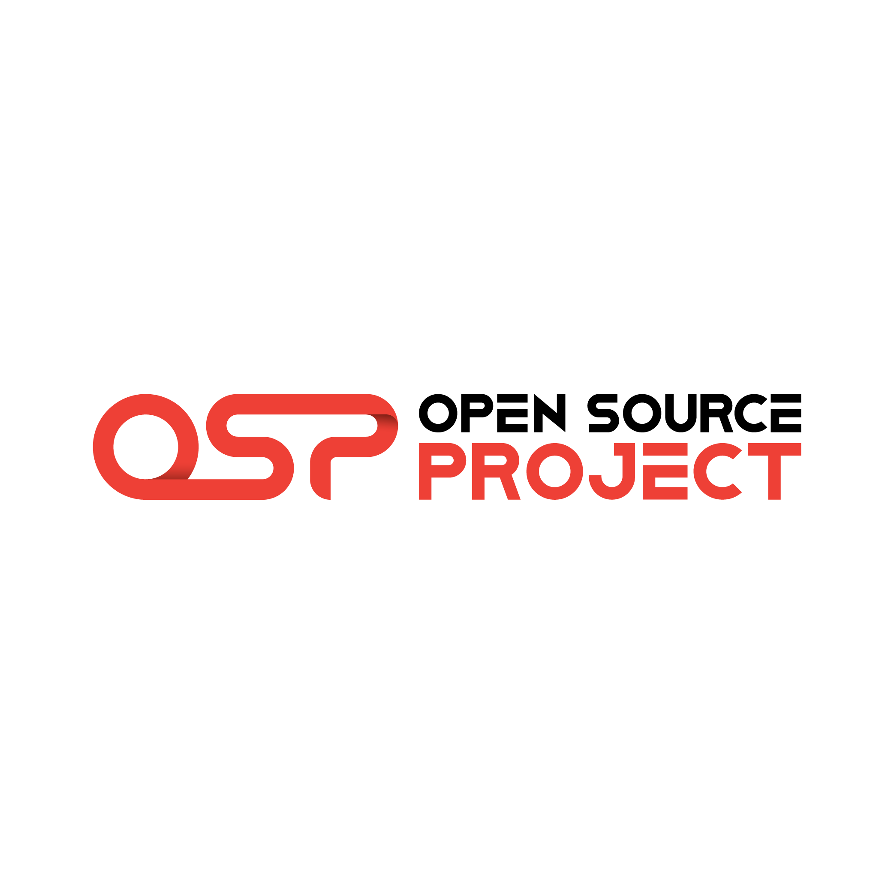
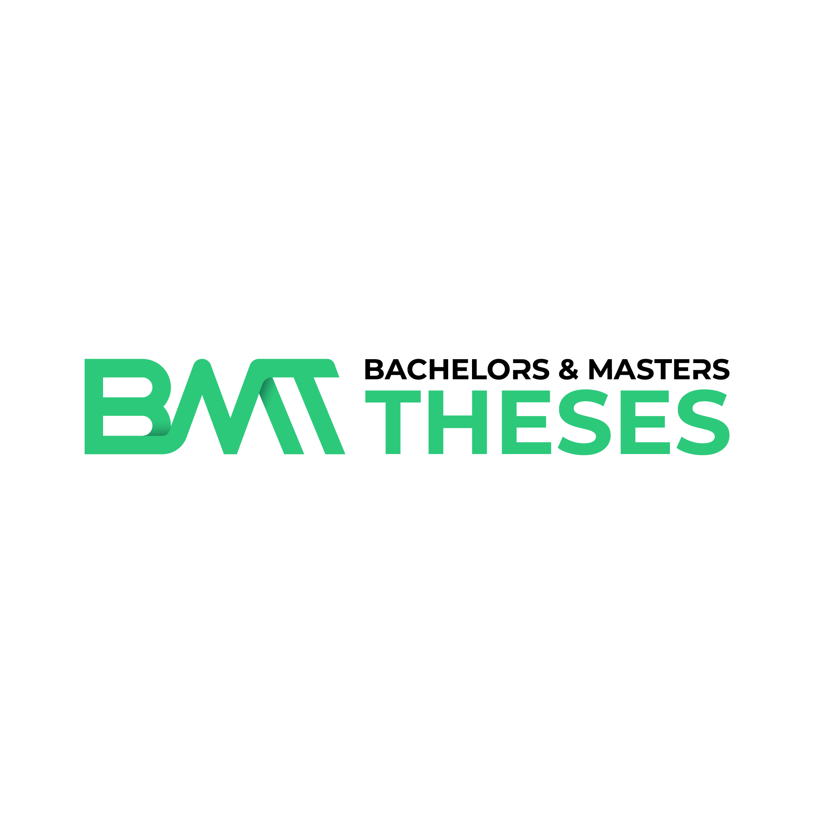

<!-- _class: centered -->

# Introduction to Digital Work

Lecture, Bachelor

Prof. Dr. Gerit Wagner
Fakultät Wirtschaftsinformatik und Angewandte Informatik
Universität Bamberg

---

**Your Instructor**  

**Prof. Dr. Gerit Wagner**  
At Bamberg University since October 2022

I'm excited to guide you through the evolving landscape of **digital work practices** and the technologies shaping the future.
This course covers the following key themes:

- **Drivers of change** in digital work and its impact on modern organizations
- **Personal information management** and strategies for individual work excellence
- Best practices for **remote teams** and effective communication
- **Collaborative content creation** and the role of open source in work environments
- The impact of **platformization** on work structures
- Understanding **knowledge-intensive services** and how they drive innovation
- Exploring **future scenarios** for work, including fully **digital and distributed organizing**
- Addressing important **ethical questions**, including the role of **generative AI** in shaping the future of work

<!-- 
Introduce myself:
- Regensburg (running)
- Montreal
-->

---

<!-- _class: centered -->

## Your expectations for the lecture "Introduction to Digital Work"

- Your background and perspective on digital work
- Topics you are interested in
- Challenges you grapple with
- Work technologies that are exciting

<!--
"Die Vorlesung mit Leben füllen, Ihre Ideen mit einbringen

Studiengänge?
Semester?
Wer plant den Master zu machen?
Jemand, der nicht in Bamberg bleiben möchte?
Wer schon im Auslandssemester/Wo?
Wer schon ein Praktikum?
Wer hat ein klares Berufsziel?

Was interessiert Sie an Digital Work, was würden Sie gerne lernen?

-->

---

# Learning objectives

- Understand the historical, organizational, and societal drivers of change in digital work.
- Familiarize with a repertoire of techniques, methods, and policies for effective digital work at the levels of individuals, teams, and crowds.
- Apply, adapt, and critically discuss these methods in different practical contexts.
- Appreciate different forms of scientific knowledge, theories, and methods prevalent in research on digital work.

<!-- 
critically discuss: understand where they come from/how they were developed (based on what evidence/theories)
Critically discuss ethical challenges associated with the future of work.

Modulkatalog:
Nach Abschluss des Kurses haben die Studierenden ein Verständnis über die Veränderungen, Gestaltungsbereiche und Auswirkungen digitaler Arbeit. Insbesondere können sie ein Repertoire ausgewählter Methoden, Designprinzipien und organisationelle Policies erklären und situativ anwenden. Zudem können sie die Evaluation einzelner Maßnahmen diskutieren und sie mit diesem Hintergrundwissen  effektiv und verantwortungsvoll in der Praxis einsetzen.
-->

---

# How this lecture approaches digital work

<!-- Philosophical foundations -->

<!-- - Relying on scientific evidence is important. Understanding what practitioners do is important.  -->
- In digital work, science and practice inform each other. 
	- Unlike in fields like medicine, scientists are not the only producers of knowledge.
	- It is valid to study how practitioners commonly work or how outstanding performers work, especially when there is limited scientific evidence. 
	- To do that, it is important to appreciate differences in scientific knowledge, including theories, methods, and evidence.

- We focus on **understanding** changes (as an observer), and on **applying** repertoire of techniques, methods, as well as underlying theory and evidence to shape digital work.

- The course is an opportunity to adapt, test, and refine the methods that work best for you.

<!-- 

in digital work: like in information systems research

-> play active role

- The focus is on understanding the options that are available, know their inner workings (steps, principles), know under which circumstances they may or may not work (why), identify abstract concepts from specific technology examples. 

Wenn sich Ihr Arzt ein neues Heilverfahren ausdenkt und ausprobiert dann wird er die Tätigkeit so nicht lange ausüben. Nur wissenschaftlich erprobtes ist zugelassen.
Wenn sich ein Unternehmen überlegt, eine agile Arbeitsmethode einzusetzen, dann ist das nicht nur in Ordnung, sondern auch gewollt. 
Wir reden hier also über fundamental unterschiedliche Disziplinen der Wissenschaft.

IS: interdisciplinary, diverse: need to consider alternative views (theories)

Digital work is relatively new as a teaching topic (no established textbook, not everything is "scientifically proven" -> need to understand the evidence)

appreciate the scientific origins (theory, method, evidence)

not everyone will use the same system

-> also: policies (society/team/organiazation)

Learning: self-directed (additional resources), slides need to be complemented with notes (examples, ...)
 -->

---

# Materials

Slides
- Presentation slides will be made available for download.
- You are expected to take complementary notes and read the recommended literature.

Literature
- Literature and complementary materials will be listed at the end of each lecture.
- Materials will be made available via VC whenever possible.
- Reading of complementary materials depends on your interest and ambition.

---

<!-- _class: must_learn -->

# Learning markers

The lecture slides are tagged with **learning markers** that help with navigating the course material and preparing for the exam(s).

| Symbol | Description | Explanation |
|--------|------------|-------------|
|  | **Must-Know** | Essential knowledge required at all times, especially during exams, with a focus on detailed understanding. |
| *(No marker)* | **Illustration / Empirics / Outlook** | To deepen understanding and develop the ability to think, comprehend, and explain in a case-based manner. |

For your convenience, a summary of all slides with learning markers is generated automatically and available [here](../output/00_learn_markers.html).

---

# Grades

- Exam: 90 points (minimum required: 45 points)
- Summaries for the exams
	- You can submit summaries at lectures 5, 8, and 11.
	- Each summary can be one page (A5).
	- Contents have to be summarized.
	- The summaries will be available during the exams.

<!-- 
If contents are not summarized, we may return them (with one opportunity to revise)

- Assignments: 12 points (in 3 parts)

bis zu 12 Punkte können vorher als Studienleistung eingebracht werden
über die 90 Punkte der Klausur hinaus
nach 45 Punkten in der Klausur werden die Bonuspunkte zugerechnet (cut bei 90 Punkten)
ggf. 6 Bonuspunkte (zB. auf Kurzvortrag zu Paper - Kurzvortrag skaliert nicht bei größeren Kursen)
Ggf. Übungsaufgaben mit Quiz
 -->

---

# We value your feedback and suggestions

We encourage you to share your feedback and suggestions on our teaching materials. You can find the following links in the footer of each slide:

 

<a href="https://github.com/digital-work-lab/literature-review-seminar/issues/new" target="_blank"> ♻️ </a> Provide feedback by submitting an issue
<a href="https://github.com/digital-work-lab/literature-review-seminar/edit/main/slides/00-orga.md" target="_blank"> 🛠️ </a> Suggest specific changes by directly modifying the content

 

Your feedback plays a crucial role in helping us align with our core goals of **impact in research, teaching, and practice**. By contributing your suggestions, you help us further our commitment to **rigor**, **openness** and **participation**. Together, we can continuously enhance our work by contributing to **continuous learning** and collaboration across our community.

Visit this <a href="https://digital-work-lab.github.io/handbook/docs/10-lab/10_processes/10.01.goals.html" target="_blank">page</a> to learn more about our goals:  🚀 🛠️ ♻️ 🙏 🧑‍🎓️ . 

---

# Administration

Contact: gerit.wagner@uni-bamberg.de

Sessions: Monday, 12.15-15.45, April 15 - July 15
Location: WE5/05.003

Consultation hours: [by appointment](https://calendly.com/gerit-wagner/30min) (individually or in small groups)
Web: https://www.uni-bamberg.de/digital-work

Materials: available via VC: https://vc.uni-bamberg.de/course/view.php?id=68000 (password: IdW25#stud)

---

# You may also be interested in ...

## The open-source project (WI-Projekt)

- Learn to code in Python and contribute to the CoLRev package
- Practice the use of Git in a small-team setting

<!-- First session: Thursday, 17. April, 12.15-13.45 (WE5 3.004) -->

## Bachelor's theses

- See information on the [process](https://digital-work-lab.github.io/theses/) and [open topics](https://digital-work-lab.github.io/theses/docs/topics.html)

<!-- 
---

Note: if the first session for the project is before the lecture, inform students about it via VC messages

# Agenda

- Introduction - Drivers of change in digital work
- Development of the course structure (interactively)
- Assignment: 3x (each major block)

Teaching: when I teach, I teach - you have my attention.
-->
