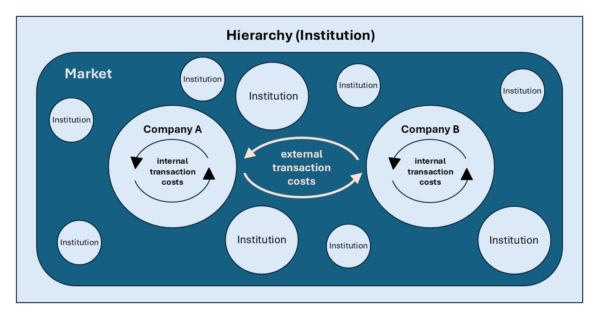
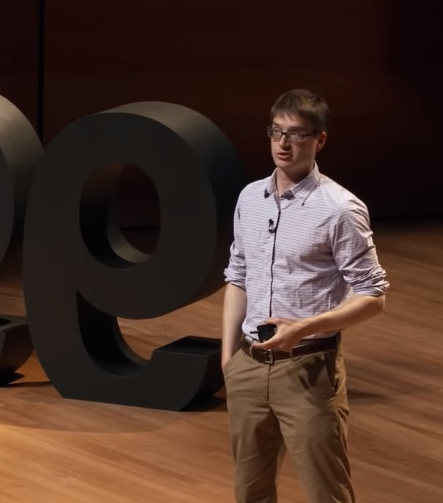

<!-- _class: lead -->

# Lecture 1: Drivers of change in digital work

---

<!-- _class: centered -->

To understand **changes in work**, we need to understand **changes in organizations**.

<!-- 
- same building (previously a factory, today a coworking space)
- major differences in worker protection: if a worker was injured 200 years ago, he was fired. If a worker is injured today, the manager may be fired.
- the modern office almost looks like a church, focus on empowerment and well-being of workers
- there are no production facilities, but books and digital devices (focus on knowledge work)
-->

--- 

# The historical development of work

<!-- The economy and it's revolutions -->

The first industrial revolution (1760-1830)
- Key technological developments: steam power, iron making, manufacturing machinery
- Work transitions from hand production methods to industrial production work supported by machines

The second industrial revolution (1870-1914)
- Key technological developments: scientific discoveries (patents), standardization, mass production
- Work is shaped by Taylorist principles, later referred to as "scientific management".

<!--

Ein ehemaliger Schulfreund von mir hat in Geschichte promoviert und wäre mit so einer verkürzten Darstellung sehr überrascht.
Also: ich lasse hier viel weg - was uns interessiert sind die großen Linien.
Wichtig: Viele große Organisationen und Managementprinzipien gehen auf bis in die Zeit zurück.

-> overview of key influences

Rationalisierung/Effizienz

- Focus: mass markets and standardization, large organizations, low bargaining power of employees, low skill requirements (for most workers)

logic: push-to-market
massive gains in productivity (chart?), frees up human labor

Not covered: Peter Drucker etc.
-->
---

# Taylorist principles

Named after Frederick Taylor (1865-1915)

1. Separate  the work of workers (efficient task completion) and managers (analysis, planning, training).
2. Use of the scientific method to study work and determine the most efficient way to perform specific tasks (instead of working based on common sense or rules of thumb).
3. Match workers to their jobs based on capability and train them to work at maximum efficiency (instead of hiring generalists with broad skill sets).
4. Monitor worker performance, and provide instructions to ensure that workers work in the most efficient way possible.

The principles have been criticized widely, but their influence on the organization of work is still visible.

<!-- 
influence: how organizations structure work, hierarchies , how we think about work

departemnt structures: division of labor
HR/hiring: selection of the best workers based on objective figures (such as years of experience) - maybe also influenced by unions
outcome-based compensation, 360 feedback -> objective selection/training

Context: low skill requirements/workers can be replaced quickly

-->

--- 

# Competitive strategies move beyond mass production

- Several markets are saturated by mass production in the 20th century. Demand for innovative, high quality products and services grows.
- Organizations adopt new competitive strategies (Porter 1985):
	- Cost leadership strategy (e.g., involving automation technology, and efficiency measures like Lean or Sig Sigma)
	- Differentiation strategy (e.g., focusing on high quality, and customer experience)
	- Focus strategy (e.g., focusing on customers with unique needs)

- Rising demand for highly skilled workers across industries

<!-- 

Lean/kanban: stop the line, all workers focus on solving the problem (all are involved, have to think beyond their individual areas)

Focus: can be a cost or differentiation focus

Porter, M. E. _[The Competitive Advantage: Creating and Sustaining Superior Performance](http://www.hbs.edu/faculty/product/193)_. NY: Free Press, 1985. (Republished with a new introduction, 1998.)
-> focus: niche markets

Ausdifferenzierung

Skills: industrial (production/automotive, chemical, ...)

TBD: Maybe as a back-up slide?

# Digitalization and the "flat world"

TODO : summarize key arguments of Friedman and ghemawat

Digitalization as a key driver
- "Flat-world hypothesis" vs. Ghemawat (scientific discourse as simple competing hypotheses) [[Hong2017a]]

-->

---

# Organizations

<!-- TBD: at one point, it may even be interesting to cover Institions (like banks, ... - trust and capital is important for work) -->

Organizations are a key innovation: As a legal entity, organizations acquire capital, organize work, and satisfy customer demands.

Different types of organizations often have different working cultures:

- Large industrial corporations
- Public companies (stocks owned by shareholders)
- Small-and-medium-sized enterprises (Germany)
- Startups
- Digital-native enterprises
- Freelancers

<!--
Can you think of examples?
-> e.g., how they deal with innovation

Discuss how each organization would develop/introduce a website

Still simplifying... but we could imagine that:

- large industrial corporation: No website for 200 years, then the marketing department has hired programmers who are in charge of the website (since 20 years)
- Public companies: public-relations with shareholders and investors are critical, all communication is controlled
- SME: B2B, no need for a website... - hard to change established approaches
- Startups/DNE/Freelancers: online as the first step. 
- Startups: investing to grow/scale, reach new customers, offer products/services
- DNE: Data/Web is their business. detailed analytics/optimization (clickthrough, etc.)
- Freelancers: using platform services, making quick adption decisions (if needed - see pandemic)

-->

---

<!-- _class: centered -->

**Key question**: Can we expect to work in larger or smaller organizations in the future? How can we explain the size of an organization?

---

# Transaction cost theory

- Assumption: organizations can either organize work in institutional **hierarchies** or source it from the **market**.
- Organizational size is then influenced by the balance of internal and external transaction costs.
- Transaction costs include *search and information costs*, *bargaining and decision costs*, and *pricing and enforcement costs*.
- Transaction costs vary across industries and value chains. Information and communication technology (ICT) often decrease transaction costs.

<!-- 
Example: Getränkehandel - Lieferservice intern oder extern? - 

Also a question of regulation/anti-trust laws/avoiding monopolies.

Capital: Haftung/liability

große Organisationen: Siemens, General Motors, General Electric Goldman Sachs, Wells Fargo...
-> Rahmenbedingungen für (digitale) Arbeit und Frage: warum arbeiten wir in kleinen Startups bzw. großen Unternehmen und wovon hängt die Größe ab, wie verändert sie sich?

Wie groß ist eine Organisation:

- TBD: mention/explain disintermediation (Kontext: Plattformisierung)?
- Technological possibilities: Replacement of organizational hierarchies with markets (communities and individuals), growing importance of individual workers (@Stabell1998)

Also: everyone can create content/offer services over the Internet

Key insight, emphasize: expect smaller organizations!
-> also depends on regulation (antitrust laws)

e.g., to hire a worker (-> taylorism):
Search/Information: pre-Internet: send an announcement to the newspapers (money + time), Internet: post online
Bargaining and decision: Pre-Internet: organize meetings with candidate/decision makers (time), Internet: Zoom-meeting
Pricing and enforcement cost: pre-Internet: personal control/monitoring, Internet: even screen recording/people analytics
-> pricing: the Internet also allows us to source services globally/take advantage of global labor arbitrage.
https://en.wikipedia.org/wiki/File:Market-Hierarchy-Model.png
-> replace company/institution by organization

---

Over the last decades, information and communication technologies (ICT) such as the Internet have emerged, which enable low-cost communication and e-commerce on a global scale.

**Question**:  As a result of these developments, would you expect organizations to grow or shrink?

 Can we expect to work in larger or smaller organizations?

TODO : prepare a clear message:
- it becomes much cheaper to find, contract, and monitor (control/trust) external partners (even individuals)
- as a result, we may expect even further shifts towards smaller organizations/growing importance of individual work (at the same time: growth of platform businesses that serve as mediators / may not always be regulated well)

-->

---

# The digital revolution

<!-- TBD: The third industrial revolution/the digital revolution? -->

- A shift towards differentiation and services (third sector)
- Ground-braking technology innovations, such as the Internet, e-commerce, and digital platforms
- Growing bargaining power of highly skilled workers (*war for talent*)
- New challenges, such as algorithmic management, and marginalization
- Disruptive changes in a highly connected world: dot-com boom, the 2007/8 financial crisis, COVID-19

How the digital revolution changes the nature of work (examples):
- Shift towards remote work
- Shorter cycles for updating skills
- Artificial Intelligence (AI) augments or replaces jobs

<!-- 
Shift towards remote work: interesting: 10-20 years ago, companies tried to persuade employees to "telework" (not successful). Today, employees ask for remote work.

- Organizational structures and management principles are often rooted in Taylorist assumptions (need to control, ...) - envisioning the future

https://en.wikipedia.org/wiki/File:Analog_to_digital_transition.jpg

war for talent: McKinsey

- Growing bargaining power: Ageing populations
- "Arbeite-wo-du-willst-Job"

Examples: teachers, doctors

Examples for other disruptions (???)
- COVID: digitalization (e.g., home-office, web-shops, contact tracing, ...)

- Innovation and customization require a shift from traditional modes of control (monitoring, incentivizing, and sanctioning employees) towards value (co)-creation, cooperation, innovation (Wiener 2019) 

- Taylorism -> New work (market demands)
- [New work](https://www.avantgarde-experts.de/de/magazin/new-work) [link-2](https://www.zukunftsinstitut.de/dossier/megatrend-new-work/), [trends](https://karrierebibel.de/zukunft-der-arbeit/)

[[Future of work]]
 

dot-com boom (e-commerce etc.)

Note : competition on price is still there! But differentiation has emerged
example: Mobility (demand-oriented, pull)
The digialization shift is not over. (e.g., Blockhchain...)
tertiarization
innovation
gig-work (Wang/dialectics?)
implicitly: more complexity! (maybe illustrate with a car/manufacturing example: in 1950, there were 100 steps to build a car, today, there are 1000 steps to build the front lights of a car)

Adoption of Facebook/...
Platforms

turbulence/disruptive competition
TBD: disruptive inovation? / competition after market saturation / replacement of jobs, ...
 -->

---

# Knowledge work

- Many professions increasingly involve knowledge work, and innovation is becoming a key driver of progress across industries
- Examples of knowledge workers: consultants, programmers, researchers, lawyers, pilots, and doctors
- Many of these professions aim to implement research innovations, adopt evidence-based practices, document compliance, and improve continuously
- The term "knowledge economy" is coined to illustrate the the production of goods and services is dominated by knowledge-intensive activities

<!-- 
knowledge work: need for generalists (moving away from an extreme division of labor) - craftsmanship / thinking in processes/outside the box
knowledge work focus: relevant for students/future jobs (although some believe "knowledge work" is not a useful distinction)

- Mention: digital technology/augmentation (e.g., drones for facility inspection, service logistics providers, coworking with robots, augmented reality, exoskelette, robot dogs)
TBD: cover blockchain? / decentralized workforce

- open work (open source, open innovation, ...)

Information Volume, overload, and the need to rethink (grant book)
 -->

---

<!-- _class: centered -->

**Question**: If you could shape the future, how should the future of work look like?

<!--
Should we work? -> **Maslow**: work: purpose/calling/self-fulfillment
TODO : maybe even add a chart of maslow: does work contradict self-fulfillment or should it coincide? What's the optimal time that people should work?

Mention: a little bit of an outlook

- challenges: Robots/AI/Automation taking care of many tasks (especially repetitive ones)
- What would the ideal world look like, what values would be important?
- How would you make it happen for yourself? Follow your passion?
-->

---

# The future of work: An economist's view

Raj Chetty (Harvard University) presents results from large-scale econometric analyses, using census data and data provided by Facebook (big data).

Findings:

- Upward mobility is declining: "90% of children born in 1940 grew up to earn more than their parents. Today, only half of all children earn more than their parents did." (Opportunity Insight)
- Implications for policy makers: Implement effective measures to reduce disparities (e.g., integrating disadvantaged people in small groups to interact with successful people).
- Suggestion: It is not a zero-sum game (all competing for a limited number of jobs), but a cake that can grow through entrepreneurship, and innovation.

<!--
upward mobility: the "American Dream"

entrepreneurship/innovation: many Einsteins lost

There is saturation in average job prospects (compared to previous generations, across the working population)

 https://www.spiegel.de/ausland/harvard-oekonom-raj-chetty-kontakte-zu-reicheren-sind-der-entscheidende-faktor-fuer-den-aufstieg-a-c98f9b76-2422-41fa-8468-9cc139761c0b -->

---

# The future of work: A philosopher's view

Key question: How *should* we work in the future, especially when automation will (partially) replace jobs?

The *new work* paradigm (Frithjof Bergmann, 1984) envisions new ways of working in the digital age. It is based on the values of autonomy, freedom, and participation.

Three pillars of new work

- Gainful employment
- Smart consumption (self sufficiency)
- Calling (doing what you really, really *want*)

<!-- 
Maslows pyramid of needs
 - idealy work should not be limited to safety: employment, but also address belonging, esteem, self-actualization (pushing ones boundaries)

How would we live if machines/automation/AI do all the work for us?
-> would we work at all?

smart consumption:
- saving resources
- easier to grow plants, fix/build things in smart environments

doing what you really want: life is short.

Mention that most issues raised in this lecture are part of a broader discourse (there are variations of positions)

Envisions centers for new work in which mentors help people to understand what they really want (e.g., art, ....)

https://newwork-newculture.dev/theorie/
Fokus: gesellschaftlicher Diskurs

Freiheit (Schaffen von Experimentierräumen, Schaffen einer Kultur der Angstfreiheit, starke Vernetzung innerhalb der Organisation)
Selbstverantwortung (Etablieren von Modellen der Selbstorganisation, Erweitern der Budget-Autorität, Etablieren von Beteiligungsmodellen)
Sinn („Arbeit, die man wirklich, wirklich will“, Erweitern des Wertschöpfungsbegriffs, Überprüfen von Strukturen und Prozessen)
Entwicklung (Etablieren kollektiver Lernstrukturen, Selbstreflexion der Organisation, Etablieren kollektiver Entscheidungsstrukturen)
Soziale Verantwortung (Ökologische und soziale Nachhaltigkeit, Regionales Engagement, Prinzip des Ehrbaren Kaufmanns)
https://de.wikipedia.org/wiki/Frithjof_Bergmann#New_Work
-->

---

# The future of work: A realist's view

Cal Newport (Professor, Georgetown University)

So Good They Can't Ignore You: Why Skills Trump Passion in the Quest for Work You Love (popular science book):

- Rule 1: Don't follow your passion.
- Rule 2: Be so good they can't ignore you.
- Rule 3: Turn down a promotion to take control.
- Rule 4: Think small, act big.

See [talk at 99U](https://www.youtube.com/watch?v=IIMu1PGbG-0)

<!--

- why not follow your passion?

	- no evidence that we have a lot of suitable passions in the first place
	- passion as a by-product of skill (rather than a pre-condition)
	- having a rare and valuable skill is necessary to gain autonomy
	- satisfaction depends on autonomy, competence, and relatedness (Self-determination theory)

- focused on knowledge work, 

Fokus: konkrete/individuelle Strategie

Passion is a side effect of skill/mastery

idea: matching skill and passion

think small, act big: 
- it is important to develop the overall vision
- you should not focus too much on specific jobs/positions
- it may be important to take risks, you have to do "self-marketing"

-> "follow your passion" can be a very risky approach ()

# https://calvinrosser.com/notes/so-good-they-cant-ignore-you/

TODO : TED talk?

-->

---

## Learning objective: 

Understand and explain the historical and contextual influences shaping digital work.

We covered:

- The industrial revolutions and scientific management
- The influence of more challenging competitive strategies
- Facets of the digital revolution
- Differences in organizational settings
- Three approaches to thinking about the future of work

<!-- 

Organizations as collections of capital
Organizations as collections of resources
Organizations as collections of contracts
Organizations as collections of knowledge

Workers fight for safe jobs, fair wages
Workers fight for social insurance and leisure
Workers fight for meaning (self-fulfillment) and flexibility

It all depends on the industry (there are low-paying jobs that require no knowledge)

- MENTION Examples/imporant to make associations with the contents in the rest of the lecture.

Fragen/Ergänzungen?
-->

---

<!-- _class: overview_all -->

<!--
Mention that this is actually how I organized the course structure
- The result of this exercise should correspond to the structure of the lecture!
-->

---

<!-- _class: centered -->

## Next week: Digital work individually - Basics of individual digital work