<!-- _class: lead -->

# Lecture 2: Digital work individually

# Basics of digital work

--- 

<!-- _class: overview_part_2 -->

<!-- 
Start: summarize last session, summarize the main things that students would like to learn.
-->
---

# Learning objectives

- Familiarize with skill classifications related to digital work.
- Apply and adapt Getting-Things-Done as an exemplary method.
- Appreciate processes and principles of organizing digital work effectively.

 <!-- when facing different challenges. -->

--- 

<!-- _class: centered -->

# Warm-up question

- What's different about digital? Which skills do we need for digital work?

<!--
TODO : how to organize the skill reponses?

Historically, capital was a key restriction to construct production facilities

- Our perspective is one of "digital natives". Many are "digital immigrants".
- Computational thinking: **introduced by ..., calling for ...**
- Thinking digitally mans... ?

TBD: source for these different thinking paradigms?
	- changing capabilities (e.g., AI: machines/objects become actors that sense and interact (internet of things), augmented reality: pokemon-go (hard to understand by digital immigrants), unprecedented roles: algorithmic management, block-chain: making a contract with the air-bnb-lock)
	- zero-cost copying (e.g., digital content, open-source infrastructure (databases, servers), ...)
	- zero-cost testing (e.g., crash-tests with cars vs. unit/pen-testing, affordance of software/digital artifacts to try things (cannot break the Internet))
	- low-cost malleability
	- platform logic (size/network effects, rapid adoption, chicken-egg problems)
	- data is valuable (???)

TBD: add stats to digital natives/immigrants?

The humans-operate-machines paradigm changes - do you know examples? (Uber, AI-training, ...)
-> the algorithm instructs, monitors, evaluates.
-> not a lot of rules for that world where the algorithm is your boss (or how a human supervisor should use algorithms in evaluation)
TODO : recherche zu airbnb-smart-lock-blockchain-contract story

copying: the cost of the components (server, content-management-system, web-shop extension, databases): mostly zero (very different from a factory/assemply line that requires a lot of capital) -> lower barriers to entry!

testing: my grandma was afraid of breaking the Internet or operating a computer.
digital systems are often designed in a robust way/self-explanatory...
-->

--- 

# Digital work competences

Frameworks that *describe and classify* digital competences (selection):

- Digital competence framework for EU citizens
- Multiple case study and grounded theory by Weritz (2022)
- Review of prior research: Gagné-Pratte et al. (2022)

<!--

Methode: wie würden Sie vorgehen, um einen Überblick skills und Kompetenzen für digitale Arbeit zu erstellen?
-> evtl. auf Bergmann/Newport beziehen: teilw. sehr einseitige Vorschläge, Vorteil der Literaturübersicht: ausgewogenes Bild
maybe illustrate how the inductive data analysis worked? (connect to the "checking quality of data" - excel errors / robust environments like git, ...)

-->

---

# The European Digital Competence Framework for Citizens (DigComp)

A supra-national policy-making perspective:

- Around 40% of the EU population have insufficient digital skills
- Differences in digital skills are a barrier to equal participation
- Among people with no digital skills, 42% are inactive in the labor market

Goals: establish a common understanding of digital skills and how to assess them.

Supports wider EU policy objectives: efforts to boost jobs, growth, and investment, creating a single digital market, and getting young people into jobs.

Development: consultation process involving experts, scientists, and stakeholders.

<!-- 
Being digitally competent is more than being able to use the latest smart phone or computer software — it is about being able to use such digital technologies in a
critical, collaborative and creative way. This is why DigComp asks people to think about a range of issues such as storing information, protecting their digital identity,
developing digital content and ‘Netiquette’.

-> how policy-making/supranational organizations are concerned with digital work (connections between research and policy making)

two-year research and 
-->

---

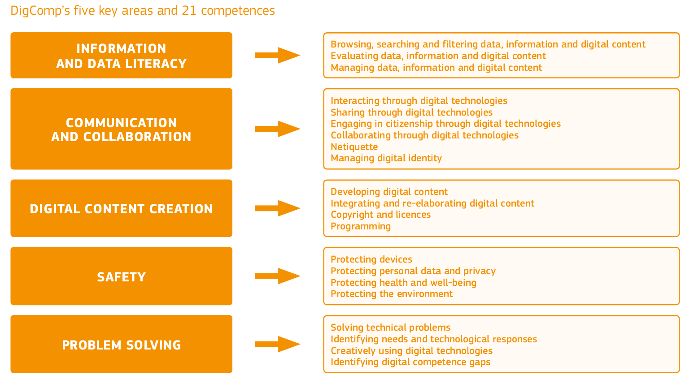

<!-- 
Surprised to find safety? -> typically considered an organizational task
-> but: more and more the responsibility of users
-> security requires technical and organizational and individual measures
-> IT also requires individual skills/attention (e.g., freelancers, knowledge workers like researchers or medical doctors: -> e.g., newborn section: no passwords/or you take responsibility for dead babies. -> protected )

-> "Reengineering the process" vs. facilitating the work of knowledge workers

Find examples/challenges/methods for each item
-->

---

<!-- _class: centered -->

# Exercise

Complete the [DigComp](https://digcomp.digital-competence.eu/) test and reflect on the skill frameworks. Where do your strengths lie? Where are potential gaps?

<!-- 
TODO : prepare mentimeter

Also ask: what is covered by the curriculum/where are the gaps?
 Where do you want to know more?

feed the most wanted items into next years course!)
Self-assessment (mentimeter): where do you see your strengths/areas for improvement, what is still missing in the curriculum? -->

---

# An empirical study

Published by Weritz (2022) in *Administrative Sciences*.

Research question:

- What are the critical future skills of employees in the digital workplace?

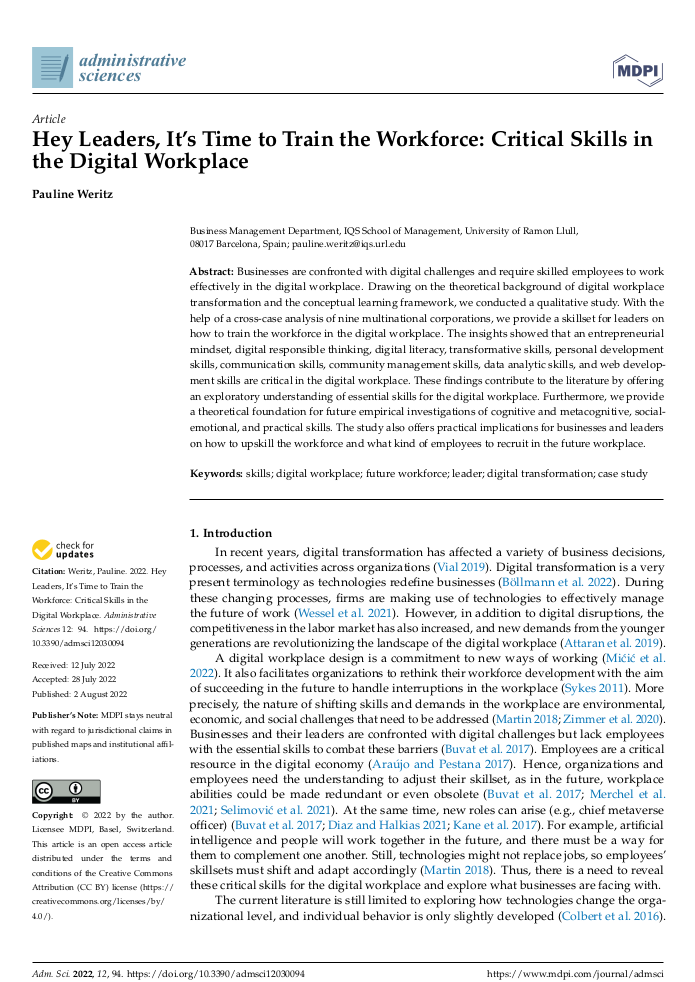

---

**Methods**

- Multiple case studies in nine multi-national corporations
- Interviews with open questions
- Inductive analysis (grounded theory) to let the insights *emerge* from the data in three steps:
	- (1) develop first-order codes from the interviews,
	- (2) process the codes into second-order themes, and
	- (3) create aggregated dimensions.

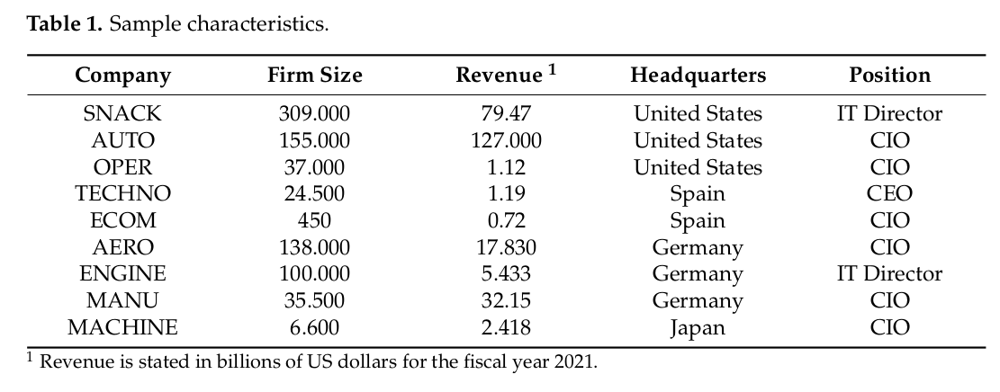

---

**Results (1)**

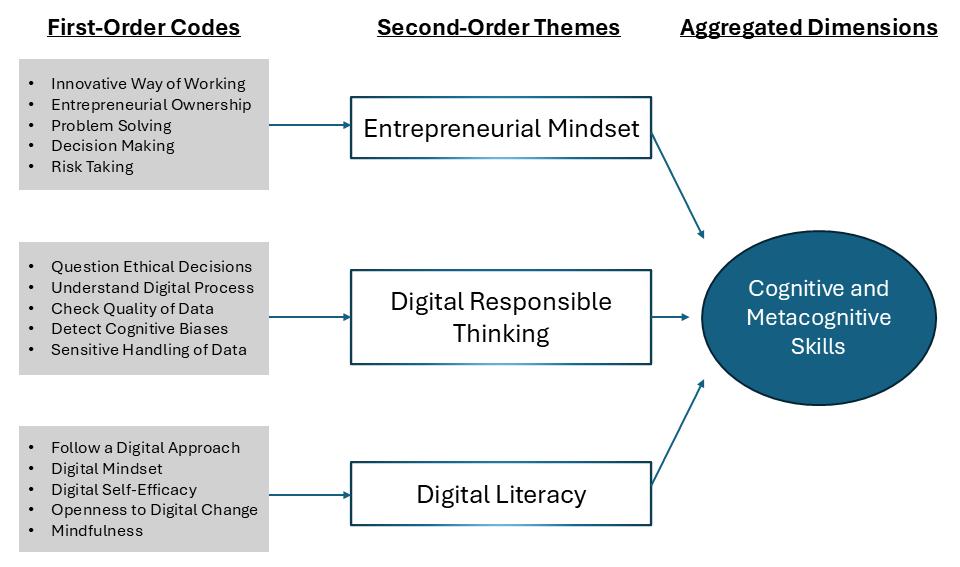

<!-- 
self-efficacy: Selbstwirksamkeitserwartung, kurz SWE, bezeichnet das Vertrauen einer Person, aufgrund eigener Kompetenzen gewünschte Handlungen auch in Extremsituationen erfolgreich selbst ausführen zu können.
-->

---

**Results (2)**

---

**Results (3)**

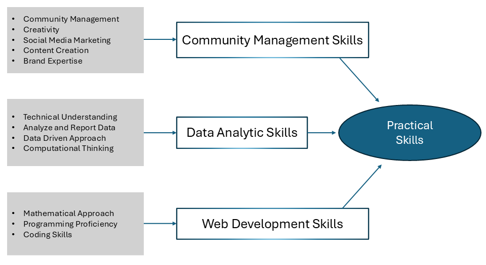

<!-- 
Implications: 
- appreciate the skills required
- provide training to facilitate the workforce transition to digital
-->

---

<!-- _class: centered -->

# Question

What are the strengths and limitations of the study?

<!-- 
TODO : add Implications for practice
-->

---

**Strengths**

- Empirical data collected from key informants
- Covers different organizations (multiple cases)
- Transparent reporting of the data analysis

**Limitations**

- Focused on large corporations, maybe startups have different requirements
- Informants recruited exclusively from C-level positions
- Data analysis completed by one individual author (other authors may reach different conclusions)

<!--
Learning-objective critical thinking

Some themes may be categorized differently. e.g., mindfulness -> social skill?, difference between coding and programming?

Potential criticism
-->

---

# A review of prior research

Published by Gagné-Pratte et al. (2022)

Research Question

- What are the required competencies to lead in the digital business environment?

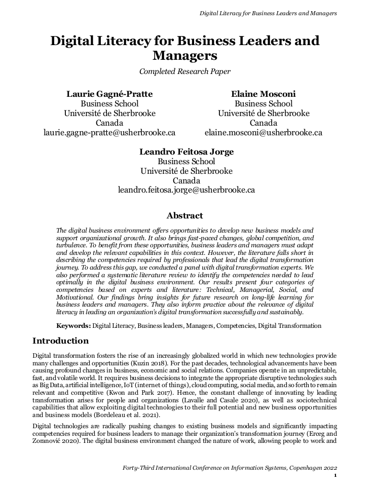

---

**Methods**

- Expert panel to identify **overarching categories**: technical, managerial, social, and motivational
- Search for relevant papers in three databases (ABI/INFORM, EBSCOhost, and Scopus) with the following search string (simplified):

(Digital literacy OR Skills OR Competencies OR Capabilities OR Capacities OR Digital Savvy) **AND**
(Manager OR Leader OR CEO OR CIO OR CTO OR Top Management OR Director OR Executive) **AND**
(Digital transformation OR Digital Era OR Digitalization OR Digitisation OR Smart Company)

- Screening for relevant papers: Out of 459 papers, 76 are retained in the final sample
- Content analysis to synthesize competencies based on the overarching categories 

<!-- 
Search string: illustrate ven-diagram (blackboard)
-> information retrieval skill!
-->

---

### Results  on "Digital Technical Competencies and Abilities" (extract)

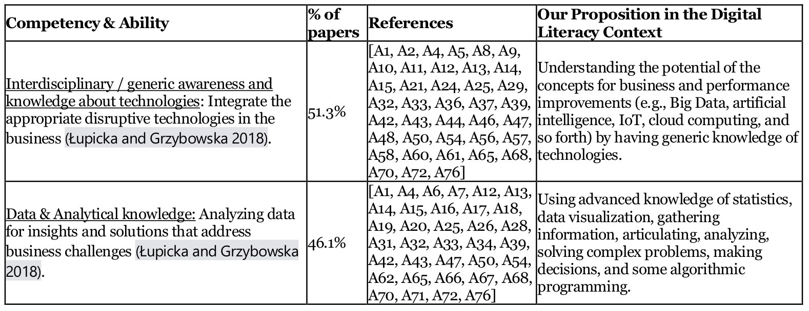

<!-- 
- Very comprehensive
- Definitions, connections to prior work
- Frequency (indication of prevalence)
-->

---

### Digital Technical Competencies and Abilities

Overall: 13 items, including

- Interdisciplinary / generic awareness and knowledge about technologies
- Data and analytical knowledge
- Knowledge management
- Information technology knowledge and abilities
- Digital security
- Organizational and external context understanding
- Resources management
- Computer programming / coding abilities

<!-- 
- Specialized knowledge of activities and processes
- Sensing and research skills
- Knowledge of field, legal and ethical basis
- Social media capabilities
- Ability to attract investment for the project implementation
 -->

---

### Digital Managerial Competencies and Abilities

Overall: 16 items, including

- Strategic scanning and intelligence
- Innovation and creativity
- Adaptability and flexibility
- Active digital innovation skills
- Entrepreneurial thinking
- Decision making
- Accepting change / change management
- Problem solving
- Critical thinking
<!-- 
- Dynamic capability
- Change, risk, and crisis management
- Inquisitive mindset
- Set and manage control
- Efficiency orientation
- Planning skills / organization
- Intuition
 -->

---

### Digital Social Competencies and Abilities

Overall: 12 items, including:

- Communication skills
- Ability to be compromising and cooperative
- Ability to work in a team
- Agility
- Diversity and intercultural relations
- Ability to transfer knowledge
- Networking abilities
<!-- 
- Inolvement and empowerment
- Customer awareness
- Emotional intelligence
- Facilitation, negotiation, and conflict resolution
- Inter-generational relations
 -->

---

### Digital Motivational Competencies and Abilities

Overall: 10 items, including:

- Leadership skills
- Innovative Practice and success driven
- Vision-setting, strategy development, and goal attainment
- Psychological readiness for change and constant self-development
- Influence and persuasion
- Self-discipline and self-confidence
- Courageous and risk-taking
<!-- 
- Role modeling
- Credibility and trust
- Self-assessment
 -->

---

|Dimension   | 
DigComp (EU)
  | 
Weritz (2022)
  | 
Gagné-Pratte et al. (2022) 
 |   
|-------------|---|---|---|
| Focus    |   |   |   |   
| Research design   |   |   |   |   
| Principal findings      | | | 
| Target audience    |   |   |   |   

<!-- 
TBD: comparisons between frameworks?
-> EU: connected to action
-> reviews of prior research: disclose the process/more objective?

CREATE A TABLE? (examples: DigComp, Weritz, Pratte)
- method
- principal findings (skills)
- limitations/strengths: repeat after each study and in the table.

-> emphasize differences between the two reviews: inductive (emergent structure) vs. deductive (a-priori structure)
-> will be important in obsidian!
-->

---

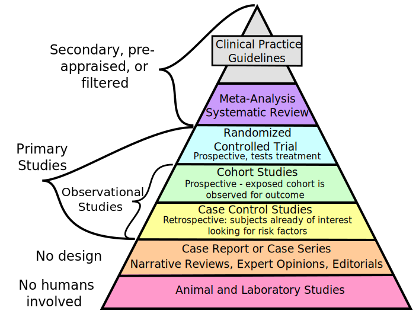

# Research designs

The *hierarchy of evidence* provides a useful point of reference to compare research designs 

- Expert opinions, and individual case studies provide low-quality evidence
- Primary studies provide moderate evidence
- Systematic reviews (meta-analyses) provide high-quality evidence (across studies)

<!-- 
experiments/randomized controlled trials

It is important to evaluate the method. "Published by scientists" is not enough

-->

---

<!-- _class: centered -->

# Recap and break

<!-- 
You should
- Know the high-level areas of the EU-framework DigComp
- Give examples of the categories and familiarize with the terminology related to different skill areas and abilities
- Distinguish corresponding research designs and research foci (you can refer to the hierarchy of evidence)

Dont memorize all the categories and abilities

-->

---

<!-- _class: centered -->

# Warm-up question 

Which methods do you know for organizing work, time, priorities, or flows of information?

---

# Overview of methods

- Deep work
- Pomodoro (management of time and concentration)
- Eisenhower matrix (priorities)
- Checklists or standard operating procedures (repetitive and critical tasks)
- Bullet journaling (priorities and tracking habits)
- Getting-things-done (time, priorities, and information flows)
- Emergent knowledge management systems (individual knowledge management)

<!--
Theoretical models (next session)
 - Personal information-management effectiveness model (PIME) (information management)

checklists/SOP:  as a part of GTD that has a more substantive background/Gawande 
 (TBD: have students write a good checklist in small groups?)

Eisenhower matrix: motivate the idea of on-paper notes/

4. Alternativen:  
4.1 Super Focus Methode
- Ursprünglich eine Methode für Notizblock und Stift, aber auch gut in die Digitale Welt übertragbar
- Ziel dieser Methode:
Balance zwischen der Bearbeitung von einfachen und komplexen und von dringenden und nicht dringenden Aufgaben (Eisenhower-Prinzip)
Angefangene Aufgaben werden abgeschlossen
- Aufgaben auf einer Zweispaltigen Liste eintragen
- In die erste spalten kommen alle neuen und nicht zeitkritischen Aufgaben erfasst
- In der zweiten Spalte werden dringende noch nicht begonnene Aufgaben erfasst
- Wenn die zweite Spalte erledigt ist, springt man zur ersten Spalte
- Alle erledigten Aufgaben werden durchgestrichen auf der Liste
- Digitale Umsetzung: Word-Liste, Notes, Pages, Notion
Erzeugt Gefühl eines Fortschritts und schüttet Glückshormone aus
4.2 Ohio Prinzip 
- „Only handle it once“ (was einmal in die Hand genommen wird, wird auch erledigt)
- Besonders geeignet für E-Mail Management
- Jede E-Mail soll anhand der Betreff Zeile entweder gleich beantwortet werden oder zu einem späteren Zeitpunkt, jedoch soll die E-Mail nur einmal geöffnet werden
4.3 43 Folders Methode
- Veraltete Methode, noch physisch basiert
- 43 Fächer in einer Mappe (12 für die Monate im Jahr und 31 für die Tage im Monat)
- Alle Aufgaben und die jeweiligen Dokumente sollen dem jeweiligen Kalendertag zugeordnet werden, sodass man am Vorabend schon weiß, was am nächsten Tag ansteht
- Am letzten Tag im Monat werden aus der Monats- in die Tagesmappe umsortiert
- Viel Disziplin erforderlich
- Nur planbare Aufgaben mit physischen / digitalen Dokumenten möglich
- Digitale Umsetzung: Ordner auf dem Desktop erstellen und auch Outlook Ordner System benutzen 
4.4 Strikethru
  - Stufenweise aufgebautes system
- Mehr Funktionen stehen zur Verfügung und verkomplizieren das System
- es gibt zwei Arten von Listen:
- Live-Liste: für Aufgaben, an denen im Moment gearbeitet wird (max. 9 Aufgaben)
- Tresor: mit thematischen Listen, wie z.B. Woche, Monat, Ziele, Wunschzettel, etc.
- Man soll bei Strikethru immer in der Live-Liste arbeiten, entweder verschiebt man Aufgaben oder erstellt eine neeue Live-Liste.
- Tresor Augaben müssen auch immer in die Live-Liste verschoben werden
- Digitale Umsetzung: kann man sehr gut "Wunderlist" oder "Erinnerung" auf dem iPhone verwenden

5. Checklisten
- Definition: "Methode zur systematischen Gestaltung von Entscheidungsprozessen. Alle entscheidungsrelevanten Faktoren werden übersichtlich in Listen zusammengestellt. In ähnlich gelagerten Entscheidungssituationen werden diese Checklisten wiederum als Hilfsmittel herangezogen und dabei ergänzt und korrigiert. Durch Kumulation von Erfahrungen sollen Prüflisten entstehen, die alle für die Entscheidungssituation wesentlichen Faktoren enthalten."

https://wirtschaftslexikon.gabler.de/definition/checklistenverfahren-27389/version-251045

  - Methode:
- die Erfassung des Ist-Zustands
- die Dokumentation des Soll-Zustands
- die Einhaltung und Steuerung eines vorgegebenen Prozesses also vom Ist-Zustand zum Soll-Zustand
- Eisenhower Methodik
- Vorteile:
- Arbeitsschritte werden nicht übersehen bzw. vergessen
- vereinbarte Elemente werden bearbeitet oder überprüft
- Ist-Zustände werden dokumentiert
- erwartete Ergebnisse werden produziert

TBD:
- Continuous learning (platforms, micro-certifications)
- Self management/promotion (maybe even mention open-source project contributions/signalling?, developing technology (diffusion of technology/computational techniques into all areas of knowledge work)/training-materials related to the work area)
-->
---

# Methods for organizing digital work

- There are no scientific methods for organizing digital work.
- GoogleTrends provides an indication of key methods.

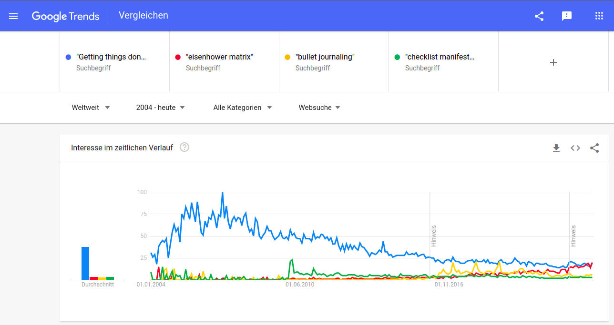

<!-- 
No "comprehensive methods"
Mention the short overview of other methods at the end
-->

---

# Focused Session on Getting-Things-Done (GTD)

- Introduced by David Allen (practitioner, productivity consultant) in 2001 
- A detailed productivity system to organize personal tasks, set priorities, and manage time.
- Assumptions:
	- Organizing work is an important part of knowledge work
	- Personal priorities can be hard to specify - they emerge and change
	- The goal is to organize work and enable people to clarify their priorities

<!-- 
the approach is relatively comprehensive and detailed.

like a workflow/how to organize and make decisions

goal/bottom-up: overwhelming, ...

Bottom-up approach: organizing work and input and support the development and change of priorities (thinking at different levels)
Other approaches require people to have clear priorities from the beginning
-->

---

# The core process of GTD

1. **Collect** things that command our attention
2. **Process** what they mean and what to do about them
3. **Organize** the result
4. **Review** the results as options for what we choose to do
5. **Do**

<!-- 

Praktiker-Methode

- Digital or physical lists ("the system")

 - GTD (building on the knowledge acquired as a homework) [check](https://www.udemy.com/course/29-big-ideas-for-getting-things-done/) and [2](https://www.udemy.com/course/how-to-implement-a-getting-things-done-system-from-scratch/) and [rezeption](https://de.wikipedia.org/wiki/Getting_Things_Done#Rezeption), discuss difference between orga>priorities vs. priorities>orga approaches 
-->

---

# GTD: Collect

- Clarify the different inboxes (digital and physical)
- Feed everything into the system
- Benefit: clearing your mind ("collecting open loops")

<!-- 
-> what are typical inboxes?

Have one place (not all over the desk/computer)
How do we treat messengers, voice mail, files on your harddrive, links in your browser
-->

---

# GTD: Process and organize

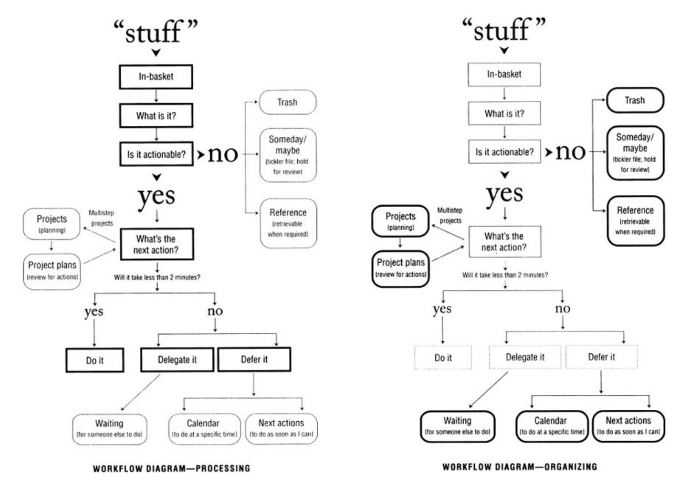

<!--
process model...

Different lists/elements of the system

Lists:
- next-actions: office, calls, agendas
- someday-maybe
- projects
- waiting-for (email: self-cc)
- reference material
- calendar

-> How would you organize those lists in your systems/digitally?

-->

---

# GTD: Do and review

- To decide what to do, check the calendar, and then the action lists, based on the following criteria:

	1. Context (office, phone, meeting)
	2. Time available
	3. Energy available
	4. Priority

- Regularly review the system (weekly, monthly, annual), and priorities, based on different horizons of focus: Projects > Areas of focus and acountability > One- to two-year goals and objectives   > Three- to five-year vision > Purpose and principles

<!-- 
make key decisions on fridays: compare commitments/time available
Use checklists/templates for reviews

mention: agenda
interesting: priority last?

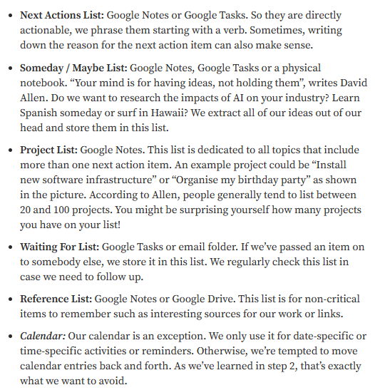

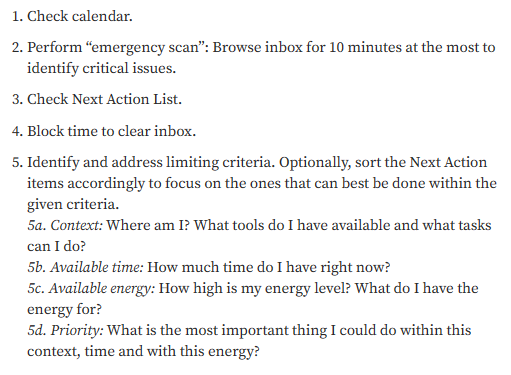

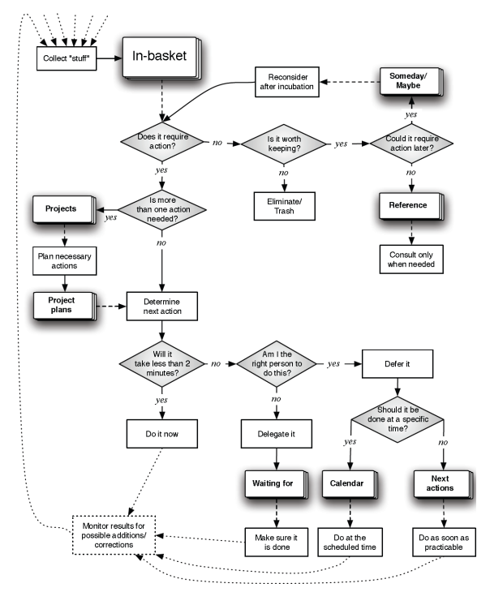

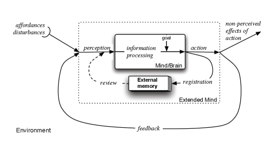

Schritt 1 „Collecting“:

Ziel: Nicht soll vergessen werden
Alle Dokumente, Notizen, Gedanken, Ideen und to-Dos in einer „Inbox“ ablegen.
Es können mehrere „Inboxen“ mit verschiedenen Zwecken.
Schritt 2 „Clearing“: 
Ziel: Ordnung in das Chaos bringen
Hier sollen Entscheidungen und Priorisierungen getroffen werden, um alle Dokumente in eine Ordnung zu bringen.
Hierfür können mehrere „Inboxen“ angelegt werden, um einen guten Überblick zu bekommen.
Für diesen Schritt gibt es noch 2 grundlegende Regeln:
1. 2-Minuten Regel: Wenn eine Aufgabe unter 2 Minuten erledig werden kann, soll dies unmittelbar geschehen
2. Nie etwas zurück in die „Inbox“ legen: Wenn man eine Aufgabe beginnt, sollte man sie unmittelbar erledigen und nicht wieder pausieren
Schritt 3 „Organising“:  
Ziel: Die übrigen Aufgaben werden zugeordnet
Nach dem „clearing“ ordnen wir die restlichen Aufgaben verschiedenen Listen mit einem bestimmten Zweck zu.
Der Begriff „done“ muss auch für einen selbst definiert werden und wann man Aufgaben von der Liste nehmen kann.
Diese Listen können benutzt werden mit den zugehörigen besten Apps dafür: Abbildung 3
Wenn Schritt 2 und 3 öfters wiederholt werden, kann man schneller Aufgaben direkt Listen zuordnen ohne zuerst alles in die gleiche „Inbox“ zu legen

Schritt 4 „Refelcting“:
Ziel: Immer einen Überblick behalten
Wöchentliche Review Sessions sind in diesem Schritt sehr wichtig, diese Sessions sollten immer am gleichen Tag geschehen und am selben Ort (entweder im GTD System oder in einem externen System, das genutzt wird).
Diese Review Sessions helfen dir die vergangene Woche zu reflektieren und zu sehen was die kommende Woche ansteht.
Hier ist ein Beispiel für eine Wöchentliche Review Checkliste:  
Abbildung 4 

Schritt 5 „Getting Things Done“:
Ziel: Aufgaben erledigen
Hier werden nun die Aufgaben zur richtigen Zeit am richtigen Ort erledigt.
Für diesen Schritt sind Daily Reviews am Anfang des Tages sehr nützlich, um die Aufgaben möglichst effizient zu erledigen.
Beispiel für eine tägliche review Checkliste:
Abbildung 5
Für den Review täglich oder wöchentlich sollte mindestens 60-90 Minuten eingeplant werden 

1.2 Getting Things Done: The Science behind Stress-Free Productivity (Quelle Science Direct)
- GTD ist simpel und felxibel um Aufgaben und AKtivitäten zu organisieren
- hilft die persönliche Produktivität zu maximieren
- hilft dabei nichts zu vergessen, was man im Kopf hat, da man es sofort dokumentiert
- Gleiche Schritte und Beschreibung, wie bei 1.1 nur anderee Abbildung
-->

---

<!-- _class: centered -->

# Excercise and talk

[David Allen's TED Talk: "Are your out of your mind?"](https://www.ted.com/talks/david_allen_are_you_out_of_your_mind)

<!--
TODO : discuss principles, how you could apply/adapt GTD

# Exercise on GTD

# AND/OR TED Talk

Input: LT

- mentimeter: do you use a formal work organization method? is it fully digital? what is physical?
- Open questions: who has completed an internship/works as a student? Would GTD be helpful?

(**EXCERCISE**? Maybe suggest different items and have students vote/mentimeter on how to deal with them (some items may need to be splitted, which gives us a starting point for discussion) - or discuss the different steps? maybe have students examine different flow diagrams and check what's consistent, whats missing/added?)
-->

---

# Evidence on GTD

Almost no scientific evidence, but Heylighen and Vidal (2008) discuss cognitive paradigms applicable to GTD:

- Externalizing memory (see illustration)
- Stigmergic action (registering information in an "actionable" form to stimulate action)
- Situated action (depending on context, bundling similar tasks, and avoiding disruption)
- Adapting is more important than planning
- Organizing from the bottom-up
- Using feedback to keep on track (checking tasks done)

<!-- 
sigmergy: indirect coordination (through traces in the environment)

situated action: select the right tasks for each context, bundle similar tasks, avoid switching/disruption

feedback: checking things off a list when they are done.

- But: Prominent in practice
- Principles (study from long-range planning)

 - research should study actual practices and possibly offer improvements

Kognitive Pradigmen in der Anwenung auf GDP:
- Feststellung, dass Abb. 7 eine vereinfachte Version von Abb. 6 angesehen werden kann, wobei verschiedenen externe Speicher zu einem einzigen zusammengefaßt wurden. Die Störungen in Abb. 7 sind einfach das im In-Korb von Abb. 6 gesammelt wird.
- GTD Innovationen in der kybernetisch-kognitive Sichtweise:
  - Gedächtnis Externalisierung:
- so viel wie möglich aus dem eigenen Kopf in ein vertrauenswürdiges externes Gedächtnis zu bringen, z.B. indem man es auf Papier oder in eine Computerdatei schreibt
-> führt zu weniger Stress Gefühl, da das Arbeits- und Langzeitgedächtnis "geleert" wird
- Stigmerisches Handeln:
- So viele Informationen wie möglich in einer "handlungsfähigen" Form registrieren sollten, d.h. in einer Weise, die Sie zum Handeln anregt
-> entspricht der Wahrnehmungs- und Handlungslogik, die der situierten Kognition oder kybernetische Kontrolle
- GTD mach Aktionen/Elemente handhabbar, indem es in mehrere Kategorien eingeteilt wird: Nächste Aktion → Ausführen, Projekt → Planen, Irgendwann/vielleicht → Überdenken
- Gezielte Aktionen:
- Entscheidungen zur Durchführung einer Handlung ist von der Situation abhängig,
bspw. von den örtlichen Umständen
- ähnlich zur 2-Minuten-Regel: wenn eine Aufgabe nicht länger als 2 Minuten dauert, wird sie sofort erledigt
- Mentale Kontexte müssen bei der zeitlichen Verzögerung von Aufgaben nochmals neu geknüpft werden -> dauert länger
- Anpassen ist wichitger als planen:
- GTD legt keinen Wert auf Priorisierung, Meilensteine oder Termine
- Alle Verpflichtungen werden festgehalten und dann wird entschiedn, welche durchgeführt werden soll, ohne zu weit in die Zukunft zu schauen
- Der Planungsmodus der bei GTD benutzt wird ist locker un flexibel, ähnlcih wie beim Brainstorming-Ansatz
- Organisierung von unten nach oben
- bei GTD werden Aktivitäten immer von unten dokumnetiert und nicht gleich das gesamte obere Ziel
- von abstrakten, idealistischen Zielen arbeitet man sich bis zu ihrer konkreten Umsetzung vor
- Prioritäten können nochmals neu definiert werden, wenn man merkt, dass das Ziel nicht erreichbar ist
- Feedback, um auf Kurs zu bleiben:
- GTD vermittelt ein Gefühl von Gesamtzwecken und nicht von einzelnen Aufgaben ohne Zusammenhang
- erhalten von konkretem Feedback und die Genugtuung, dass Sie vorankommen

Referenzprüfung:
- Hollan, J., Hutchins, E. and Kirsh, D. (2000): Distributed cognition, ACM Transactions on Computer-Human Interaction 7:2, p. 74-196.:

- Mit den neuen Möglichkeiten der Kommunikation und Interaktion steht der Bereich der Mensch-Computer-Interaktion vor der schwierigen Herausforderung, komplexe Aufgaben zu unterstützen, vernetzte Interaktionen zu vermitteln und die ständig wachsende Verfügbarkeit digitaler Informationen zu verwalten und zu nutzen
- Um menschliche kognitive Leistungen zu verstehen und effektive Mensch-Computer-Interaktionen zu gestalten, ist es wichtig, die Natur dieser Prozessverteilungen zu verstehen
- Die Ethnographie bietet clevere Wege, Dinge zu erledigen, die in neue Entwürfe einfließen können, es können neue Verwendungsmöglichkeiten für alte Strategien gefunden werden, und Techniken, die sich in einer bestimmten Umgebung bewährt haben, können auf eine andere übertragen werden
- Experimente können die Theorie der verteilten Kognition verfeinern, die ihrerseits zur Verbesserung des Designs eingesetzt werden kann
- Da der Designprozess neue Werkzeuge für Arbeitsplätze schafft, gibt es neue Strukturen und Interaktionen zu untersuchen

3. Aktuelle Studien:
- Es existieren keine empirischen Studien die sich mit der Wirksamkeit der GTD Methode beschäftigt
- Getting Things Done: The Science behind Stress-Free Productivity von Francis Heylighen und Clement Vidal (Im Kapitel 1.2 behandelt): die Erkenntnisse der Psychologie und Erkenntniswissenschaft bestärkt und unterstützt die GTD-Methode
-->
<!--
---

## Exercise and homework

Exercise: Input: LT

reflection scenario: if you were to adopt GTD in your current work system, how would you do it, what would you change and which challenges (misfits) would you see, how would you extend it?

## Übungs Ideen  
- Übung zur Eisenhower-Methodik oder generell zu Getting Things Done:
am Beispiel von der Prüfungssituation von Studenten:
- Welche Aufgaben stehen an:
- Prüfungsanmeldung
- Prüfungs Vorbereitung
- Prüfung schreiben
- Welche Dokumente kann man benutzen: (Beispiele suche ich noch bis zu dem Termin am Dienstag zusammen)
- Online Seite des Prüfungsamtes
- Prüfungstermin Dokument
- Screenshot E-Mail von der Fachschaft oder Studienberater
- Vorlesungsunterlagen und Übungsunterlagen
- Screenshot von FlexNow zur Prüfungsanmeldung
- Anfrage von Altklausuren, bei der Fachschaft?
- Prüfungstermin
- Erstellung von Fragen für einen Checklisten Fragenkatalog:
am Beispiel von Programmierung:
- Welche Fragen stelle ich mir beim programmieren? -> Fragen für die Checkliste
- Beispielprozesse und Fragen:
- Mit was muss / soll ich programmieren? -> Programmiersprache wählen und Program
- Was soll programiert werden? -> Verfassen von einer Outline vllt auch eigene
Checkliste erstellen
- Was soll mein Code später ausführen? -> Funktionen die eingebaut werden sollen
aufschreiben und in die Outline einbauen
Code wurde geschrieben:
- Sind alle Funktionen inbegriffen? -> Code review
- Funktioniert mein code? -> Code durchlaufen lassen
- Sind Fehler vorhanden? -> Code vllt umschreiben
Code wird gespeichert
-->

---

# Recap

- Familiarize with skill classifications related to digital work
- Apply and adapt Getting-Things-Done as an exemplary method
- Appreciate processes and principles of organizing digital work effectively

---

## Materials

Allen, David (2001). Getting Things Done: The Art of Stress-Free Productivity. Penguin Books.

European Union, DigComp Framework, available at:
[https://joint-research-centre.ec.europa.eu/digcomp/digcomp-framework_en](https://joint-research-centre.ec.europa.eu/digcomp/digcomp-framework_en).

Gagné-Pratte, L., Mosconi, E., & Jorge, L. F. (2022). Digital Literacy for Business Leaders and Managers. In: *International Conference on Information Systems*. [Link](https://aisel.aisnet.org/icis2022/digit_nxt_gen/digit_nxt_gen/13/)

Weritz, P. (2022). Hey leaders, It’s time to train the workforce: Critical skills in the digital workplace. *Administrative Sciences*, 12(3), 94. doi: [10.3390/admsci12030094](https://doi.org/10.3390/admsci12030094).

<!--
(clearly distinguish between simple starting points and longer books/materials): GTD ted talk;  [Udemy: Get Things Done: 29 BIG Ideas For Getting Things Done](https://www.udemy.com/course/29-big-ideas-for-getting-things-done/), GTD book

brainstorm: skills/challenges (apps, techniques)

Think: digital literacy? / information retrieval on the internet (fact checking?)

**JP**: emergent knowledge  management tools etc. : eher excellence?

- Organizing work efficiently and effectively, without erorrs, the digital workplace
- Methods: self-commitment devices, GTD, checklists, ..., e-mail strategies (interesting dialectic papers? MiddletonCukier2006)
- continuous learning / micro-certifications
- pull information/vigilance/anticipation

Include knowledge work/knowledge database

- Data quality checks (Excel)?

Distinguish individual digital work from classical organizational work? (wrt. data/process/standardization questions)
- BPM vs. checklists/SOP (did not receive a lot of attention)
- SQL vs. Excel (how to?)
- Encoding knowledge in the system (repeatability) vs. curating a knowledge database for on-demand reuse/recombination
- Industry standards (ISO...) vs. best practices
-->
