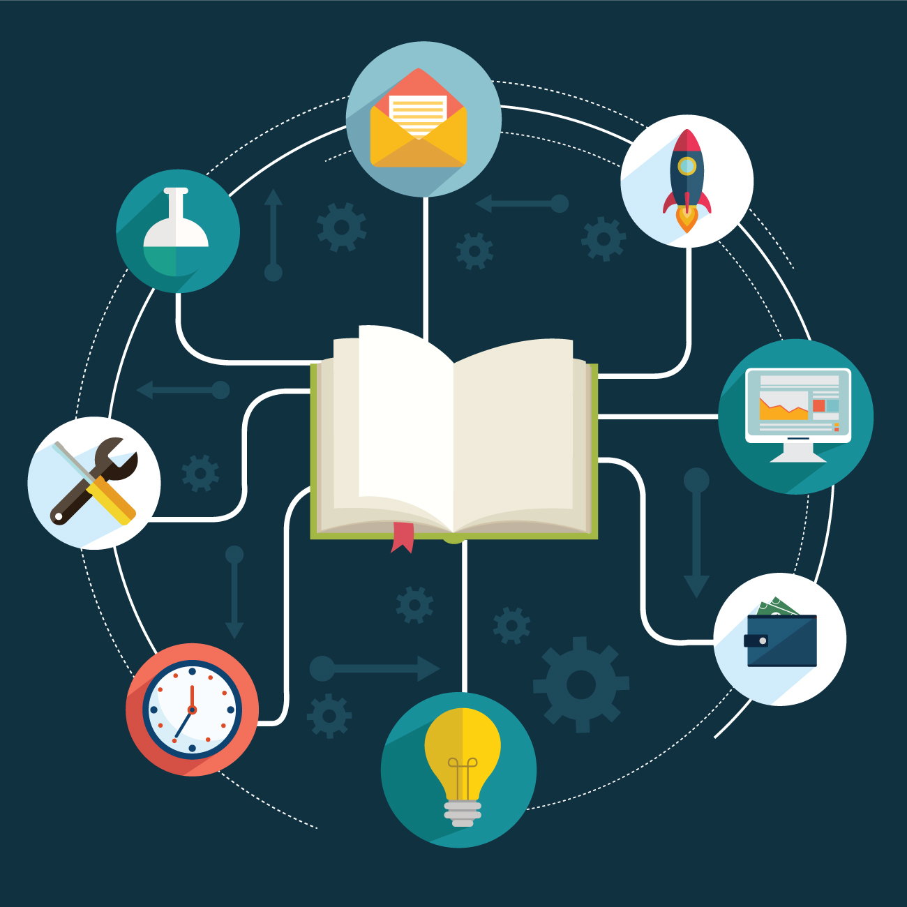

<!-- _class: lead -->

# Lecture 3 - Digital work individually

# Personal information management

<!-- - The digital workplace -->

---

<!-- _class: overview_part_2 -->

---

# Learning objective

- Familiarize with key constructs of personal information management effectiveness and appreciate their association with job performance
- Describe the key principles of second-brain approaches and create an interconnected knowledge repository

---

# Personal Information Management Effectiveness

- Effective personal information management (behaviors) as a key element to organizational knowledge management
- Lack of insights on the dimensions of PIM and the effect of PIM on job performance
- Foundational framework and model development

---

# Conceptual framework

---

# Development of PIM dimensions and sub-dimensions

---

# PIME: Methods

- Survey of 352 knowledge workers employed in a healthcare insurance company in the US
- Based on the following instrument (structured questions)

---

# PIME: Results

> - **Effects**: Coefficients (β) how the *direction and strength* of relationships (positive = increase, negative = decrease). *p-values* indicate *significance* (typically marked with *, **, ***).
> - **Explained variables**: *R² (R-squared)* % of *variance explained* by the model (closer to 1 = better fit).  

<!-- [[HwangKettingerYi2015]] -->

---

# PIME: Questions

- How do you interpret the results?
- How would you rate the quality of evidence provided by the study?
- In which jobs are the different motivations more prevalent?
- Which tools and practices are relevant for the sensing and maintaining capabilities?

---

<!-- _class: centered -->

# Break

Download and install [obsidian](https://obsidian.md/) on your personal or CIP machine

---

# Focus session: Organizing knowledge

- How would you organize a digital knowledge repository?
- How would you measure its effectiveness?

---

# Digital Gardening

Historical origins: Luhmann's Zettelkasten (70 books, 400 papers)

Principles:

- Information heterarchy
- Atomicity of notes
- Serendipity

Information heterarchies allow for bidirectional links between resources, supporting serendipitous emergence of connections. 
In contrast, classical hierarchies such digital folders, require items to be assigned to one category exclusively.

> Also known as *second brain* approaches.

---

# Introduction: Obsidian

- Exemplary personal knowledge management application
- Supports emergent data structures and associations ("second brain" approaches)
- Based on open data standards (markdown) and extensible

---

# Obsidian 101

- Atomic notes (and lists or documents)
- Backlinks (using ``[[concept-name]]``)
- Graph view (to visualize backlink-associations)
- Canvas (mindmaps)
- Tags

Note: backlinks can be visualized in the right pane ("link mentions")

---

# Practice session: Case description

Lisa is an Information Systems student at Otto-Friedrich-University Bamberg. Her goal is to focus on programming and modelling skills, as well as languages. She plans to participate in all mandatory courses offered in the Bachelor's program and most of her goals can be covered by courses at the university. However, in some cases, the curriculum does not cover the goals Lisa has set for herself. In these cases, she considers to participate in extra-curricular activities or online courses.

Information, including notes and files, could either be organized according to the curriculum (courses to take) or Lisa's own goals (skills to learn). When information is structured according to the curriculum, it may be less transparent how the different elements align with the intended goals. Vice versa, when implementing a structure that primarily mirrors the goals, she may risk missing mandatory courses.

This is a typical case in which a second-brain approach, or an information heterarchy, can be helpful.

---

# Setup

To explore how second-brain approaches work in practice, we transfer Lisa's case to an obsidian vault (i.e., repository), using the files provided in the VC course.

As a preliminary step, [download the materials](https://download-directory.github.io/?url=https%3A%2F%2Fgithub.com%2Fdigital-work-lab%2Fdigital-work-lecture%2Ftree%2Fmain%2Fexercises%2Fobsidian_exercise), and move them to a new obsidian vault. Briefly explore the contents of the files and familiarize with the obsidian functionality.

---

# Step 1: Set goals

<!-- Lisa’s plan is to participate in all mandatory courses (such as introductory ones), but in the following,  -->

First, our focus is on formulating the main goals.

- Create a markdown file for the overview of goals.
- Create backlinks for the skill nodes (modeling, programming, Spanish).
- Check how the graph view changes.
- Next, navigate to the modeling note, expand the right column (displaying linked and unlinked mentions).
- Check whether the suggested notes are relevant, and add them to the modeling skill (in a new section of the document: ``# Relevant courses``).
- Repeat the process for the other skills (programming and Spanish). Add complementary courses if necessary.

---

# Step 2: Assess the courses

Next, we focus on the courses

- Create a markdown file for the overview of courses.
- Drag-and-drop course notes to create backlinks.
- Create three semester sections and assign the courses. Use `ctrl`+hover to identify dependencies.
- Open the graph view and validate the associations.

---

 
# Step 3: Make plans

Next, we would like to create a canvas as a more stable structural representation that connects to the different notes.

- Create a canvas named `Courses and semesters`
- Drag-and-drop the courses to the Canvas.
- Create connections illustrating the dependencies (courses to be taken together/in sequence).
- Assign each course to one of the three semesters (by creating groups).
- Add the goals to the canvas and connect them to the requisite courses.

> Note: The notes for goals and courses and the semester canvas is available [here](https://download-directory.github.io/?url=https%3A%2F%2Fgithub.com%2Fdigital-work-lab%2Fdigital-work-lecture%2Ftree%2Fmain%2Fexercises%2Fobsidian_exercise_solution).

<!-- 
## Aufgabenstellung Bonuspunkte:
At the end of this semester will be a written exam. For this exam are the lecture contents and exercises important. 
As a preparation you shall model the most important aspects and their dependencies from lecture one, two and three, as well as the exercises.
Use the last exercise with the university example as a point of reference.

Part 1: Setting goals
Create a markdown file for the overview of lectures (a list of backlinks) and briefly summarize each lecture and exercise in the backlined node
Read through the contents of lectures and exercises as well as your personal notes and annotate the relevant contents (skills) using backlinks

Part 2: Assess the lectures:
If there are contents that need to be researched, list the sources, and used contents that you have used (e.g., online courses, or by reading)

Part 3: Making plans
The contents have to be assigned to a lecture
Add all the lectures to the canvas and create links

Using digital tools and assistants (examples: ...) and developing/adapting them (especially when they are new)
Brainstorm with students: how could bots support obsidian, e.g., 

- tech. quality: spell-checking/broken links/formatting and coding standards
- Information quality: notifications related to incomplete items/stale items/suggestion of mechanisms (such as putting things into comments to simplify the graph),
- Supporting the exploration of new materials (clustering, ...)
-->

---

<!-- _class: centered -->

# Short video

[How a software developer advocate uses Obsidian for work](https://www.youtube.com/watch?v=D7e1ud_Dk24)

--- 

<!-- _class: centered -->

# Recap

- Familiarize with key constructs of personal information management effectiveness and appreciate their association with job performance
- Describe the key principles of second-brain approaches and create an interconnected knowledge repository

---

## Material

Ahrens, S. (2022). How to take smart notes: One simple technique to boost writing, learning and thinking. Sönke Ahrens.

Hwang, Y., Kettinger, W. J., & Yi, M. Y. (2015). Personal information management effectiveness of knowledge workers: conceptual development and empirical validation. *European Journal of Information Systems*, 24(6), 588-606.