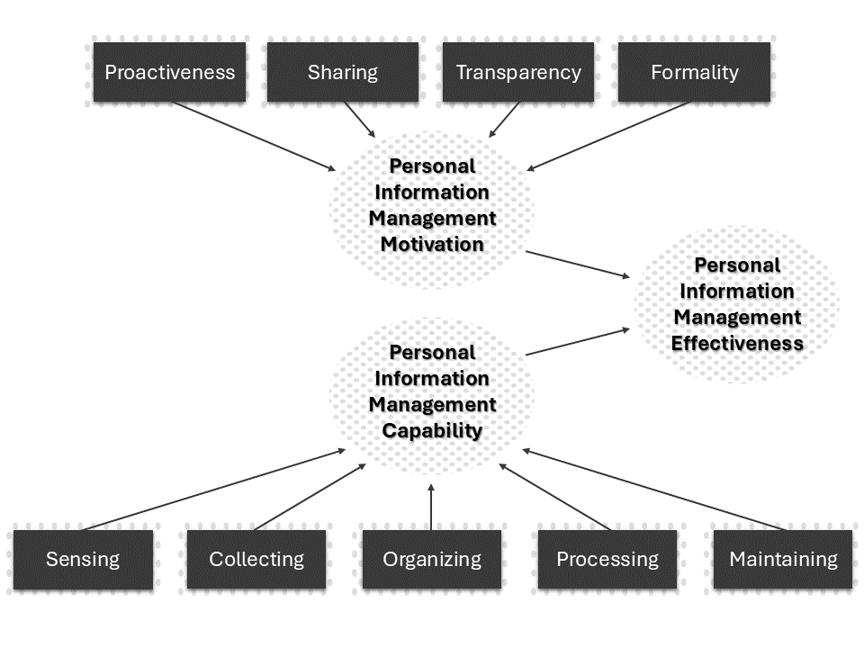

<!-- _class: lead -->

# Lecture 3 - Digital work individually

# Personal information management

<!-- - The digital workplace -->

---

<!-- _class: overview_part_2 -->

<!-- 
TODO : recap the last session (open questions)
 -->

---

# Learning objective

- Familiarize with key constructs of personal information management effectiveness and appreciate their association with job performance
- Describe the key principles of second-brain approaches and create an interconnected knowledge repository

<!--

Our focus is on the high-level elements to expect and how to interpret the results. We do not focus on completing or evaluating the statistical analyses.

Identify key concepts in digital workplaces, explain them in a generalizable way, and describe examples of work practices.

Start with an open question: what counts in organizing digital workplace (more generally/beyond following specific processes like GTD)? 

--- 

## The digital workplace

- Objective: explain effective personal information management based on the PIME model and understand the different steps of the empirical study.

In the following: jump between the paper and the slides
-->

---

# Personal Information Management Effectiveness

- Effective personal information management (behaviors) as a key element to organizational knowledge management
- Lack of insights on the dimensions of PIM and the effect of PIM on job performance
- Foundational framework and model development

<!--
- Background: Highlight that managing information is a key part of digital/knowledge work
Introduce elements of an empirical study (intro/background, model or theory/hypotheses, methods, results, discussion)
-->

---

# Conceptual framework

<!-- - Model development: the conceptual framework (figure 1), the synthesis of concepts from prior research (including definitions), the hypotheses (the full model) -->

---

# Development of PIM dimensions and sub-dimensions

 <!-- based on prior literature -->

---

# PIME: Methods

- Survey of 352 knowledge workers employed in a healthcare insurance company in the US
- Based on the following instrument (structured questions)
<!--
instruments: partially new
(participants/demographics (population?), instruments: look at the appendix for an example)
 - Introduce variables (definitions and what students would expect in each dimension) -->

---

# PIME: Results

<!-- 
- Results: effect sizes (usually standardized/comparable - but better check)/significance (-> likely to result from chance?), explained variance, control variables (same as the other variable,s but ok if they are non-significant)
(ask: how would you interpret the model (before explaining the elements to students)) -->
<!-- [[HwangKettingerYi2015]] -->

---

# PIME: Questions

- How do you interpret the results?
- How would you rate the quality of evidence provided by the study?
- In which jobs are the different motivations more prevalent?
- Which tools and practices are relevant for the sensing and maintaining capabilities?

<!-- 
Selbstwahrnehmung und Korrelation (statt Experiment/klinischer Studie und Kausalität)

- Discussion/implications: TODO (check)
	- Critically discuss the study (correlation/limited knowledge on an intervention, self-reported ("compared to my co-worker, I perform well in my job overall..."))
	- Highlight generalizability (independence of particular technologies)
	- Interesting variables like proactiveness, sensing, processing, ...
	- Conceptual categories need to be translated into applications or practices

---

## PIME: Application

# TBD: we already covered collecting/organizing/processing in GTD??!?!

| PIME Capability | Practices    | Applications |
|-----------------|--------------|--------------|
| Sensing         |              |              |
| Collecting      |              |              |
| Organizing      |              |              |
| Processing      |              |              |
| Maintaining     |              |              |

**Task**: Form groups of three and fill out the table. What examples of applications and practices  for each capability?

Afterwards: extend the discussion to cover the broader workspace (collaboration, non-distraction environments, physical-digital workspaces)

Sensing:
- Practice: regularly (reading particular magazines, talking to people, listening to podcasts), setting up monitors to be notified of changes
- Applications: changedetection.io, ...
-> generally: applying a coding/testing mindset to organizing work/life (e.g., know when your websites are not available to proactively reach out/know what happens when customers ask, also query websites for particular events such as "coworking space closed today/construction works and noise" - to prevent unnecessary commutes/ monitor for twitter events/trends - have a coding/testing mindset, e.g., for academia: know what your colleagues publish, in marketing: know when competitors launch new campaigns, generally: sense fluctuation in demand)
Collecting: TODO
Organizing: TODO
Processing: TODO
Maintaining: TODO	

Ask students to read the paper (maybe skip a few elements in the methods/discussion)

## Beyond PIME

Think of applications and practices that are important in your work but not listed in the table. What are they and to which conceptual category do they belong?
-->

---

<!-- _class: centered -->

# Break

Download and install [obsidian](https://obsidian.md/) on your personal or CIP machine

<!-- Note : obsidian can be installed in CIP pool computers -->

---

# Focus session: Organizing knowledge

- How would you organize a digital knowledge repository?
- How would you know or measure whether its effectiveness?

<!-- 
Evernote, Wikis, ...

Effectiveness: how it facilitates retrieval/knowledge recombination/output, how much it frees up mental capacity

Interesting: the PIME/organizing refers to "classifying" (a notion of MECE) instead of second-brain approaches

Knowledge is a key asset.
Mentimeter:
- who organizes his/her knowledge in a systematic way?
- how do you organize you knowledge, which principles/systems do you use?
- how much room for improvement do you see?

E.g., mindmapping: how useful is if if we can't connect it to existing structures, refine it at more granular/higher levels?

- Start a mindmap exercise at the whiteboard, ask students about the key challenges and how they could be addressed by digital work methods/technology (state that this unorganized overload of information is typical for knowledge work/when starting a job).
- TBD: have students work in teams?
Better: make students think about how they would re-use/retrieve the materials from this lecture later on (e.g., in their job)
-> remembering in which slide can be challenging.
-> BUT: if we have organized it in a linear fasion, it is hard to extend it, connect it, and really get value out of it.

-  Raise the question of how to organize that kind of knowledge/information. Illustrate that entering everything in excel is not helpful because there are no connections/it is difficult to organize and retrieve information). - **TBD: maybe explain the principles in the next session?**

-->

---

# Second brain approaches

Historical origins: Luhmann's Zettelkasten (70 books, 400 papers)

Principles:

- Information heterarchy
- Atomicity of notes
- Serendipity

Information heterarchies allow for bidirectional links between resources, supporting serendipituous emergence of connections. 
In contrast, classical hierarchies such digital folders, require items to be assigned to one category exclusively.

<!--
Luhmann: extraordinary output (without a lot of phd students)
-> "Theorie der Gesellschaft; Laufzeit: 30 Jahre; Kosten: keine" https://www.ndr.de/geschichte/koepfe/Niklas-Luhmann-Der-Mann-mit-dem-Zettelkasten,luhmann100.html
Principles go back to Luhmann's Zettelkasten (Luhmann: sociologist who published 70 books and 400 papers, 90.000 index cards (on paper), worth millions of Euros)

Illustrate the notes (1, 2,3, adding 1a,1b, adding links)

Heterarchies: powerful when knowledge is complex, changes fast, and needs to be recombined (not useful for control/separation of concerns/MECE)

- (multiple representation formats and search cues)
-serendipity: unplanned fortunate discovery through multiple options for retrieval/analysis/associations (e.g., links, backlinks, tags, graph view, canvas)

Compare: excel/wiki

and autonomy 

- Exploratory affordances/flexibility of search perspectives

- Individual knowledge management (mention obsidian as an example of an emergent knowledge management tool  - explain the benefits, such as emergence of associations, multiple retrieval paths, ... -> key consideration in knowledge management: knowledge reuse -> hard to anticipate how we will search for the knowledge....)

https://neuron.zettel.page/atomic#:~:text=The%20principle%20of%20atomicity%3A%20The,and%20comprehensible%20on%20its%20own.
https://neuron.zettel.page/heterarchy
[[Personal Knowledge Management System]]

- Suggest that the Internet (hyperlinked content) is pretty efficient, and then introduce obsidian as a relatively new/trending tool.
- Suggest to students that obsidian would also be a great example to prepare for exams (maybe even announce a reflection exercise at the end?)
 -->

---

# Introduction: Obsidian

- Exemplary personal knowledge management application
- Supports emergent data structures and associations ("second brain" approaches)
- Based on open data standards (markdown) and extensible

<!-- 
Illustrate markdown!

simple versioning
see [[obsidian]]
Obsidian (and similar tools): gaining in popularity
-->
<!-- 

---

# Markdown 101

TODO

- headings, lists, links, embeddings (figures, files, videos, formulas), comments, versioning

Other use cases: open-source documentation (e.g., on Github), academic writing, presentations.
TODO : add links
 -->

---

# Obsidian 101

- Atomic notes (and lists or documents)
- Backlinks (using ``[[concept-name]]``)
- Graph view (to visualize backlink-associations)
- Canvas (mindmaps)
- Tags

Note: backlinks can be visualized in the right pane ("link mentions")

<!-- 
- Show backlink - click on it to create new
- Show graph view in split-mode
- Show linked/unlinked mentions
- Show canvas

Live illustration
[[obsidian]]

- provide a shot introduction into markdown/backlinks
- Mention: for literature reviews/theses (demonstrate: one window for writing/one for the notes)

- Start a (obsidian-based) mind-map (explain markdown syntax, especially links), similar to the seminar and ideally showcasing the emergence of concepts/structures (what are the challenges/how should we prepare?) interactively and then provide an intro into obsidian (managing a personal knowledge database).

- show [obsidian docs](https://help.obsidian.md/Obsidian/Index), interactive graph on the top right
 
# Obsidian Research
## Best Practice für Knoten, Tags, etc.
- Es bestehen keine generellen best pratcices für den Aufbau, die Bennenung von Objekten oder sonstigen
- Es gibt von bestimmten Personen Tipps für Anfänger zum Aufbau der Obsidian App
- Es gibt auch Erklärungsvideos auf Youtube für Obsidian, hier sind ein paar Links zu relativ guten Erklärungsvideos:
- Erstes Video von einer Obsidian Serie: https://www.youtube.com/watch?v=svqJ8BUh8mU
- Ein Starter Video: https://www.youtube.com/watch?v=QgbLb6QCK88
- Vergleichsvideo von Obsidian mit Notion: https://www.youtube.com/watch?v=PNxr3KdiWac
-->

---

# Practice session: Case description

Lisa is an Information Systems student at Otto-Friedrich-University Bamberg. Her goal is to focus on programming and modelling skills, as well as languages. She plans to participate in all mandatory courses offered in the Bachelor's program and most of her goals can be covered by courses at the university. However, in some cases, the curriculum does not cover the goals Lisa has set for herself. In these cases, she considers to participate in extra-curricular activities or online courses.

Information, including notes and files, could either be organized according to the curriculum (courses to take) or Lisa's own goals (skills to learn). When information is structured according to the curriculum, it may be less transparent how the different elements align with the intended goals. Vice versa, when implementing a structure that primarily mirrors the goals, she may risk missing mandatory courses.

This is a typical case in which a second-brain approach, or an information heterarchy, can be helpful.

---

# Setup

To explore how second-brain approaches work in practice, we transfer Lisa's case to an obsidian vault (i.e., repository), using the files provided in the VC course.

As a preliminary step, [download the materials](https://download-directory.github.io/?url=https%3A%2F%2Fgithub.com%2Fdigital-work-lab%2Fdigital-work-lecture%2Ftree%2Fmain%2Fexercises%2Fobsidian_exercise), and move them to a new obsidian vault. Briefly explore the contents of the files and familiarize with the obsidian functionality.

<!-- These are the steps that need to be taken to get organized using markdown, canvas, and obsidian. -->

---

# Step 1: Set goals

<!-- Lisa’s plan is to participate in all mandatory courses (such as introductory ones), but in the following,  -->

First, our focus is on formulating the main goals.

- Create a markdown file for the overview of goals.
- Create backlinks for the skill nodes (modeling, programming, Spanish).
- Check how the graph view changes.
- Next, navigate to the modeling note, expand the right column (displaying linked and unlinked mentions).
- Check whether the suggested notes are relevant, and add them to the modeling skill (in a new section of the document: ``# Relevant courses``).
- Repeat the process for the other skills (programming and Spanish). Add complementary courses if necessary.

<!-- 
Note: Now, we have a classical hierarchy. But the links/serendipity of obsidian was already useful
-->
---

# Step 2: Assess the courses

Next, we focus on the courses

- Create a markdown file for the overview of courses.
- Drag-and-drop course notes to create backlinks.
- Create three semester sections and assign the courses. Use `ctrl`+hover to identify dependencies.
- Open the graph view and validate the associations.

<!-- 
The list of courses is provided (as markdown files). Read through the contents and annotate the relevant contents (skills) using backlinks
-> If there are skills that cannot be covered by the university, suggest how Lisa could acquire those skills (e.g., complementary courses, or online materials)
-->

---

# Step 3: Make plans

Next, we would like to create a canvas as a more stable structural representation that connects to the different notes.

- Create a canvas named `Courses and semesters`
- Drag-and-drop the courses to the Canvas.
- Create connections illustrating the dependencies (courses to be taken together/in sequence).
- Assign each course to one of the three semesters (by creating groups).
- Add the goals to the canvas and connect them to the requisite courses.

<!-- 
The courses must be assigned to a semester. Remember that for some courses there are specific requirements (e.g., in the 3rd semester or later, required courses that need to be passed beforehand)
-> After all the preparation, please prepare a plan for Lisa. Add the courses to the canvas, create links, group the university courses into Semesters and assign the complementary courses (depending on availability/time).

## Aufgabenstellung Bonuspunkte:
At the end of this semester will be a written exam. For this exam are the lecture contents and exercises important. 
As a preparation you shall model the most important aspects and their dependencies from lecture one, two and three, as well as the exercises.
Use the last exercise with the university example as a point of reference.

Part 1: Setting goals
Create a markdown file for the overview of lectures (a list of backlinks) and briefly summarize each lecture and exercise in the backlined node
Read through the contents of lectures and exercises as well as your personal notes and annotate the relevant contents (skills) using backlinks

Part 2: Assess the lectures:
If there are contents that need to be researched, list the sources, and used contents that you have used (e.g., online courses, or by reading)

Part 3: Making plans
The contents have to be assigned to a lecture
Add all the lectures to the canvas and create links

Using digital tools and assistants (examples: ...) and developing/adapting them (especially when they are new)
Brainstorm with students: how could bots support obsidian, e.g., 

- tech. quality: spell-checking/broken links/formatting and coding standards
- Information quality: notifications related to incomplete items/stale items/suggestion of mechanisms (such as putting things into comments to simplify the graph),
- Supporting the exploration of new materials (clustering, ...)
-->

---

<!-- _class: centered -->

# Short video

[How a software developer advocate uses Obsidian for work](https://www.youtube.com/watch?v=D7e1ud_Dk24)

--- 

<!-- _class: centered -->

# Recap

- Familiarize with key constructs of personal information management effectiveness and appreciate their association with job performance
- Describe the key principles of second-brain approaches and create an interconnected knowledge repository

---

## Material

Ahrens, S. (2022). How to take smart notes: One simple technique to boost writing, learning and thinking. Sönke Ahrens.

Hwang, Y., Kettinger, W. J., & Yi, M. Y. (2015). Personal information management effectiveness of knowledge workers: conceptual development and empirical validation. *European Journal of Information Systems*, 24(6), 588-606.