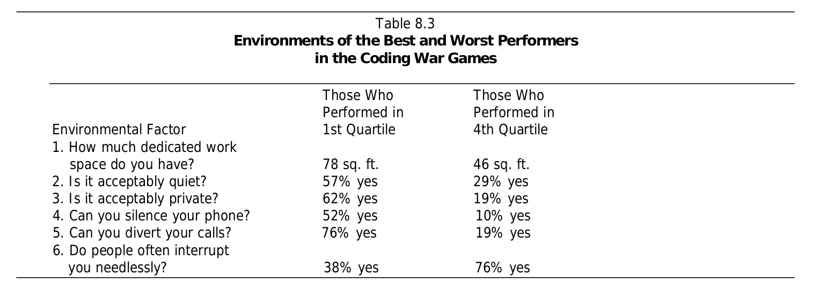
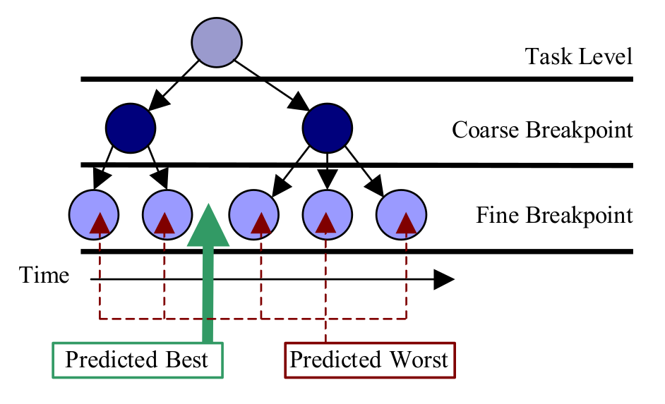
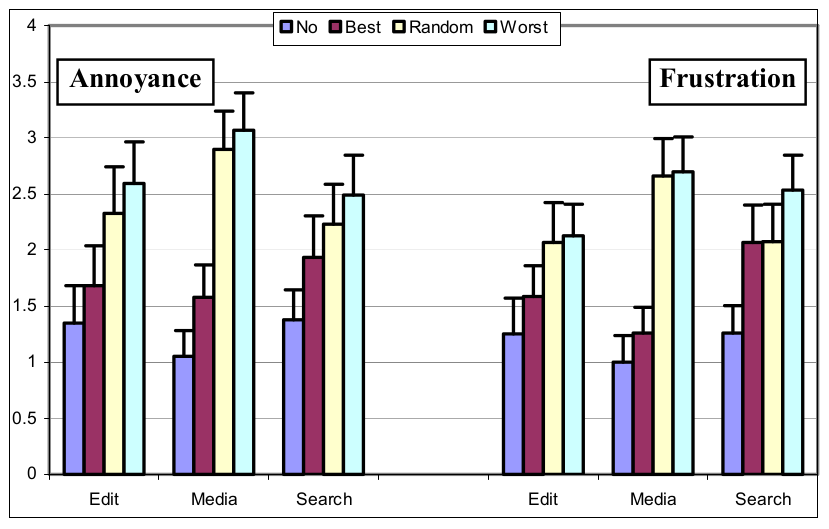
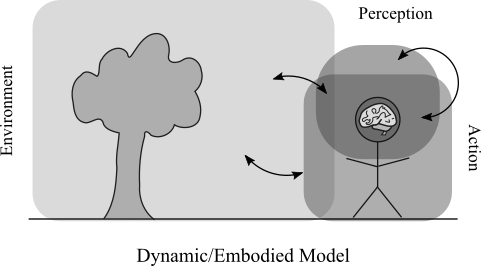
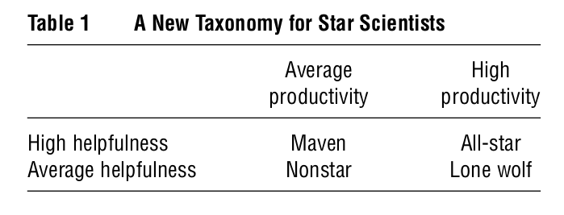
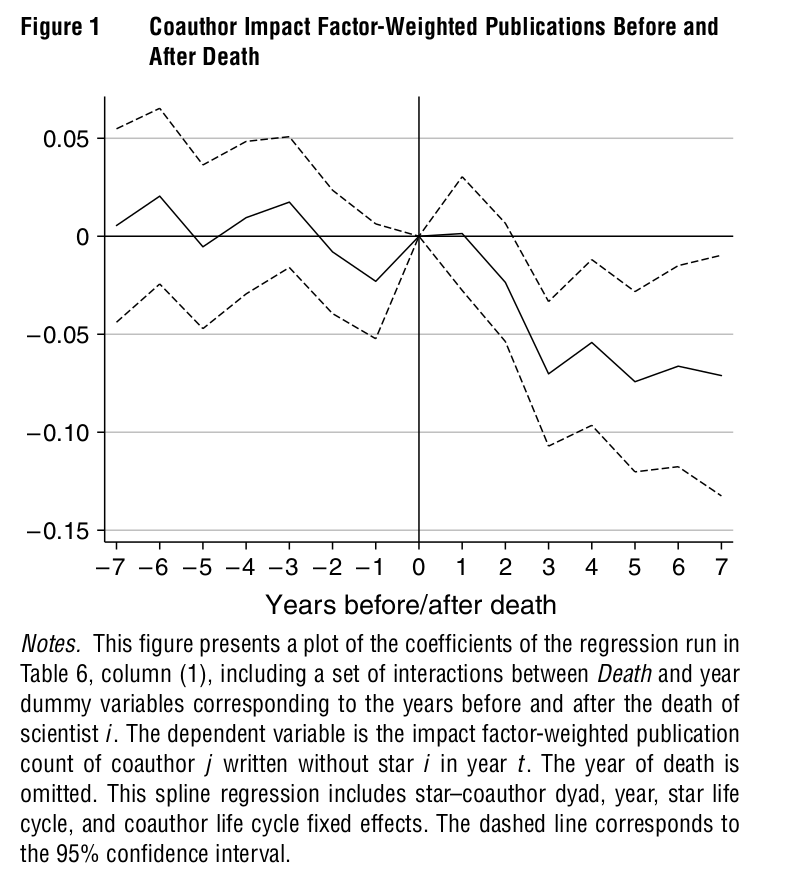

<!-- _class: lead -->

# Lecture 4 - Digital work individually

# The pursuit of excellence

<!-- Or: The pursuit of excellence -->

---

<!-- _class: overview_part_2 -->

---

# Learning objective

- Gain an overview of the discourse surrounding excellent work performance at the individual level.
- Understand the antecedents and facilitating conditions.

---

# Individual performance

- Individual performance follows a Paretian (power law) distribution instead of a Gaussian (normal) distribution (O’Boyle and Aguinis 2012)
- Studies of programmer productivity confirm order-of-magnitude differences across a range of activities and performance measures
- In the industry, people refer to the phenomenon of "10x developers"

"A top-notch engineer is worth three hundred times or more than an average engineer.… I’d rather lose an entire incoming class of engineering graduates than one exceptional technologist." 
(Google vice president of engineering)

<!-- 
"There are order-of-magnitude differences among programmers" has been confirmed by many other studies of professional programmers (Curtis 1981, Mills 1983, DeMarco and Lister 1985, Curtis et al. 1986, Card 1987, Boehm and Papaccio 1988, Valett and McGarry 1989, Boehm et al 2000).

https://cacm.acm.org/blogs/blog-cacm/180512-is-there-a-10x-gap-between-best-and-average-programmers-and-how-did-it-get-there/fulltext
-->

---

# A study of a 10x developer

DeMarco and Lister (2013) compared high and average performers in programming tasks

- 600 programmers from over 90 companies worldwide
- Programmers solved a competition (*Coding War Games*) and completed a survey

Findings:

- No differences in performance when considering salary or years of experience (min. 6 months)
- Programmers who were paired with a high-performer had higher productivity

<!-- 
Possible explanation: other factors at play: e.g., learning (quality of experience)
-->

---

# Speed-typing as an ingredient of productivity and a signal of performance (?)

Join the [TypingClub](https://www.typingclub.com/) for a quick introduction and playful competition

---

# Differences in workspaces (DeMarco and Lister)

Do the findings really tell us that having more space makes people more productive ???

<!-- Just observational data! -->

--- 

# The concept of focus

- Attention economy: information is abundant, firms compete for attention (Davenport)
- Focus as the hidden driver of excellence: focused learning with immediate and adequate feedback is more important than practicing 10,000 hours (Goleman)
- Deep work: Focused success in a distracted world (Newport)

<!-- 
work and private life/technology intertwine (social media, e-mail, advertising,...)
human attention: scarce commodity

Social media firms/platforms:
Data > Attention > Action (monetization)
(personalization)

Goleman:
- feedback (e.g., radiologists have a hard time learning from predictions - AI has much better conditions)
- apprenticeship / working with good people (Roche: academic supervisors)

shallow vs deep work (meetings, ...)
https://www.samuelthomasdavies.com/book-summaries/business/deep-work/

Revisit knowledge management (Luhman: Bsp. aus der Wissenschaft, Prinzipien: in obsidian, Beispiel für individuelle Arbeit mit hohem Output/impact)
TODO : add Flow
-->

---

# Distraction and interruptions

Study of Adamczyk and Bailey (2004)

- Focus on the effects of interruptions on emotional states and performance
- Experiment to understand differences between interruptions occurring at coarse of fine breakpoints

<!--
RCT/CONSORT

Leroy: Aufmerksamkeitsverzögerung („attention residue“)

Introduce method: experiment (using a good example)
-->

---

# Findings (selected)

<!-- 

Stress, errors
In some cases: creativity/productivity

https://link.springer.com/article/10.1007/BF00309260
https://dl.acm.org/doi/abs/10.1145/1357054.1357072
-->

---

<!-- _class: centered -->

# Break

---

# Towards antecedents and facilitating conditions

- To explain individual performance in (digital) work, a holistic approach is needed
- Understanding cognitive work requires consideration of the mind, the body, and the environment
- Work and life domains are intertwined

<!-- 

A programmer is a machine that turns coffeine into code

- A holistic framework for action/intervention

https://en.wikipedia.org/wiki/Embodied_cognition
-->

---

# Theory of embodied cognition

- The mind, body, and environment are dynamically interrelated
- Embodiment thesis: Many features of cognition are embodied in that they are deeply dependent upon characteristics of the physical body of an agent, such that the agent's beyond-the-brain body plays a significant causal role, or a physically constitutive role, in that agent's cognitive processing.

Which aspects related to the body and environment could help to cause or facilitate work performance?

<!-- 
(Varela et al. 1991)

Examples: 
- feeling more confident when you raise your arms (physical -> emotional)
- smiling when you are happy (different areas of the body are active for different emotions)
- scoring better on IQ tests in nicer environments (environment -> )

DeMarco-Peopleware.png

What can be done in practice
- Focused work, blocker/self-commitment devices ("combating distraction/interruptions")
- self-commitment devices/blockers (maybe show an odysseus image)

- Cognition is shaped by sensory and motor systems

- Sustainability (not getting fired, not dying)

https://www.steelcase.com/asia-en/research/articles/topics/wellbeing/a-holistic-view-body-mind-environment/

“Western culture typically views the mind, the body and the environment separately, but science is showing that they are intricately linked, as Eastern cultures have long known.”

our senses impact cognition
 -->
---

# Example of "beyond-the-brain" influences: Physical activity

- Several meta-analyses published in the health sciences provide evidence on the effects of physical activity on a range of measures, including:

    - Mortality
    - Cardiovascular disease, and chronic pain (e.g., lower back, neck)
    - Mental health (e.g., depression, Alzheimer)
    - Quality of sleep
    - Cognitive and emotional outcomes (e.g., stress, concentration, mood, anxiety, resilience)

- These measures may, in turn, benefit work-related outcomes.

<!-- 
- self-tracking
- PA effects
 -->

--- 

# Stars may not necessarily shine as individuals

- Oettl (2012) analyzes the extent to which different types of academic stars influence the performance of their co-authors
- For the analyses, scientists are categorized according to their helpfulness and productivity
- A scientist is considered helpful when she is mentioned in the acknowledgment section of her co-authors' papers

<!-- 
Story/example: if we find that highly helpful researchers have highly productive coauthors, that does not tell us whether their productivity is caused by the helpfulness or by other factors (endogenous, such as selection)
-->

---

# Design and findings

- Measuring the influence of an academic star on her co-authors is challenging because decisions to coauthor (with whom) are not random (potential bias)
- Instead, Oettl analyzes how the performance of co-authors changes when an academic star dies (a random event)
- The quality of a co-author's output is heavily influenced by ties to scientists with high helpfulness and not by ties to scientists who are merely prolific.

<!-- 
Innovation and helpfulness (as key impacts of star performers)
- Innovation: meeting people/sharing ideas and recombining them
- Introduce method: natural experiments of startups/coworking spaces and scientists: disentangling causality
-->

---

# Recap: Digital work individually

- Session 2: Skills for digital work and Getting Things Done
- Session 3: Personal information management effectiveness and knowledge management
- Session 4: The pursuit of excellence

<!--

## Digital leadership (skills of the individual)

- Use the ICIS paper (Digital literacy for business leaders and managers)
- Cover advantages of (different forms of) networking, mentoring (influencing others without referring to formal hierarchies)

## Exercise and homework

**Exercise**: have students do research on what distinguishes a 10x developer (understanding story telling in the practitioner community)

## Materials

- [ ] TODO

- High variance in digital (knowledge) work performance compared to other forms of work (factor 10)
networking/profile/self-branding (list platforms/facets - linkedIn profile workshop / github)
EU framework: managing identity: ask students to create their CV/regularly update

Star performers in knowledge work
Reconceptualizing stars: Scientist helpfulness and peer performance 
(@MRoche: do you have an interesting suggestion?)
-> show a fotograph (women leaders!)
excellence in knowledge work (10x productive) 
- nice transition to teams (others)...

the Book I have - billion-dollar coach? 

-->

---

<!-- _class: centered -->

# Reminder: first summaries can be submitted next week

---

# Materials

Adamczyk, P. D., & Bailey, B. P. (2004). If not now, when? The effects of interruption at different moments within task execution. In *Proceedings of the SIGCHI Conference* (pp. 271-278).

Davenport, Thomas; Beck, John (2001). The Attention Economy: Understanding the New Currency of Business. Cambridge: MA: Harvard Business School Press.

DeMarco, T., & Lister, T. (2013). Peopleware: productive projects and teams. Addison-Wesley.

O’Boyle Jr, E., & Aguinis, H. (2012). The best and the rest: Revisiting the norm of normality of individual performance. *Personnel Psychology*, 65(1), 79-119.

Oettl, A. (2012). Reconceptualizing stars: Scientist helpfulness and peer performance. *Management Science*, 58(6), 1122-1140.

Varela, F. J., Thompson, E., & Rosch, E. (1991). The embodied mind. MIT press.