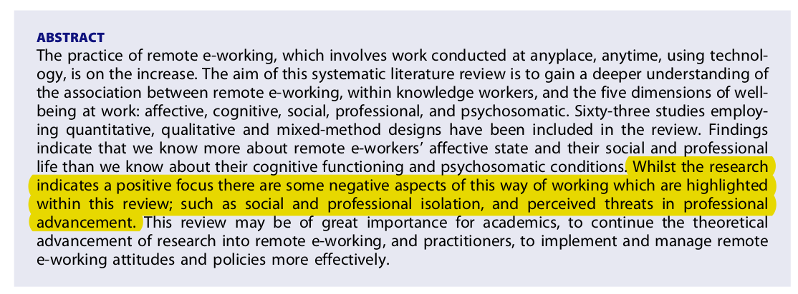
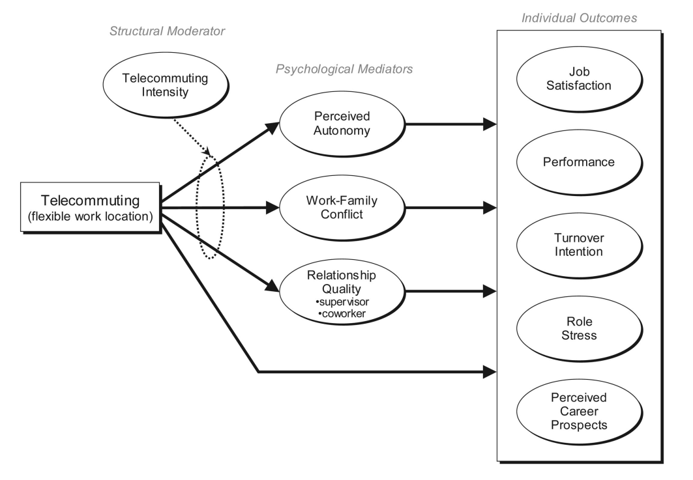
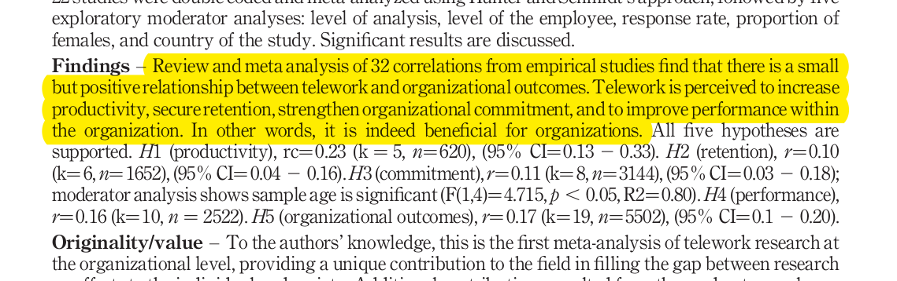
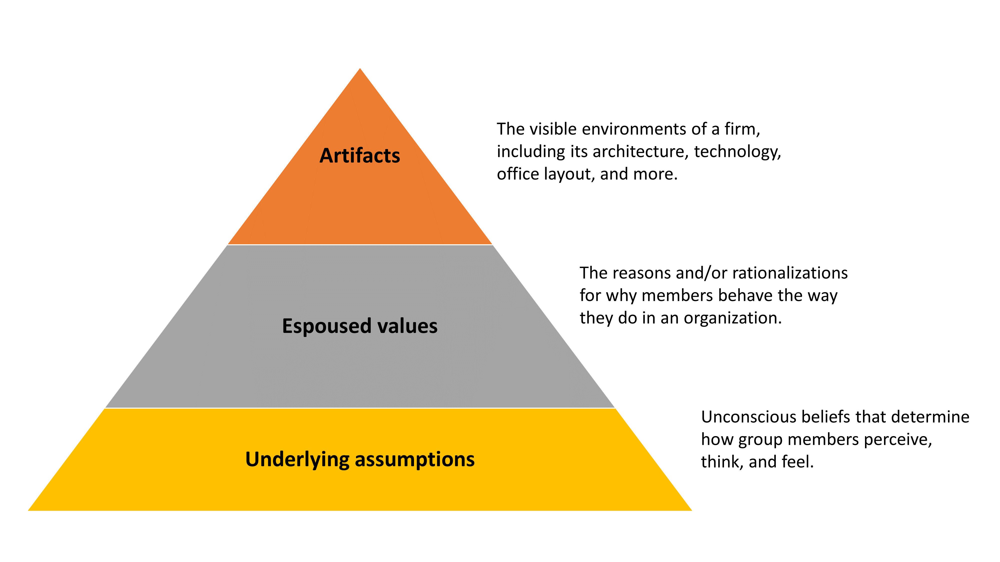
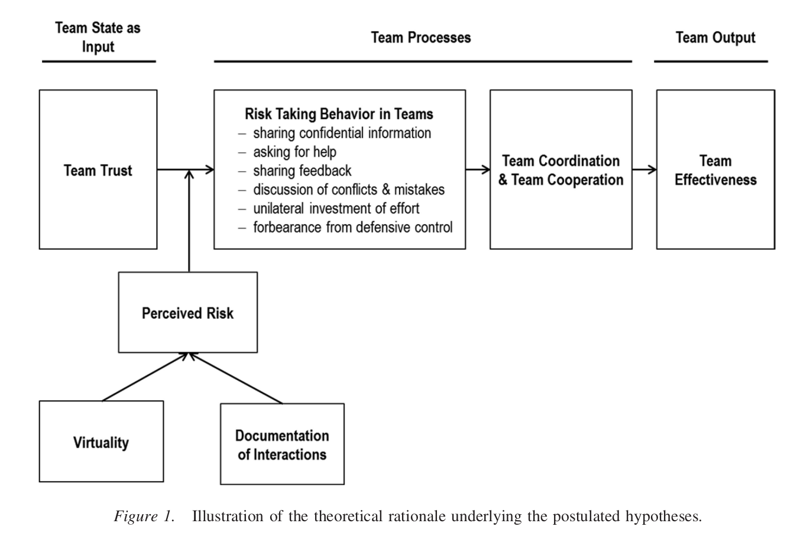
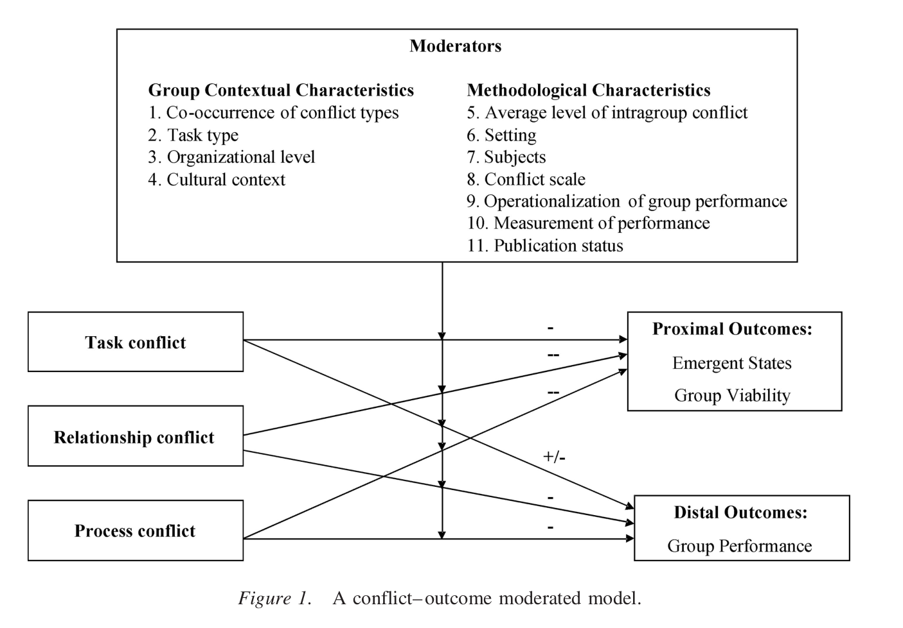

<!-- _class: lead -->

# Lecture 5 - Digital work in teams

# Remote teams

<!--
Remote becomes a challenge when we work in teams (more than working individually)

Back-and-forth: e.g., Twitter: calling employees back to the offices
https://www.theguardian.com/technology/2022/nov/10/elon-musk-scraps-twitter-work-home-staff
-->
---

<!-- _class: overview_part_3 -->

---

# Learning objectives

- Appreciate the challenges and opportunities in remote work and virtual team settings.
- Explore GitLab's approach as a remote-first organization and familiarize with its handbook.

<!-- 
digital newbie firms > digital-first firms > remote-first firms
geographically dispersed...
-->

---

# Virtual teams

Virtual teams are defined as "groups of geographically, organizationally and/or time dispersed workers brought together by information and telecommunication technologies to accomplish one or more organizational tasks." (Powell, Piccoli and Ives 2004)

Research on virtual teams has started decades ago, but the pandemic has created an unprecedented shift to remote work settings.

Our focus:

- The **effects** of working remotely, or in virtual teams
- The role of **culture** in virtual 
- The role of **trust** in virtual teams
- The role of **conflicts** in virtual teams

---

# Effects of remote work: Evidence at the individual level (I)

Charalampous et al. (2019)

---

# Effects of remote work: Evidence at the individual level (II)

Meta-analysis by Gajendran and Harrison (2007):
- Small but beneficial effects on proximal outcomes (e.g., perceived autonomy and (lower) work-family conflict)
- No generally negative effects on quality of workplace relationships
- Beneficial effects on distal outcomes (e.g., job satisfaction, performance, turnover intention, role stress)
- High-intensity telecommuting (> 2.5 days/week) is beneficial for (reduced) work-family conflict, but harms relationships with coworkers

---

# Effects of remote work: Evidence at the organizational level

Harker and MacDonnell (2012)

---

# Remote in practice: The case of GitLab

- GitLab: An open-source company that operates GitLab, a DevOps platform for software development
- A public all-remote company with no physical offices
- 2,100 employees across 60 countries
- Outreach and education efforts, such as the [Coursera course](https://www.coursera.org/learn/remote-team-management) or the [remote playbook](https://about.GitLab.com/company/culture/all-remote/) 
- An exciting case to understand how all-remote models can work

[Interview with Sid Sijbrandij, co-founder and CEO of GitLab](https://www.youtube.com/watch?v=u0dRWDmYSvg)

---
# Remote in practice: GitLab's remote playbook

Take a look at the following sections of the  [playbook](https://about.GitLab.com/company/culture/all-remote/) :

- Different remote models
- Transition to remote
- Leadership in remote teams
- Mental health

<!--
importance of retention: cost of replacing an employer: 6-9  x their last monthly salary
BATNA

https://escalla.co.uk/blog-remote-working-5-benefits-challenges/
-->
---

# Remote in practice: The GitLab handbook

- The handbook is a key element at GitLab 
- It has over 2,000 pages and everyone can suggest changes

1. Go to the [handbook](https://about.GitLab.com/handbook/) and gain an overview of what is covered
2. Imagine you were to join GitLab. Navigate to the onboarding page and review the onboarding issue template. What are the key things you are expected to do in the first days?
3. Briefly review the strategy document.
4. Scan the values section. Is there anything surprising, or something you (dis)agree with?

<!--

Open-source organizing principles
TBD: which aspects should not be disclosed publicly?
[[Team conflict]] / [[KankanhalliTanWei2006]]
- Cover control (formal, clan, ... ) + Wiener 2019?
-->

---

<!-- _class: centered -->

# Break

---

# The role of culture in virtual teams

Definition of organizational culture (Schein): 

> *a pattern of shared basic assumptions that a group learns as it solves its problems of external adaptation and internal integration, which has worked well enough to be considered valid and, therefore, to be taught to new members as the correct way to perceive, think, and feel in relation to those problems.*

The potential benefits of organizational culture:

- Alignment towards achieving goals
- Employee morale and job satisfaction
- Higher individual performance
- Increased innovation
- More effective teamwork

<!-- 
Unintended downsides: group-think, ...
-->

---

# Schein's Organizational Culture Model

**Question**: Do you recognize artifacts of organizational culture in the GitLab handbook?

<!-- https://mitsloan.mit.edu/ideas-made-to-matter/5-enduring-management-ideas-mit-sloans-edgar-schein

TODO : cover Adam Grant / giver, taker, matcher
-->

---

# Shaping the culture of the digital-work-lab: Our core values

🚀 **Impact in research, teaching, and practice**: We challenge ourselves every day to make significant contributions to research on digital work, inspiring students in different teaching formats, and facilitating the application of our work in practice.

🛠️ **Rigor, reliability, and reproducibility**: We value rigorous methods that are based on evidence and yield reproducible results. To this end, we select reliable tools and standard operating principles.

♻️ **Sustainability, openness, and sharing**: We aim to make our work processes, continuous improvement efforts, and outcomes openly accessible. In particular, we prefer open-source over proprietary technology.

🙏 **Support, participation, and diversity**: We build a culture of support, encouraging the participation of different stakeholders, including current and former team members, students, and colleagues. We make diversity our strength.

🧑‍🎓️ **Continuous learning**: We believe in continuous growth, setting aside time to learn on a regular basis, and curating helpful resources.

**Task**: How could the **values** ([link](https://digital-work-lab.github.io/handbook/docs/10-lab/10_processes/10.01.goals.html)) be integrated in the [digital-work-lab handbook](https://digital-work-lab.github.io/handbook/), i.e., as a tangible **artifact** of culture?

---

# The role of trust for effective virtual teams

Meta-analysis by Breuer et al. (2016):

---

# The role of conflicts in virtual teams

Meta-analysis by de Wit and Greer (2012):

---

# Homework

Read the paper of Choudhury et al. (2020), who presents the perspectives of different organizational scientists on GitLab's all-remote approach. Take notes to answer the following questions:
- What are the **main challenges** that need to be addressed in all-remote companies?
- What are the **key organizing principles** at GitLab?
- What are the **boundary conditions** for all-remote approaches?

Choudhury, P., Crowston, K., Dahlander, L., Minervini, M. S., & Raghuram, S. (2020). GitLab: work where you want, when you want. _Journal of Organization Design_, _9_, 1-17. [link](https://link.springer.com/article/10.1186/s41469-020-00087-8#citeas)

---

<!-- _class: centered -->

# Reminder

Next session: May 27 (pre-recorded session)

<!--
Lookup terms that you don't know.
-->
---

## Materials

Breuer, C., Hüffmeier, J., & Hertel, G. (2016). Does trust matter more in virtual teams? A meta-analysis of trust and team effectiveness considering virtuality and documentation as moderators. _Journal of Applied Psychology_, _101_(8), 1151.

Charalampous, M., Grant, C. A., Tramontano, C., & Michailidis, E. (2019). Systematically reviewing remote e-workers’ well-being at work: A multidimensional approach. _European Journal of Work and Organizational Psychology_, _28_(1), 51-73.

Choudhury, P., Crowston, K., Dahlander, L., Minervini, M. S., & Raghuram, S. (2020). GitLab: work where you want, when you want. _Journal of Organization Design_, _9_, 1-17.

De Wit, F. R., Greer, L. L., & Jehn, K. A. (2012). The paradox of intragroup conflict: a meta-analysis. _Journal of Applied Psychology_, _97_(2), 360.

Gajendran, R. S., & Harrison, D. A. (2007). The good, the bad, and the unknown about telecommuting: meta-analysis of psychological mediators and individual consequences. _Journal of Applied Psychology_, _92_(6), 1524.

Harker Martin, B., & MacDonnell, R. (2012). Is telework effective for organizations? A meta‐analysis of empirical research on perceptions of telework and organizational outcomes. _Management Research Review_, _35_(7), 602-616.

Powell, A., Piccoli, B., and Ives, B. (2004) Virtual teams: a review of current literature and directions for future research. _The DATA BASE for Advances in Information Systems_, _35_ (1).

<!-- 
https://www.ted.com/talks/nedra_glover_tawwab_your_3_step_guide_to_setting_better_boundaries_at_work/comments

- Include contents from CSCW research stream [cscw/wikipedia: matrix and articulation/awareness/appropriation work](https://en.wikipedia.org/wiki/Computer-supported_cooperative_work#:~:text=Computer-supported%20cooperative%20work%20(CSCW,support%20collaborative%20activity%20and%20coordination.)
- **Agile/SCRUM** practices / Projektmanagement (mention - should be covered in other lectures??)
-->