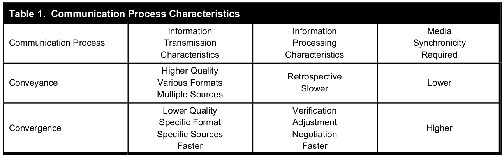
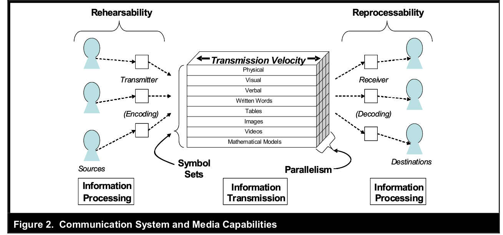
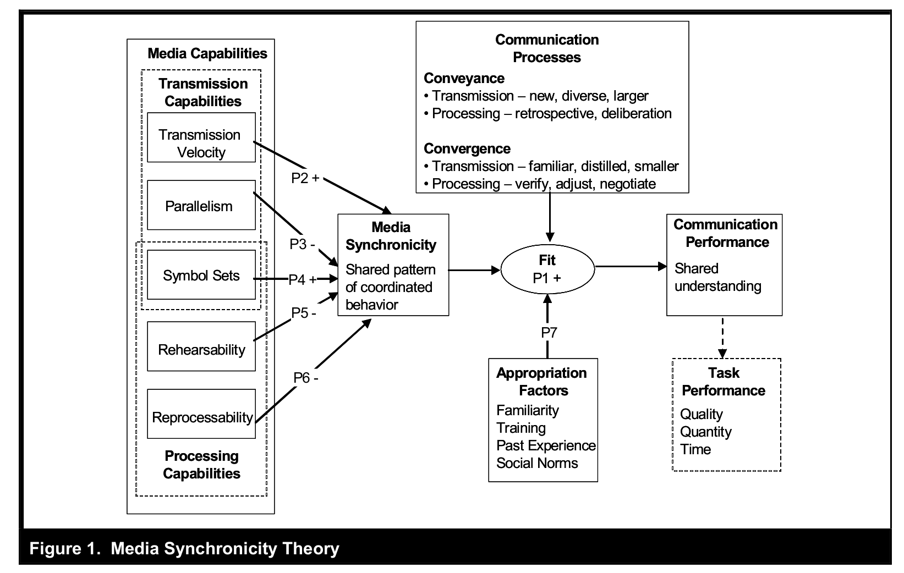
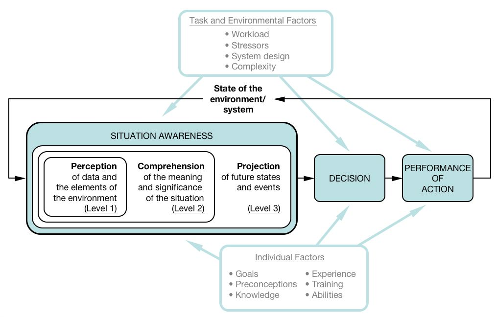

<!-- _class: lead -->

# Lecture 6 - Digital work in teams

# Communication

---

<!-- _class: overview_part_3 -->

---

# Learning objectives: 

- Explain the selection of appropriate communication technologies based on media synchronicity theory
- Describe the role of situational awareness in communication settings
- Appreciate different facets and practical consideration related to communication in teams

<!--
 (e.g., conflict, interruption, inclusion).
- Distinguish synchronous from asynchronous communication settings. / Distinguish forms of synchronous and asynchronous collaborative content creation and select appropriate technologies.
-->

---

# GitLab: work where you want, when you want

Read the case of Choudhury et al. (2020) and answer the following questions:

- What are the **main challenges** that need to be addressed in all-remote companies?
- What are the **key organizing principles** at GitLab?
- What are the **boundary conditions** for all-remote approaches?

<!-- 
---

# Break

-->

---

# Communication and media selection

Key question: which communication media are the most effective ones, or should be selected for a task at hand?

**Media richness theory** (Daft and Lengel, 1986):

- Communication is essential in organizational information processing to reduce uncertainty and equivocality.
- Communication media differ in richness, e.g., video calls transmit richer information including gestures and body language.
- Richer communication media are generally more effective for communicating equivocal issues in contrast with leaner media.

**Media synchronicity theory** (Dennis et al. 2008)
- There are different communication tasks:
    - *Conveyance* refers to the transmission of information.
    - *Convergence* refers to the process of mutually agreeing on the meaning of information.
- Communication media differ in their ability to support synchronicity, depending on their transmission or processing capabilities.
- Communiation performance, essentially, depends on the **fit** between communication processes, media synchronicity, and appropriation factors.

<!-- 
https://is.theorizeit.org/wiki/Media_synchronicity_theory -->

---

# Communication processes and characteristics

---

# Communication system and media capabilities

---

# Media synchronicity theory (MST)

<!--

 don't start with media richness theory (maybe a bit too challenging/differences to MST are more difficult to understand) 
Task: too broad -> MST: communication processes at a micro-level
Media synchronicity theory (Dennis, Fuller, and Valacich, 2006): 
- An influential theory in IS (citations, best paper awards)
- The theory explains communication (and task) performance based on the fit between media synchronicity, communication processe, and appropriation factors

**TODO : start with the fit aspect**
[[DennisFullerValacich2006]]
-->

<!-- 
# MST: Communication processes

- Introduce the elements step-by-step:

 - Communication processes: conveyance vs. convergence, which are more specific/smaller than tasks (MRT). also distinguish transmission from processing

# MST: Media synchronicity

 - Media synchronicity: synchronous vs. asynchronous (definition)

# MST: Media synchronicity requirements

- Media synchronicity requirements for different communication processess (table 1, proposition P1) -> importance of **fit**

# MST: Appropriation factors

- Appropriation factors (**fit**)

# MST: Examples I

- **TODO : short exercise for the main concepts (communication processes, media synchronicity, appropriation factors, fit and communcation performance)**

# MST: Media characteristics

- Media characteristics: transmission and processing capabilities: construct figure 2 step-by-step (starting with the simple sender - medium - receiver model and then adding the different elements)

# MST: Examples II

- TODO : exercise: rate different communication media...

# MST: Summary

- refer back to HwangKettingerYi2015 and point out that DennisFullerValacich2006 stop at the hypothesis generation step (no empirical study)
- Derive implications
- TODO : application / exercise (short descriptions of scenarios, such as a team rejecting a certain application)
- TODO : collect and discuss best practices (e.g., signalling availability - are you red/orange/green?) / analyze based on MST (?) / don't cover conflict etc. too much - they are in lecture 7

https://convergencelabs.com/blog/2018/01/the-four-cs-communication-coordination-cooperation-and-collaboration/
https://coachbetter.tv/the-difference-between-communication-cooperation-coordination-collaboration/
# Homework

Read [external communication](https://about.gitlab.com/handbook/communication/#external-communication)
-->
---

# MST: examples and application

1. Shared whiteboard in videoconferences: how does it change the media capabilities?
2. It was a misunderstanding, but one that escalated quickly. Why can asynchronous textual communication (such as email or chat) be problematic in such settings?
3. When sending out invitations to the weekly video-conference, your colleague emphasizes that he looks forward to **seeing** you in the call, and greets participants who share their video with a "nice to see you". Do you see any connections to MST?
4. Take a minute to review the features offered by the [Zoom AI assistant](https://www.zoom.com/en/products/collaboration-tools/features/). How do they relate to MST?
5. Consider a setting in which you would like to help your colleague with a challenging programming task. Your colleague works remotely. Which technologies would you select, and how could your choice be connected to MST?

<!--
whiteboard: expands the symbol set, e.g., allowing participants to develop sketches or mathematical models. also increases parallelism (audio, video of participants, and video of whiteboard)
Video: increase symbol set (visual cues, gestures, reactions) - especially when meetings aim to converge on particular items. Appropriation factors: familiar with the challenges, perhaps even trained to increase video-use, could be due to past experiences, or even norms in the team or organization.
AI assistant: several features to transcribe, summarize, or sub-title meetings - improves reprocessability (during and after the meeting)
coding: Convergence requires high synchronicity, especially wrt. the symbol set of collaborative coding (synchronous) - e.g., [Visual Studio Live Share](https://visualstudio.microsoft.com/de/services/live-share/)

 https://www.zoom.com/en/products/collaboration-tools/features/ -->

---

# Communication and situational awareness

Endsley's cognitive model of **situational awareness** provides a useful framework to think about communication.

Situational awareness involves three levels:
- Perception of data and elements of the environment (communication partners)
- Comprehension of the meaning and significance of the situation (communication goals)
- Projection of future states and events (potential communication outcomes)

Decisions and actions (related to communication) create a feedback loop, affecting communication partners, and awareness of changing situations over time.

<!-- 
What can the communication outcomes be?
e.g., reduce ambiguity, rally support for a project, foster inclusion and trust, discover private information, make decisions, prevent and resolve conflicts

Individual and task/environment factors at play (stress/complexity/technology)

Key message:
- Communication media and practices should be adapted to the situtation (many facets to consider, many potential outcomes to anticipate)
- Theories of fit may be particularly suitable, as exemplified by Media Synchronicity Theory

propositions...
-->
---

---

# Situational awareness: examples

Examples of situational awareness in practice:

- "At what times do you focus, at what times are you available for calls?"
- "Are you green?"
- "You have been quiet. What is your view on the issue?"

<!--
- we have a short explanation video for that
- should we reschedule? should I brief you after the meeting? -->
---

# Practice: Communication at GitLab

<!-- In small groups (2-3),  -->
Take a few minutes to examine the [communication section](https://about.gitlab.com/handbook/communication/) in GitLab's handbook and take notes on
- The different communication settings
- Best practices (potential challenges to keep in mind)

Major items to cover:
- [Effective and responsible communication guidelines](https://about.gitlab.com/handbook/communication/#effective--responsible-communication-guidelines)
- [Internal communication best practices](https://about.gitlab.com/handbook/communication/#top-tips-and-best-practices)
- [Video calls](https://about.gitlab.com/handbook/communication/#video-calls) and [E-Mail](https://about.gitlab.com/handbook/communication/#email)

Additional items (select the ones you are most interested in):
- [Slack](https://about.gitlab.com/handbook/communication/#slack), [direct messages](https://about.gitlab.com/handbook/communication/#avoid-direct-messages), [meeting problems](https://about.gitlab.com/handbook/communication/#common-meeting-problems), or [video and presentation tips](https://about.gitlab.com/handbook/communication/#video-and-presentation-tips-with-lorraine-lee)

<!--
https://about.gitlab.com/handbook/communication/#smart-note-taking-in-meetings
https://about.gitlab.com/handbook/communication/#types-of-meetings
-->
---

# Summary 

- Discussed media selection and synchronicity
- Covered the role of situational awareness in communication settings
- Considered different facets and practical consideration related to communication in teams

---

# References

Daft, R. L., & Lengel, R. H. (1986). Organizational information requirements, media richness and structural design. *Management Science*, 32(5), 554-571. doi:[10.1287/mnsc.32.5.554](https://doi.org/10.1287/mnsc.32.5.554)

Dennis, A. R., Fuller, R. M., & Valacich, J. S. (2008). Media, tasks, and communication processes: A theory of media synchronicity. *MIS Quarterly*, 32(3), 575-600. doi:[10.2307/25148857](https://doi.org/10.2307/25148857)

Endsley, M. R. (1995). Toward a theory of situation awareness in dynamic systems. *Human Factors*, 37(1), 32-64. doi: [10.1518/001872095779049543](https://doi.org/10.1518/001872095779049543)

Moorman, C. and Hinkfuss, K. (2023). Managing the cultural pitfalls of hybrid work. *MIT Sloan Management Review*. [link](https://sloanreview.mit.edu/article/managing-the-cultural-pitfalls-of-hybrid-work/)

<!--
Homework: 
read the product-development workflow in the gitlab handbook

# Exercise and homework

Preparation: do a git tutorial (provide short/longer and interactive ones) - be prepared for the in-depth session next week (have your questions ready)

# Materials

- [ ] TODO

check: Superbosses: How Exceptional Leaders Master the Flow of Talent
Give and Take: Why Helping Others Drives Our Success

TBD: communities-of-practice (e.g., wikipedia on CSCW: awareness)

alternative exercise:
TBD: maybe give students 2-3 cases, have brief discussion, have them read different papers (MRT,MST,interruptions,conflict,team-leadership,learning/onboarding), and then discuss the cases from the perspective of different theories

Note: possible extensions:
- zoom-fatigue (what are the different forms of labor that make videoconferences exhausting?)
- Virtual impression management: https://journals.sagepub.com/doi/10.1177/01492063231225160

-->