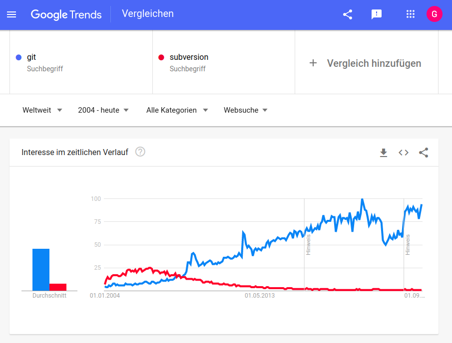
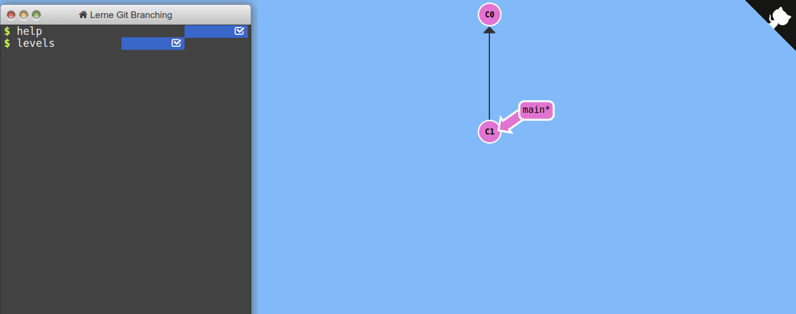

<!-- _class: lead -->

# Lecture 7 - Digital work in teams

# Collaborative content creation

---

<!-- _class: overview_part_3 -->

---

# Learning objectives

- Appreciate the key differences between software packages for collaborative content creation.
- Understand the elements and operations of Git.
- Use Git to make a contribution to a shared project (repository).

---

# Modes of collaborative content creation

Settings:

- Single vs. multiple devices
- In-person vs. remote
- Synchronous vs. asynchronous 

<!-- Note: in-person and asynchronous does not work. Single device and remotely does not work -->

Software can support collaborative content creation in different ways:

- Simultaneous sessions for editing documents (e.g., [VisualStudio Live Share](https://visualstudio.microsoft.com/de/services/live-share/))
- File synchronization, replacing files or creating copies when different people edit the same document (e.g., Dropbox, Owncloud)
- File synchronization with lock mechanisms (e.g., [Sharepoint](https://support.microsoft.com/de-de/office/auschecken-oder-einchecken-von-dateien-in-einer-dokumentbibliothek-acce24cd-ab39-4fcf-9c4d-1ce3050dc602) with file check-out and check-in)
- Branching and merging in shared repositories (e.g., Git, GitHub)

<!--
TODO : virtual/augmented reality vs. simple documents
Discuss that lock-systems don't work well (mostly for 3-5 people, otherwise, teams have very high coordination efforts/e.g., for sharepoint)
-->

---

# Focus session: Git



<!-- 
- Windows, Linux, Github, ...
- decentralized (vs. [centralized](https://git-scm.com/book/en/v2/Getting-Started-About-Version-Control))

- Give a brief overview/intro to git (its relevance/use cases; industry-driven, but battle-tested: Linux/diffusion)

-->

---

# Git: A distributed version control system

Advantages:

- Every repository has a full version history
- Most operations run locally
- Reliable data handling, ensuring integrity and availability
- Efficient data management for versions and branches
- Scalable collaboration mechanisms for large teams and complex projects

Caveats:

- Need to learn and understand the underlying model
- Not built for binary files or large media files


<!-- 
- most prevalent version control system, rapid adoption over the last decade
- large tech companies use git (e.g., Windows migrated)
- if you want to develop software today, there is no way around git.

you wouldn't want to version binary/media files.

no need to connect to a central server: can create versions, branches etc. (share if we decide to do so)

Create a cheat sheet

Examples:
https://github.com/git/git
https://github.com/tensorflow/tensorflow

# DEMO

figure displaying the git commit content (tree, ...): show at the end of practice session 1 (not at the beginning)


**TODO : interactively develop the conceptual chart at the blackboard (explain to students which operations lead to transitions between the states)**

Highlight: we focus on local repositories only in this part!
-->

---

<style>
blockquote {
    border-top: 0.1em;
    font-size: 60%;
    margin-top: auto;
}
</style>

# Theory and practice sessions

## Learning objectives

Understand and use git to develop software in teams.

**Part 1**: Branching
**Part 2**: Committing
**Part 3**: Collaborating

Each part starts with the **concepts** before the **practice** session.

In the practice sessions:

- Form groups of two to three students
- Work through the exercises
- Create a *cheat sheet* summarizing the key commands


> \* Note: This session is based on our [unique and peer-reviewed approach](https://digital-work-lab.github.io/rethink-git-teaching/).

<!-- **Preconditions**: 
- Git installed, username and email set (using the [software carpentry tutorial](https://librarycarpentry.org/lc-git/02-getting-started/index.html))
- SSH setup for Github (using the [software carpentry tutorial](https://librarycarpentry.org/lc-git/03-sharing/index.html)). The `ssh -T git@github.com` command runs successfully.

**Part 3**: Remote collaboration (60 min) -->

<!--
Goal: figure out how to accomplish the tasks (the instructions are more detailed at the beginning, you need to remember the commands/use and annotate the git cheatsheet. You will have to use the commands again, know what they do and how the changes and commands are situated in the three areas)

groups: help each other!

-> cheatsheet: how you would internalize it. Ask yourself: if you were to answer the tasks without having the slide/explanation, what should you have on your brief cheatsheet/what should you be able to reproduce from memory? 

Write the slide numbers on the board and help students who have not reached that number

we work with the cli!

https://swcarpentry.github.io/git-novice/
https://librarycarpentry.org/lc-git/
-->

---

<!-- _class: centered -->

# Part 1: Branching

---

# Commits

<style>
blockquote {
    border-top: 0.1em;
    font-size: 60%;
    margin-top: auto;
}
</style>

- A **commit** refers to a snapshot (version) of the whole project directory, including the meta data and files
- Commits are identified by the **SHA** fingerprint of their meta data and content\*, e.g., `98ca9`
- Commits are created in a sequence, with every commit pointing to its **parent** commit(s)
- The **tree** object contains all files (and non-empty directories); it is identified by a SHA hash
- Commits are created by the **git commit** command

<!--

    Demo:
    - setup a git repository, create a file (explain the working directory), add the changes (explain the staging area), create a commit
    - inspect the commit (the internal git objects / history):
    git log
    - commit ID (sha)
    - HEAD points to the main branch. (aha)
    git cat-file -p ENTER_COMMIT
    - go through the information (if any of that information changes, the fingerprint of the commit changes)
    - you see that git handles all objects (files, trees, commits) by their fingerprint.
    git cat-file -p (TREE)
    git cat-file -p (FILE)

    - if git handles everything through fingerprints, it checks whether the file or tree is already in the database.

-->


> \* If any of the meta data or content changes, the SHA will be completely different.

<!--
Author/date/message
Parent(s)
Tree-hash

-> file handling based on hashes/fingerprints. if one bit changes, the hash changes completely
-> illustrate in a commit-chain (all child commits change - problematic if we want to work on the same tree)
-> internal file handling: get ae9d898d7fa...
-> growth: adding a new commit/branch requires very little additional storage

Discuss/provide solutions for atomic commits

As soon as we have a git repository, we can see and modify everything in our copy.

Break
-->

---

<style>
blockquote {
    border-top: 0.1em;
    font-size: 60%;
    margin-top: auto;
}
</style>

# The DAG, branches, and HEAD

- Commits form a **directed acyclic Graph (DAG)**, i.e., all commits can have one or more children, and one or more parents (except for the first commit, which has no parent). Closed directed cycles are not allowed.
- With the **git branch \<branch-name\>** command, a separate line of commits can be started, i.e., one where different lines of commits are developed from the same parent. The branch pointer typically points at the latest commit in the line.
- With the **git switch \<branch-name\>** command, we can select the branch on which we want to work. Switch effectively moves the HEAD pointer, which points to a particular branch and indicates where new commits are be added.
- With the **git merge \<other-branch\>** command, separate lines of commits can be brought together, i.e., creating a commit with two parents. The *merge commit* integrates the contents from the *\<other-branch\>* into the branch that is currently selected. The *\<other-branch\>* is not changed. 
- Per default, Git sets up a branch named "main".

<!-- - Development typically focuses on the **main branch**, which often contains the latest stable version of the project -->

> Note: Arrows point from children to parent commits.

<!--
- The **git switch** command moves the **HEAD** pointer to the selected branch and copies its contents to your project directory

- Commits and their parent links form a directed acyclic graph (DAG)
Branches are useful to develop features, test code, or fix bugs without interferring with the main branch
 - Branches are highly efficient: It only takes a few bytes to create a branch of a large repository -->


---

# What's in a commit?


Note: `git cat-file -p sha` shows the contents of a Git object.

<!-- 
Explain "bullwhip" effect based on this and the previous slide (why rewriting history should be avoided)

note: size is not part of the commit?!
git cat-file -p ID

Demonstrate how 
git clone https://github.com/CoLRev-Environment/colrev
cd colrev
du -hs .
for branch in alpha{1..500}; do git checkout -b $branch; done;
du -hs .


Author/date/message
Parent(s)
Tree-hash

-> file handling based on hashes/fingerprints. if one bit changes, the hash changes completely
-> illustrate in a commit-chain (all child commits change - problematic if we want to work on the same tree)
-> internal file handling: get ae9d898d7fa...
-> growth: adding a new commit/branch requires very little additional storage

Discuss/provide solutions for atomic commits

As soon as we have a git repository, we can see and modify everything in our copy.

Break
-->

---

# Practice: Branching

To practice git branching, we use the [learn-git-branching](https://learngitbranching.js.org/?locale=de_DE) tutorial.

Complete the first two levels on branching, merging, and navigating in the git tree.
<!-- LT: maybe mention they can practice the whole tutorial afterwards for practice -->




**NOTE**: You can type "undo" when you made a mistake.

<!-- 

-> afterwards: branching challenge : post challenge on the blackboard/add nodes/branchnames, after a while: erase the instructions (select commit/create branch)
-> for the challenge: use branch-names only (don't checkout individual commits into main)

ESC to skip explanation

-->

---

To continue practicing, create the following tree, which resembles a typical setup of Git branches.


<!-- 
git commit
git commit
git checkout c1
git checkout-b hotfix
git commit
git checkout main
git merge hotfix
git checkout c1
git checkout -b dev
git commit
git commit
git checkout c6
git checkout -b feature
git commit
git commit
git checkout dev
git merge feature
git checkout main
git merge dev
-->

---

<!-- _class: centered -->

# Part 2: Committing

<!-- 
- most prevalent version control system, rapid adoption over the last decade
- large tech companies use git (e.g., Windows migrated)
- if you want to develop software today, there is no way around git.

you wouldn't want to version binary/media files.

no need to connect to a central server: can create versions, branches etc. (share if we decide to do so)

Create a cheat sheet

Examples:
https://github.com/git/git
https://github.com/tensorflow/tensorflow


# DEMO

figure displaying the git commit content (tree, ...): show at the end of practice session 1 (not at the beginning)


**TODO : interactively develop the conceptual chart at the blackboard (explain to students which operations lead to transitions between the states)**

Highlight: we focus on local repositories only in this part!

ASK for concentration

- How should a versioning system look like? - area where you have the project files that you work with, and a separate "version database". Git calls it the "working directory" and the git directory. It has operations to create new versions from the files in your working directory. And it also has operations to retrieve files from the "version database" or the "history". That's what we will focus on for now (local operations). [AREAS AUFZEICHNEN]
- Zusätzlich gibt es noch eine Staging Area [IN DER MITTE  EINZEICHNEN]. 
- Stellen Sie sich jetzt vor, dass wir unser Git-Projekt angelegt haben, es gibt also das working directory und das git directory. Und wir haben jetzt verschiedene Dateien erstellt, zB. Programmcode, tests, dokumentation, und notizen. [ADD FILES TO WORKING DIRECTORY].
- Die erste Frage, die sich stellt ist: wie lege ich eine neue Version an? Wir wollen also den Programmcode und die Tests in der neuen Version haben. Die Dokumentation ist noch nicht fertig und die Notizen sollen auch nicht in die Version. Und da kommt die Staging Area ins Spiel. Alles was in die nächste Version aufgenommen werden soll muss vorher in die Staging area, sozusagen markiert für die nächste Version bzw. den nächsten Commit.
- Also: alle Dateien sind erst einmal im Working directory und Sie können auswählen, was Sie in die Staging Area übernehmen. Das ist der "git add ..." befehl. Sie geben also "git add code.py" und "git add tests.py" ein und dann wandert die aktuelle Version der ausgewählten Dateien in die Staging area [KOPIE DER DATEIEN VERSCHIEBEN und GIT ADD AUF PFEIL SCHREIBEN].
- Um dann einen Commit aus den Dateien in der Staging Area zu erstellen geben wir einfach "git commit" ein [DATEIEN IN EINEN COMMIT KOMBINIEREN]. So einfach ist der Ablauf. Sie sehen, dass die STAGING AREA wieder leer ist und dass Sie die gleichen Dateien immer noch im Working Directory haben. Also gibt es jetzt keinen Unterschied zwischen den drei Bereichen.
- Sehen wir uns noch einmal die Staging Area an. Wofür ist die Staging Area nützlich? Ich könnte ja auch einfach sagen dass die Dateien gleich committed werden sollen. [IDEEN?] - die Staging Area gibt uns die Möglichkeit, Dateiänderungen gezielt auszuwählen. Wir hatten hier zB. auch die Notizen und die unfertige Dokumentation. Die liegen im gleichen Ordner, sollen aber nicht in den nächsten Commit. Wenn wir git add ... ausführen haben wir also die Möglichkeit, einzelne Dateien in die Staging Area aufzunehmen. Gerade bei Programmierprojekten probiert man ja häufig verschiedene Implementierungen aus und manche funktionieren und andere funktionieren nicht. Und wenn Sie beim Programmieren den Moment haben, wo Sie sagen - Yes! jetzt funktioniert es endlich! Dann sagen fügen Sie Ihre Änderungen in die Staging Area ein. Also git add.
- Dann kümmern sie sich vielleicht um die Codeformatierung, die zugehörigen Tests und die Dokumentation und fügen das auch step-by-step in die Staging area ein. Dh. wenn Sie an einer bestimmten Funktionalität arbeiten können Sie auch gut ein paar Stunden die Staging Area befüllen. Und wenn Sie dann das Gefühl haben - jetzt ist es perfekt, jetzt funktioniert es zuverlässig, die Tests und die Doku passt, dann gehen Sie auf git commit. Die Staging Area kann Ihnen also helfen, Code mit hoher Qualität zu schreiben. Außerdem wird es so auch viel einfacher, Dateiänderungen, die nicht zu dem Problem gehören, im working directory zu belassen und nicht in die neue Version aufzunehmen.
- Wir haben uns also die drei Bereiche angesehen und wie man Dateiänderungen in die Staging area übernimmt und einen neuen Commit anlegt. Gibt es dazu Fragen?
- Als nächstes sehen wir uns die entgegengesetzte Richtung an.
- Wenn Sie Änderungen im Working directory haben, die Sie nicht mehr brauchen sagen Sie einfach "git restore file". Dann bekommen Sie die Version, die aktuell in der Staging Area liegt. Wenn Sie Änderungen in der Staging Area zurücksetzen möchten, geben Sie "git restore --staged file" ein. Dann bekommen Sie den letzten aktuellen Versionsstand aus dem git repository und die Änderungen aus der Staging Area sind nur noch im Working Directory. [PFEILE UND OPERATIONS EINZEICHNEN].
- Jetzt kennen wir hier die Operationen in beide Richtungen: git add und commit bzw. git restore und git restore --staged.
- Sehen wir uns das Git repository, also die Versionshistorie genauer an.
- Wir hatten den ersten Commit schon einmal angelegt und wenn wir jetzt weiter entwickeln können wir einen weiteren Commit anlegen. In jedem Commit wird auch immer gleich festgehalten, welcher Commit der Vorgänger war. Also der "Parent" commit. Wenn Sie einen Git Client nutzen, dann wird Ihnen zu jedem Commit typischerweise nicht der vollständige Inhalt angezeigt, sondern die Änderungen, also das Delta zum Vorgänger. Das sehen Sie bspw. auf Github [zeigen]. Sie sehen auch, dass Git sehr viele Versionen effizient verwalten kann.

Recap: d.h. wir haben jetzt gesehen, dass Dateien oder Dateiänderungen in drei Zuständen sein können: im Working Directory, in der Staging area, und im Git repository. Sie kennen die Operationen, mit denen wir Änderungen für die nächste Version markieren können und die neue Version anlegen können (git add und commit).
Wir haben uns auch den entgegengesetzten Weg angesehen - git restore und git restore --staged.

-->

---

# The three states of a file

Files in the working directory can reside in three states:

- New files are initially **untracked**, i.e., Git does not include new files in commits without explicit instruction.
- With *git add*, file contents are staged and the file is tracked. Given that the file in the working directory is identical with the staged file contents, the file is **unmodified**.
- When users change a file, it becomes **modified**, i.e., the file in the working directory differs from the file contents in the staging area.
- With *git add*, the file contents are staged again, and the file becomes **unmodified**.
- With *git rm*, files are no longer tracked.

Note: *git add* and *git rm* do not change the contents of the file in the working directory.


<!-- 
Note: there are very few reasons to checkout a commit

This is the most important thing to know about Git!

Hogbin-Westby:
- working directory: what can be seen (in the file explorer)
- staging area: the difference of what is stored and what is seen (WHAT HAS BEEN MARKED FOR THE NEXT COMMIT)
- repository: what is stored
-->

---

# Resetting changes

To undo changes that are not yet committed, it is important to understand whether they are staged or unstaged:

- If changes are not yet staged, the file is currently *modified*. A **git restore \<file-name\>** replaces the file in the working directory with the staged version. As a result, the file is *unmodified* because it corresponds to the staged file.
- If the file is currently *unmodified*, a **git restore --staged \<file-name\>**, Git discards the staged changes by using the last committed version. The file contents in the working directory do not change, but the file becomes *modified* because it differs from the staged version.


<!-- 
TODO : better explain this with a git graph displayed like here:

https://stackoverflow.com/questions/3528245/whats-the-difference-between-git-reset-mixed-soft-and-hard

# Undoing committed changes

Clean working directory required!

To **undo committed changes**, there several options (some are available in gitk):

- Revert the commit, i.e., create a new commit to undo changes: `git revert COMMIT_SHA --no-edit`
- Undo the commit and leave the changes in the staging area: `git reset --soft COMMIT_SHA` (*)
- Stage changes, and run `git commit --amend` to modify the last commit (*)

If you have the time, try the different undo operations in the session.

(*) Important: only amend commits that are not yet shared with the team. Otherwise, revert is preferred.

-->

---

<!-- 
TBD/do not cover?

    Demo:
    - setup a git repository, create a file (explain the working directory), add the changes (explain the staging area), create a commit
    - inspect the commit (the internal git objects / history):
    git log
    - commit ID (sha)
    - HEAD points to the main branch. (aha)
    git cat-file -p ENTER_COMMIT
    - go through the information (if any of that information changes, the fingerprint of the commit changes)
    - you see that git handles all objects (files, trees, commits) by their fingerprint.
    git cat-file -p (TREE)
    git cat-file -p (FILE)

    - if git handles everything through fingerprints, it checks whether the file or tree is already in the database.

---
-->

In this part, we work with an existing project. To download the example, open the `Git bash` (which should start at ``W:>``, your personal directory on the file server), and run the following commands:

```shell
git clone https://github.com/CoLRev-Environment/colrev
cd colrev                     # Enter the directory of the colrev project
```

**Check**: The clone command should print something like the following (with different numbers):

```
Cloning into 'colrev'...
remote: Counting objects: 100% (125/125), done.
remote: Total 22225 (delta 41), reused 54 (delta 27), pack-reused 22100
Receiving objects: 100% (22225/22225), 10.11 MiB | 2.37 MiB/s, done.
Resolving deltas: 100% (18519/18519), done.
```
**Note**: You do not have to enter the explanation after the hashtag (#). To create an empty Git project, you would run ``git init``.

---

Next, we check the current status of the project:

```shell
git status
```

This command provides an overview of the current state of the project and the files in the three sections. Therefore, you will need to run ``git status`` regularly.

**Check**: It should print something like the following:

```
On branch main
Your branch is up to date with 'origin/main'.

nothing to commit, working tree clean
```

The last line indicates that there are no changes in the staging area (nothing to commit). The working directory has the same content as the last version in the Git respository (working tree clean).

---

Take a look at the files and directories that were retrieved as part of the CoLRev project.

Git stores its data in the `.git` directory. It can be instructive to explore how Git handles data internally, but keep in mind that manual changes in the `.git` directory may break the repository.

**Note**: If you work on your own machine and Git is not yet configured, you need to run ``git config --global user.name "John Doe"`` and ``git config --global user.email johndoe@example.com`` to configure your user name and email.


<!-- 
We start with the setup of a git repository

Start with the slide, after 2 minutes: ask who has already completed the step/who needs help
Then: proceed: step-by-step with the following slides
-->

---

Next, we modify files (state: **untracked**/**modified**), mark them to be in the next commit (state: **staged**) and create the first version (state: **committed**). This corresponds to the three sections of a Git project.

- Open the `README.md` file and add your name to the list of contributors (`# Contributors` section).

```
git status              # Check the `git status` between each command
```

- Open the `CONTRIBUTING.md` file and change it.

**Check**: The `git status` should now show two files with changes in the working directory (state: **modified**).

---

We decide that the changes in the `README.md` file should be staged for the next commit. The changes in the `CONTRIBUTING.md` file are no longer needed. Use the commands suggested by `git status` to accomplish this.

**Check**: The `git status` should now display 

```
On branch main
Your branch is up to date with 'origin/main'.

Changes to be committed:
  (use "git restore --staged <file>..." to unstage)
	modified:   README.md

```

This means that changes in the README.md are **staged** (to be committed).

---

To create the commit, we run

```
git commit -m 'add contributor'
```

The `-m 'add contributor'` adds a short summary message, which is expected for every commit.

**Check**: `git status` should reflect your expected state of files in the three Git sections.

---

Sh***! We just committed changes containing an error 🤯

To undo the last commit, we can simply run:

```
git reset --soft HEAD~1
```

You should now have the `README.md` file in the staging area again.

**Note**: the `HEAD~1` refers to the last commit.

**Check**: Run `git status` to see the changes.

---

We decide to discard our changes. Use the commands suggested by `git status` to do that.

**Check**: The `git status` should show the following:

```
On branch main
nothing to commit, working tree clean
```

<!-- 
```
                              # Manually create a REAMDE.md file in the project.
git status                    # Should show the README.md file as "untracked"
git add README.md             # Add the README.md file using the `git add` operation
git status                    # Should show the README.md file as a change "to be committed" (staged)
                              # Download the MIT license file from https://choosealicense.com/licenses/mit/
                              # Save it as `LICENSE` (filename) and 
git add .                     # add all changes to the staging area
git status                    # Should now show two files "to be committed" (staged)

git commit -m 'Initial comit' # Create the first commit (version of the project)
git status                    # Should show a clean working directory and staging area
```

Instead of modifying the files manually, we can also apply patches (i.e., files containing changes):

```
git apply ../git-tutorial-example/setup.patch
git status                                   # See which files were changed
git add .                                    # Add all changes
git commit -m 'Add code'                     # Create the first commit (version of the project)
```

In the following, we work with patches to save time while creating changes that resemble a software development project. 

**Check**: The commands did not produce any error messages.

For the next steps, download the code for [colrev](https://github.com/CoLRev-Ecosystem/colrev) as a zip file (through the `Code` button), extract the files and move them to your `colrev_project` directory*. Add all changes and create a new version. -->

---

Let's see the changes that were committed in the project.

To analyze the specific changes, open `gitk` (or another Git GUI):

```
gitk
```

- Check which files were added and modified by the last commit
- Check the code that was modified (increase and decrease lines of context in gitk). The next page provides an overview of gitk (other Git GUIs have similar interface elements).

---


<!-- 
gitk.png screenshot + add explanations similar to https://lostechies.com/joshuaflanagan/2010/09/03/use-gitk-to-understand-git/
-> highlight that versions are identified by their commit-ID/sha-fingerprint

TODO : create another version and check how gitk displays the unstaged/staged changes

Go to the [colrev](https://github.com/CoLRev-Ecosystem/colrev) project on GitHub and explore the version history.
- Navigate to `commits` and check which files were modified in the most recent version
- From the [main page](https://github.com/CoLRev-Ecosystem/colrev), navigate to `colrev/dataset.py` and click on `Blame` to see what revision and author last modified specific lines of code

**Check**: When was the `load_records_dict` function last modified?

Note : patches allow us to work with more substantial examples in the following
-->

---

It is good practice to create **atomic commits**, i.e., small changes that belong together. One should avoid large commits that modify many unrelated parts of the code base and pursue different objectives.

Analyze the following commits and discuss which ones are atomic and which ones combine changes that do not belong together (i.e., should be in separate commits):

 - [commit 1](https://github.com/CoLRev-Environment/colrev/commit/a0c9043784f9342136d2ab214513688769669199)
 - [commit 2](https://github.com/CoLRev-Environment/colrev/commit/5288e92083b6df546d7c8fd590df3e968a909114)
 - [commit 3](https://github.com/CoLRev-Environment/colrev/commit/ba08d4242f48ec96b4fa8cfd053ee3781e32231f)
 - [commit 4](https://github.com/CoLRev-Environment/colrev/commit/ce9850f805a140692866970c92557833e6befa0b)
 - [commit 5](https://github.com/CoLRev-Environment/colrev/commit/93fc7e851d2ba3fc95cc3190b6b71dc4a907c96b)

Also check the commit message (short summary at the beginning). Does the message clearly summarize the changes?

---

To create atomic commits, you may need to **add specific lines of code that should go into a commit**, leaving other changes in the working directory.

The changes are provided in the [`rec_dict.patch`](../material/rec_dict.patch) file, which must be placed in the project's working directory. To apply it, run:

```
git apply rec_dict.patch                # Suggests to rename the method but also introduces unrelated changes.
git status                              # Different files were modified by the patch
gitk                                    # Check the changes that were introduced by the patch
```

In the following, we would like to add *only* the changes in lines related to the `load_records_dict` method and the `skip_notification` parameter (using `-p` for a partial `git add`):

```
git add -p colrev/dataset.py            # Add specific lines of code from the colrev/dataset.py
                                        # using y/n to add or skip (confirming with ENTER)
gitk                                    # Check whether the correct lines were added
```

Create a commit containing the relevant changes. Afterwards, discard the remaining changes.


<!--
**Check**: The working directory should be clean again.
 TODO : link to good commit messages

git diff > rec_dict.patch
 
 -->

---

When writing code, we can make mistakes, or we may need to undo or modify previous changes. To undo changes, it is important to understand whether they are unstaged, staged, or committed.

To **undo unstaged or staged changes**, `git status` suggests the corresponding operations (`git restore <file>` and `git restore --staged <file>`). To see how `git restore` works:

- Modify the `README.md` file and add the changes to the staging area
- Undo the staged changes
- Undo the unstaged changes

**Check**: The working directory should be clean again.

---

To **undo committed changes**, there several options (some are available in gitk):

- Revert the commit, i.e., create a new commit to undo changes: `git revert COMMIT_SHA --no-edit`
- Undo the commit and leave the changes in the staging area: `git reset --soft COMMIT_SHA` (*)
- Stage changes, and run `git commit --amend` to modify the last commit*

If you have the time, try the different undo operations in the session.

\* Important: only amend commits that are not yet shared with the team. Otherwise, revert is preferred.

<!-- 
HEAD~
shorthand for
HEAD~1

TODO : how to test/demonstrate undoing an error?
-> This would be important to practice!!!

**SEE HOGBIN-WESTBY CHAPTER**

---

**TODO**: include examples for undoing changes
-->

---

# Transfer challenges I 

1. Consider how the **git switch** (or the revert/checkout) command affects the Git areas. How does it affect the working directory?

<!--
Do you see any challenges?
- Try to reproduce the situation
(stash) -->

2. Git provides the option to edit prior commits using an interactive rebase, such as the **git rebase -i**. How would that affect the following commits?

<!-- 
git questions: understand linearized git history displayed on github / reading gitk DAG

Illustrate on the whiteboard : new/alternative commit with the same parent, all following commits are applied on top of the new commit
- commit shas change!
- Refer to the slide on commits
- Maybe even illustrate 

---

# Illustration: Git Merge

Setting: Two authors working on the same document ([paper.md](../material/paper.md)).

1. Setup the code skeleton
2. Write different parts of the same document

  - git checkout -b author_1 (add introduction)
  - git switch main & git checkout -b author_2 (add background)
  - git switch main & git merge author_1 (fast forward)
  - git merge author_2 (merge commit, no conflict)

3. Edit the same part (remember to merge both branches with main)

  - case 1: conflicting contents that contradict each other
  - case 2: conflicting contents that need to be resolved

-->
<!-- Note: It can be instructive to go through this merge exercise at home. -->

<!-- 
# Bonus part 2

- Create a fork of the [handbook](https://github.com/digital-work-lab/handbook)
- Give your team access to the fork (settings/collaborators)
- Develop contents
- Create a pull request (available in the original repository, not the fork)
- Assign the maintainer and respond to feedback

TBD: maybe use the hierarchy of evidence to clarify the challenges of assessing technology (almost no "scientific evidence", but overwhelming adoption in the industry...)

Start with a picture of files and directories
-> ask students about their experiences collaborating on files, the problems and their strategies (mentimeter?)

provide an overview of synchronous editing (live in the same editor, e.g., Word/atom?)
Asynchronous editing (e.g., last-saved-replaces, Locks /Sharepoint, git)

Git-demo (tech or organizational perspective?)

mention johnny decimal?
-->

---

# Part 3: Collaborating

---

# Collaborating

- The distributed model of Git means that every repository has a full version history, (almost) all operations can be completed locally, and every repository can be developed autonomously.
- To collaborate, a *remote* repository is needed, initially named "origin"
- If the remote repository exists, the **git clone** command retrieves a local copy
- To create a remote repository (named "origin"), and push a specific branch:

```
git remote add origin REMOTE-URL
git push origin main
```

<!-- - If the remote repository does not exist, you have to add the remote origin and push the repository -->


---

# Collaborating on branches

- To retrieve changes, use the **git pull** command
- To share changes, use the **git push** command

- Most remote operations, including pull, push, pull requests refer to branches
- In some cases, **branches must be selected explicitly**, and in other cases, git automatically selects branches, i.e., it remembers the typical branch to pull or push


---

# Collaborating with forks

This model works if you are a maintainer of the remote/origin, i.e., if you have write access.

- In Open-Source projects, write-access is restricted to a few maintainers
- At the same time, it should be possible to integrate contributions from the community
- **Forks** are remote copies of the upstream repository
- Contributors can create forks at any time and push changes
- Contributors can open a **pull request** to signal to maintainers that code from the fork can be merged
- Pull requests are used for code review, and improvements before code is accepted or rejected

<!-- 

- In the fork, it is recommended to create working branches instead of committing to the `main` branch.
- It is good practice to regularly **sync** the `main` branches (on GitHub), and merge the changes into your working branches (locally or on GitHub).
- Syncing changes may be necessary to get bugfixes from the original repository, and to prevent diverging histories (potential merge conflicts in the pull request).
-->


---

<!-- _class: centered -->

# Survey

Please share your feedback to help us improve!

---

# Reminder

Summaries are due next week.