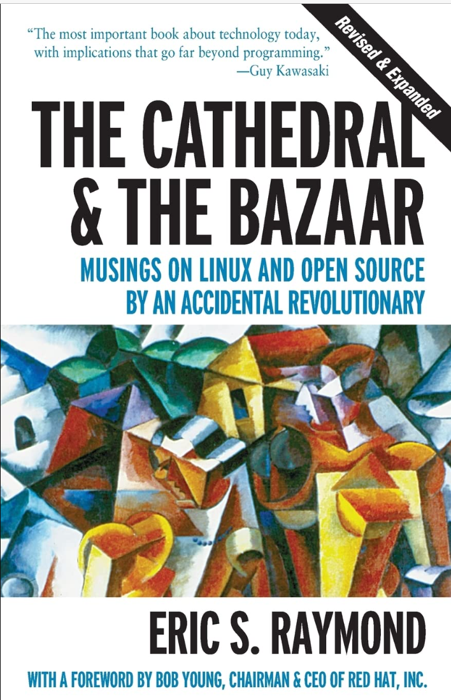

<!-- _class: lead -->

# Lecture 8 - Digital work in crowds

# Open-Source work

---

<!-- _class: overview_part_4 -->

---

# Learning objectives

- Describe the key **open-source concepts** in the context of organizational work
- Learn how to **use the collaboration features of Git**, including forks, pull requests, merges, and issues
- Familiarize with the **key elements of open-source project documentation**

<!-- 
- Follow Open-Source practices to contribute to a shared project.
- Explain how different technologies can help to organize Open-Source work.
- Apply them in a **realistic setting of multiple contributors**
-->

---

<!-- 
## TODO: Sumary: Key concepts and processes

- Fork
- Pull request
- Maintainer
- ...

-->

# Open Source

Open-source software (OSS) is software with source code that anyone can inspect, modify, and enhance. OSS development is typically decentralized, community-driven, and publicly accessible.

<!--
https://opensource.org/osd
> “Open source promotes universal access via an open-source license to a product’s design or blueprint” 
-->

Open source is enabled through specific **licenses** that allow use, modification, and redistribution. Examples: MIT License (permissive), GNU General Public License (GPL) (copyleft), Apache License 2.0.

<!-- Each license governs how software can be reused or altered. -->

**Development Process:**
- Code is hosted on public platforms (e.g., GitHub).
- Contributions via issue tracking, pull requests, and peer review.
- Guided by the "bazaar" model (Raymond, 1999) — fast iterations, collective debugging.

<!-- > “Given enough eyeballs, all bugs are shallow.” – Linus’s Law -->

> Open-source offers a new model for organizing work, with distinct principles for task division, task allocation, reward distribution, and information flows (Puranam et al., 2013).

---

# Diffusion and Impact

**Pervasiveness:**
- Commercial applications include OSS components (even exceeding 95%).
- OSS underpins operating systems (Linux), programming libraries, infrastructure (Kubernetes), AI (TensorFlow).
- Dedicated organizations support OSS (e.g., Linux Foundation, Apache, OSI).

**Economic Value:**
- Firms would need to spend $8.8 trillion to replace freely available OSS (Hoffmann et al., 2024).
<!-- - Recreating the top 50 OSS packages alone would cost ~$4.2B. -->

**Labor Market:**
- Open-source skills (Linux, Python, Docker) are in high demand.
- GitHub contributions act as a public portfolio for developers.
- Companies (e.g., Red Hat, Microsoft) hire and sponsor OSS contributors.

> Hiring open-source experts brings external credibility and internal expertise. (Hoffmann et al., 2024)

<!-- https://www.library.hbs.edu/working-knowledge/open-source-software-the-nine-trillion-resource-companies-take-for-granted -->

---

# Open Source in the Industry

**Linux:**
- Powers 100% of top supercomputers, 90%+ of cloud infrastructure.
- Forms the basis of Android OS (70–85% global mobile share).
- Red Hat offers Linux support services and was acquired by IBM for $34B — OSS as strategic infrastructure.

**Microsoft:**
- Migrated Windows development to Git in 2017–2018, building custom tooling (GVFS) to scale Git for 8,000+ developers and a 300GB codebase.
- Acquired GitHub for $7.5B in 2018, underscoring strategic importance.
- GitHub Copilot uses open-source code to train AI models, demonstrating the value of community-created code.
- Microsoft transitioned from criticizing OSS to fully embracing OSS:

> 2001: “Linux is a cancer that attaches itself in an intellectual property sense to everything it touches.” (Ballmer)
> 2014: “Microsoft loves Linux.” (Nadella)
> 2025: Full support for Linux apps, open-sourced WSL (Windows-Subsystem for Linux).

<!-- 
https://learn.microsoft.com/en-us/windows/wsl/tutorials/gui-apps

Steve Ballmer, Microsoft CEO, 2001 interview with the Chicago Sun-Times
Satya Nadella, Microsoft CEO, 2014 keynote at Connect();
-->

---

# Principles and Influence of Open Source

**Core Principles:**
- **Self-selection:** Contributors choose tasks freely.
- **Meritocracy:** Influence is earned through contributions, not hierarchy.
- **Transparency:** All code and discussions are public.

**Beyond Organizational Boundaries and Hierarchies:**
- Teams operate without formal management and beyond organizational boundaries.
- Trust, documentation, and community guidelines replace supervision.

**Influence on Models of Organizational Work:**
- **Agile & DevOps:** Iterative, transparent workflows echo open-source development.
- **InnerSource:** Internal OSS-style collaboration across departments.
- **Holacracy:** Inspired by OSS governance (no managers, roles evolve).

<!-- 
> The bazaar model is not just for code — it's reshaping how organizations work. (Fitzgerald & Stol, 2016)

Note: examples: GitLab 

Fitzgerald and Stol: the bazaar model from open-source development is influencing broader organizational practices—reshaping how teams collaborate, coordinate, and govern beyond code.

Crowston and Howison (2005)

https://github.com/InnerSourceCommons/awesome-innersource
https://innersourcecommons.org/stories/
-->

---

# The Open-Source Collaboration Game

Materials for this part are available [here](https://github.com/geritwagner/open-source-collaboration-game)

---

<!-- _class: centered -->

# Break

---

<!-- 
# TODO: Technical/Git-based... Concepts and principles for collaborative Open-Source work

Principles/Technical/Conceptual foundations

- Transparent versioning: code, people, and processes are visible and enable stigmergic coordination
- Openness to modifications: everyone can create issues, suggest specific code modifications, or fork the project
- Control of contributions: maintainers can review changes proposed in pull request (with the help of [code quality checkers](https://pre-commit.ci/), [automated builds and tests](https://docs.github.com/en/actions/automating-builds-and-tests), and [GenAI Code Review](https://github.com/marketplace/actions/code-review-with-chatgpt)), request changes, and decide whether or not to merge the contributions

 -->
# Technical Foundations of Collaborative Open-Source Work

- **Transparent version control:** Git enables a fully traceable history of all code changes. On platforms like GitHub, commit logs, pull requests, and contributor activity are publicly visible, enabling accountability and stigmergic coordination.
- **Fork-and-pull workflow:** Anyone can fork a repository, make changes in a personal copy, and propose those changes via a pull request. This decouples contribution from direct repository access, supporting large-scale, distributed work.
- **Issue tracking and discussion:** GitHub Issues and Discussions provide structured ways to report bugs, propose features, or discuss design decisions — forming a transparent backlog of community-driven development tasks.
- **Code review and maintainership:** Project maintainers use pull requests to review proposed changes, provide feedback, and decide whether to merge contributions. This process is often supported by:
  - [Pre-commit hooks and CI checks](https://pre-commit.ci/) for enforcing style and standards
  <!-- - [GitHub Actions for automated builds and tests](https://docs.github.com/en/actions/automating-builds-and-tests) -->
  - [GenAI-assisted code reviews](https://github.com/marketplace/actions/code-review-with-chatgpt) to surface issues or suggest improvements

- **Licensing and governance encoded in the repo:** Licenses (`LICENSE` file) and contribution guidelines (`CONTRIBUTING.md`, `CODE_OF_CONDUCT.md`) are stored in the repository, clarifying legal and community norms.

<!-- 
- **Branching strategies:** Open-source projects often follow structured branching models (e.g., `main`, `dev`, `feature/*`) to isolate development work and ensure production stability.

Note:
Powerful and efficient model
- almost no limitations for modifications (even forks are possible) - introduces variation
- very efficient control mechanisms
-->

---
# Work in Open-Source projects

The well-known book of Raymond (1999), "The Cathedral and the Bazaar", compares two models of software development:

- The **Cathedral** model, in which an exclusive group of developers works on a project and releases it to the public.
- The **Bazaar** model, in which code is developed publicly, allowing anyone to contribute.

This distinction raises interesting questions on how effective work can be organized in the absence of hierarchical control.

---
# Work in Open-Source projects (continued)

Raymond summarizes 19 lessons learned from open source software projects. These include:

- Every good work of software starts by scratching a developer's personal itch.
- Good programmers know what to write. Great ones know what to rewrite (and reuse).
- Plan to throw one (version) away; you will, anyhow
- Release early. Release often. And listen to your customers.
- Given a large enough beta-tester and co-developer base, almost every problem will be characterized quickly and the fix obvious to someone.
- The next best thing to having good ideas is recognizing good ideas from your users. Sometimes the latter is better.

<!-- 
Underlying: 
- Intrinsic motivation replacing extrinsic rewards (money)
- How to work with existing resources (code): the question shifts from the initial creation of code to the assessment, selection and reuse of existing code. Even ideation is crowd-sourced (see 11)
- Incremental work is useful to coordinating across development efforts.
- Linus law (8): assumption that every non-trivial program has bugs. The question shifts from the prevention of bugs to the detection and fixing of bugs. The fixing by the community is only possible when the code is open. This is particularly relevant for security issues.
-->

---

# Challenges in Open-Source work 

Challenges:

- The lack of hierarchical control can lead to conflicts and coordination problems
- Self-selection into tasks can be inefficient (e.g., for beginners, tasks that are not interesting)
- Establishing open, welcoming, and inclusive communities
- Values and goals may differ across contributors ("free as in beer" or "free as in free speech")

Open-Source projects implement measures to address these challenges:

- **Licenses** (e.g., GPL vs MIT), which are legal documents, but also signal shared norms and values
- A **code of conduct**, which defines acceptable behavior and sanctions for violations
- **Governance structures**, which define the roles and responsibilities of contributors
- **Organizing best practices** and technologies, which facilitate coordination and collaboration (e.g., issue labels identifying "good first issues" for beginners)

<!-- 

TODO : afterwards, we have a good basis to compare/evaluate open-source projects (commits/contributors/pull-requests/issues)

Self-selection: inefficient for beginners, for tasks that are not attractive, or tasks that are not visible, or tasks that are too challenging
Coordination problems: often addressed by forks (redundant work)

Need for code of conduct, ...

---

# Open-Source philosophy

values

---

# Open-Source challenges

Challenges?
- How to facilitate self-selection into tasks (especially beginners)
- Tone/code of conduct (refer to control theory - clan control)

- Mention possibility of multiple forks (intention to contribute to the original project vs. to create a new project)
- TBD: licenses (associated values)

-> methods / leadership / control questions

Later: add: The technologies and organizing best practices (solutions)

https://www.coursera.org/learn/open-source-software-development-methods#syllabus

https://whatthediff.ai/
https://github.com/marketplace/what-the-diff
-> AI / prompting to rewrite code / to summarize pull requests

-->
---

# Materials

Aksulu, A., & Wade, M. R. (2010). A comprehensive review and synthesis of open source research. *Journal of the Association for Information Systems*, 11(11), 6.

Crowston, K., & Howison, J. (2005). The social structure of Free and Open Source software development. *First Monday*, 10(2).
<!-- https://firstmonday.org/ojs/index.php/fm/article/download/1207/1127 -->

Fitzgerald, B., & Stol, K.-J. (2016). Continuous software engineering: A roadmap and agenda. *Journal of Systems and Software*, 123, 176--189.

Hoffmann, M., Nagle, F., & Zhou, Y. (2024). The value of open source software. *Harvard Business School Working Paper*, (24-038).

Puranam, P., Alexy, O., & Reitzig, M. (2014). What's “new” about new forms of organizing?. *Academy of Management Review*, 39(2), 162-180.

Raymond, E. S. (1999). *The Cathedral and the Bazaar*. OReilly.

