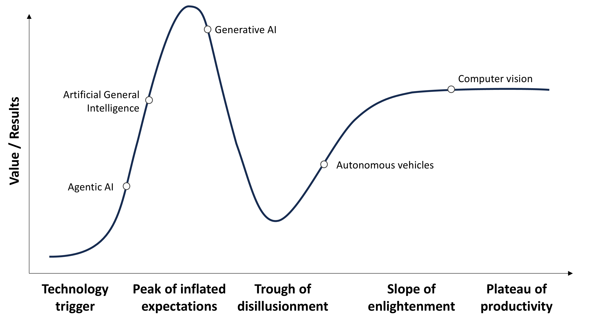
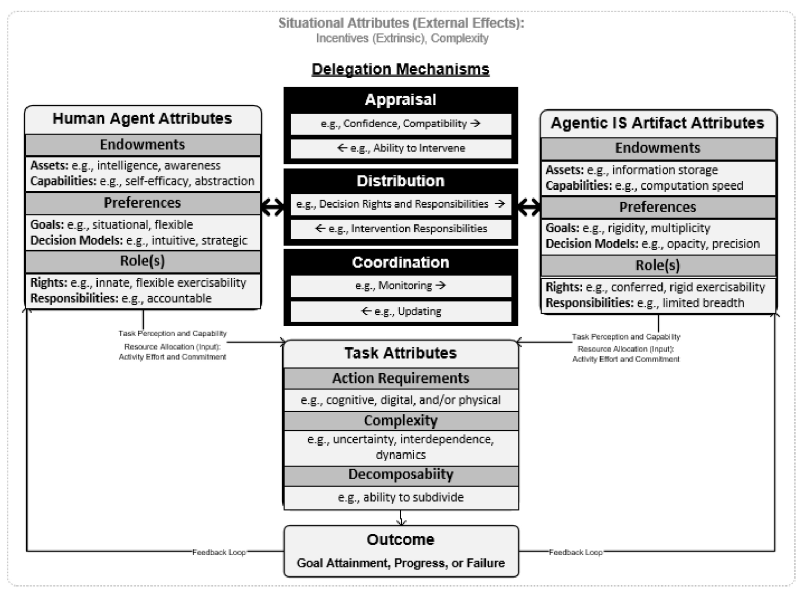
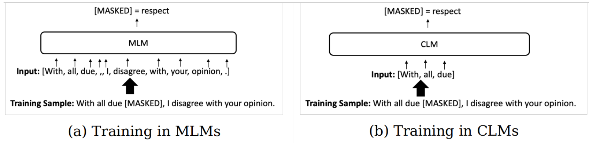

<!-- _class: lead -->

# Lecture 10 - Digital work in crowds

# Teaming with (AI) agents

---

<!-- _class: overview_part_4 -->

---
# Agenda: Agentic AI

- [Conceptual foundations](#5)
- [Use of agentic AI in organizations](#8)
- [Spotlight: Large Language Models (LLM)](#10)

<style scoped>
.callout {
  border-left: 4px solid #007acc;
  background-color: #f0f8ff;
  padding: 1em;
  margin: 1em 0;
  border-radius: 0.5em;
}
.callout strong {
  color: #007acc;
}
</style>

<div class="callout">
  <strong>Learning objectives</strong> 
  <ul>
  <li>Describe the concept of agentic AI</li>
  <li>Use LLMs effectively by selecting appropriate prompting techniques</li>
  <li>Discuss interaction modalities</li>
  </ul>
</div>

<!-- 
---

# Learning objectives

- Desribe the concept of agents
- Use LLMs effectively by selecting appropriate prompting techniques
- Discuss interaction modalities

In the exam, you will be  provided with a scenario and asked to write a prompt, identify the technique or interaction modality, and explain why this choice can be expected to be effective (ideally with reference to research studies).


Students are provided with a conceptual overview of the prompting techniques and interaction modalities (teacher-centered instruction).
Selected research papers are used to understand under which conditions they are effective (self-studying in small groups with short summaries).
Examples are used to practice the application of prompts and assess their effectiveness (hands-on practice with short cases).

Bild des Flickenteppich (wir wissen wenig, oft vermeintlich Wiederspruch)
-->

---

# Hype Cycle for Artificial Intelligence (Gartner)

<br>



<!--
TODO : start with Gartner and select genAI/agentic?
- Generative AI and agentic AI applications are increasingly adopted in the industry (Gartner).

https://www.gartner.com/en/articles/hype-cycle-for-artificial-intelligence -->

---

# Conceptual foundations: Agentic AI

Agentic information systems or AI can act autonomously, not just as passive tools. They can initiate actions and take responsibility for tasks under uncertainty.

<!-- **TODO: SHORTEN/select** -->

<table style="width:100%; table-layout: fixed;">
  <thead>
    <tr>
      <th style="width:45%; text-align:left;"><strong>Archetypes of agentic IS</strong></th>
      <th style="text-align:left;"><strong>Examples</strong></th>
    </tr>
  </thead>
  <tbody>
    <tr>
      <td><strong>Reflexive</strong>: React to stimuli using predefined rules; limited to expected scenarios.</td>
      <td>
        - Alerting agents (e.g., rebalance portfolios)<br>
        - Voice assistants responding to queries
      </td>
    </tr>
    <tr>
      <td><strong>Supervisory</strong>: Detect deviations from norms and guide decisions to restore or improve goal progression.</td>
      <td>
        - Decision support and nudging systems<br>
        - Smart cues guiding user behavior (e.g., lights)
      </td>
    </tr>
    <tr>
      <td><strong>Anticipatory</strong>: Proactively anticipate needs using model-based reasoning.</td>
      <td>
        - Social media filtering and curation<br>
        - AR tools showing names or info
      </td>
    </tr>
    <tr>
      <td><strong>Prescriptive</strong>: Make autonomous decisions or prescribe actions in complex settings.</td>
      <td>
        - Bots (chat/search/resume filters) or autonomous vehicles<br>
        - Legal and medical decision agents
      </td>
    </tr>
  </tbody>
</table>

> Based on Baird and Maruping (2021), Agentic IS.

---

# Conceptual foundations: From system use to delegation

<table style="width:100%; table-layout: fixed;">
  <thead>
    <tr>
      <th><strong>Prior Vocabulary</strong></th>
      <th><strong>IS Use</strong></th>
      <th><strong>IS Delegation</strong></th>
      <th><strong>New Vocabulary</strong></th>
    </tr>
  </thead>
  <tbody>
    <tr>
      <td><strong>Users</strong></td>
      <td>
        – <em>Responsible</em> for usage knowledge and application, often requiring focused attention.<br>
        – Emphasis on <em>self</em> (e.g., self-efficacy) in system use.
      </td>
      <td>
        – Supervisory roles are <em>no longer fixed</em>; roles shift during interactions.<br>
        – Humans may <em>not always outperform</em> AI; preferences are situational.
      </td>
      <td><strong>Human Agents</strong></td>
    </tr>
    <tr>
      <td><strong>Systems</strong></td>
      <td>
        – <em>Dependent</em> on user for initiation and instructions.<br>
        – <em>Functional</em> roles (e.g., automates, informs).
      </td>
      <td>
        – More <em>autonomous</em>:<br>
          • <em>Situated</em> (via awareness)<br>
          • <em>Flexible</em> (via computation)<br>
          • <em>Social</em> (via interfaces)
      </td>
      <td><strong>Agentic IS Artifacts</strong></td>
    </tr>
    <tr>
      <td><strong>Tasks</strong></td>
      <td>
        – Often <em>well-defined</em> or <em>bounded</em> tasks.
      </td>
      <td>
        – Agentic IS handle more <em>open-ended, ambiguous</em>, and <em>uncertain</em> tasks, combining sensing, reasoning, and acting.
      </td>
      <td><strong>Tasks</strong></td>
    </tr>
  </tbody>
</table>

---

# Conceptual foundations: A model of delegation mechanisms



<!-- 
BairdMaruping2021 (delegation)

Note: bots vs. AI (technology is often hard to distinguish by users, may be a combination of rule-base, ML, reinforcement learning, LLM)
- start with algorithmic management (role of (anthropomorphous) bots? / uncanny valley)
- different forms of bots and capabilities (chatbot, ... )?
-->

---

# Use of agentic AI in organizations

**Shadow AI** refers to the deployment of AI tools in an enterprise network without an IT department or CIO's approval, knowledge or oversight (IBM); 40% of employees acknowledge having shared sensitive data with LLM tools.

- Opportunity to explore AI tools and identify promising use cases
- Threat of leaking sensitive data, running ineffective prompts

**Worker-centric institutionalization**

- Bring-your-own-AI as an extension of bring-your-own-device ?

**Organizational institutionalization**

<!-- - Management by the IT department -->
- Custom interfaces and integrations, e.g., through Application Programming Interfaces (API) and local LLMs
- Provision of context and integration with existing tools, e.g., through Model Context Protocol (MCP)
- Responsible use and compliance

<!--
tbd: handbook/obsidian/git

Thought: LLM as a powerful capability, but its effectiveness depends on engineering the right environment


https://www.gartner.com/en/articles/hype-cycle-for-artificial-intelligence?utm_source=chatgpt.com

https://www.ibm.com/think/topics/shadow-ai


Highlight LLMs as a key capability (connecting to the next slide)

https://zapier.com/mcp

Civilization advances by extending the number of important operations which we can perform without thinking about them. – Alfred North Whitehead, 1911

https://www.agentic.ai/ 

-->

---

# Effective delegation: Initial research evidence

 **Task**: Choose one of the following studies and evaluate what it reveals about how to delegate effectively to AI. Prepare a brief summary for class discussion, using three concise bullet points.

<!-- 
 (provide summary afterwards?) - selected papers + summaries (whiteboard)

Critically evaluate the strengths and weaknesses of interaction modalities (should). Refer to research studies to justify prompt designs (can).
    • Overriding AI (Fuegener)
    • Difference in experience (DellAqua)
    • Ghost-writing vs. sounding boards (ChenChan)
-->

<br>

<style scoped>
    p {
        padding-left: 36px;
    text-indent: -36px;
}
</style>

Chen, Z., & Chan, J. (2024). Large language model in creative work: The role of collaboration modality and user expertise. *Management Science*, 70(12), 9101-9117.

Dell'Acqua, F., McFowland III, E., Mollick, E. R., Lifshitz-Assaf, H., Kellogg, K., Rajendran, S., ... & Lakhani, K. R. (2023). Navigating the jagged technological frontier: Field experimental evidence of the effects of AI on knowledge worker productivity and quality. *Harvard Business School Working Paper*, (24-013).

Fügener, A., Grahl, J., Gupta, A., & Ketter, W. (2022). Cognitive challenges in human–artificial intelligence collaboration: Investigating the path toward productive delegation. *Information Systems Research*, 33(2), 678-696.

<!-- 
    • Group work: analysis of selected research papers
    • Short presentations for the other groups
    • Summary slide

Key references:
- DellAqua
- Fuegener
- ChenChan

-->

---

<style>
blockquote {
    border-top: 0.1em;
    font-size: 60%;
    margin-top: auto;
}
</style>

# Spotlight: Large Language Models (LLMs)



Large Language Models (LLMs) are trained based on two distinct mechanisms:

- Masked Language Models (MLMs) with masked words in context
- Causal Language Models (CLMs), which focus on the prediction of the next tokens

The Generative Pretrained Transformer (GPT) models are CLMs.

Foundation models require an extensive computational training effort; they are fine-tuned by Reinforcement Learning from Human Feedback (RLHF).

Advantages:

- High performance in a range of generative tasks (no target leakage in CLMs)

Disadvantages:

- Hallucination ("statistical parrots")
- Directionality of the language model ("reversal curse")

<!--

- Non-determinism (temperature parameter)

## 🧩 Foundation Models  
- Transformer-based neural nets pretrained on massive unlabeled text/data to predict next tokens 
- GPT‑3 debuted May 2020; GPT‑4 released March 14 2023; ChatGPT launched November 30 2022
- GPT‑4o (multimodal) released May 2024; GPT‑4.5 “Orion” launched Feb 27 2025

## 🎓 Training & Tuning  
- **Pretraining**: Learn language patterns via self-supervised token prediction
- **Fine-tuning**: Supervised tuning + RLHF (Reinforcement Learning from Human Feedback) on GPT‑3.5+ to align outputs

## 🌫️ Diffusion vs. Autoregressive Models  
- Standard LLMs are autoregressive (predict next token sequentially).  
- **Diffusion language models** offer parallel generation & editability; emerging work aims to match AR performance


## 📊 Benchmarking (Hugging Face Overview)  
- Key tasks: MMLU, MT‑Bench, Chatbot Arena; Hugging Face leaderboard aggregates publicly reported scores
- Metrics include accuracy, latency, inference cost—use multiple benchmarks to avoid overfitting. 


This represents a significant departure from MLMs and has substantial consequences for the application of CLMs. In MLMs, since subsequent tokens are not random and are influenced by the target token, the use of tokens that follow the target token can lead to target variable leakage during training.


## 🎯 Summary  
| Component            | Role                             |
|---------------------|----------------------------------|
| Transformer         | Foundation of LLM architecture  |
| Self-supervised pretraining | Builds general language understanding |
| Fine-tuning + RLHF  | Aligns model with human values   |
| Benchmarking tools  | Compare model strengths and trade-offs |


TBD: Shortcomings (statistical parrot, reasoning, ...)

 Adatped version: Blended: watch youtube LLM-video in preparation and summarize at the beginning (Ergebnisse sichern) -->

> Intro to Large Language Models (Karpathy): https://www.youtube.com/watch?v=zjkBMFhNj_g

---

## Good prompting practices

1. **Be Clear and Specific**  
   Use precise, unambiguous language. Avoid vague questions.

2. **Assign Roles**  
   Set a clear persona or role to shape tone and expertise (e.g., "You are a dev-ops software engineer...").

3. **Guide Step-by-Step Reasoning**  
   Encourage stepwise thinking with phrases like "Let's think step by step."

4. **Use Examples When Needed**  
   Provide one-shot or few-shot examples to illustrate format or logic.

5. **Provide Relevant Context**  
   Include background information or documents the model needs to ground its answer (see Retrieval-Augmented Generation, RAG).

6. **Specify Output Constraints**  
   Set expectations for length, format, tone, or target audience (e.g., "Explain in <150 words for beginners").

7. **Iterate, Refine, and Validate**  
   Experiment with prompt variations and improve based on outputs. Fact-check and ask the model to self-critique if needed.

<!-- 
Distinguish prompting techniques and interaction modalities (must)
    • Clarity, context and role assignment, output constraints
    • One-shot/few-shot, retrieval-augmented generation, reasoning chains
-->

---

## Application use cases and limitations

 **Task**: 


**Exercise 1: Catching Up After Vacation**

**Scenario:**  
You've just returned from a two-week vacation. Your team used Slack and email heavily while you were gone. You want to use an LLM to get a high-level overview of what happened during your absence.

**Task:**  
Design a prompt to summarize important discussions and decisions from a set of Slack messages and emails.

---

## Exercise 2: Self-Coaching Through a Challenging Situation

**Scenario:**  
You are feeling overwhelmed with work and unsure how to prioritize. You want to use an LLM to help you reflect and coach yourself through it.

**Task:**  
Design a prompt that allows the LLM to act as a reflective coach helping you identify priorities, sources of stress, and strategies for time management.

<!-- 
---

## Exercise 3: Interpreting and Applying Handbook Practices

**Scenario:**  
You’ve read part of your organization’s handbook about documentation practices, but you’re unsure how to apply them to your current project. You want to use an LLM to explain and contextualize these rules.

**Task:**  
Design a prompt that gives the LLM the handbook section and your project description, asking for a contextual interpretation.

**Draft Prompt Solution:**

```text
I will provide a paragraph from our organization's internal handbook on documentation practices, followed by a brief description of my current project. Help me interpret the rules and give me specific suggestions for how to apply them in my context.
```

---

## Exercise 4: Preparing a Slide Deck from a Meeting Transcript

**Scenario:**  
You conducted a 1-hour strategy meeting and have a transcript or rough notes. You need to prepare a 5-slide summary presentation.

**Task:**  
Design a prompt that guides the LLM to generate a slide outline with suggested titles and bullet points.

**Draft Prompt Solution:**

```text
Here is the transcript from our 1-hour strategy meeting. Create a 5-slide presentation summarizing the key points. Each slide should have a title and 3–5 concise bullet points. Emphasize decisions, next steps, and strategic themes.
```

---

## Exercise 5: Research Task Delegation — Exploring a New Tool

**Scenario:**  
You heard about a new productivity tool (e.g., Obsidian, Notion AI) and want a concise, opinionated overview to decide whether to invest time in exploring it.

**Task:**  
Design a prompt that instructs the LLM to give you a short, actionable overview focused on features, trade-offs, and organizational use cases.

**Draft Prompt Solution:**

```text
Give me an opinionated overview of [Tool Name] for knowledge workers in organizations. Summarize its main features, strengths, limitations, and the kinds of workflows it supports. Focus on whether it’s worth adopting for managing tasks, notes, or team knowledge.
```

*Tip: When evaluating your prompts, consider if they provide the LLM with enough context, specify the desired format, and include role or tone instructions.*

TODO : share solutions via rustpad

---

Example: writing a literature review thesis (many different types, including ....., you decided to write a realist review)

Reflection: data privacy, ...?

Question: how would you use ChatGPT/LLMs? When would you not use it?
-->

---

# Summary

- **Understanding agentic AI**: Autonomous systems range from reflexive to prescriptive, reshaping how we delegate and interact with technology.
- **From tools to teammates**: Agentic information systems blur traditional user/system roles and take on more dynamic, context-aware functions.
- **Interaction modalities**: Studies show different modalities (e.g., overriding, sounding board) offer an initial suggestion on how to use LLMs effectively.
- **In LLMs, prompt quality matters**: Crafting effective prompts—via role assignment, context, and format—enhances LLM utility and output quality.

---

<style scoped>
    p {
        padding-left: 36px;
    text-indent: -36px;
}
</style>

## Materials

Baird, A., & Maruping, L. M. (2021). The next generation of research on IS use: A theoretical framework of delegation to and from agentic IS artifacts. *MIS Quarterly*, 45(1).

Chen, Z., & Chan, J. (2024). Large language model in creative work: The role of collaboration modality and user expertise. *Management Science*, 70(12), 9101-9117.

Dell'Acqua, F., McFowland III, E., Mollick, E. R., Lifshitz-Assaf, H., Kellogg, K., Rajendran, S., ... & Lakhani, K. R. (2023). Navigating the jagged technological frontier: Field experimental evidence of the effects of AI on knowledge worker productivity and quality. *Harvard Business School Working Paper*, (24-013).

Fügener, A., Grahl, J., Gupta, A., & Ketter, W. (2022). Cognitive challenges in human–artificial intelligence collaboration: Investigating the path toward productive delegation. *Information Systems Research*, 33(2), 678-696.