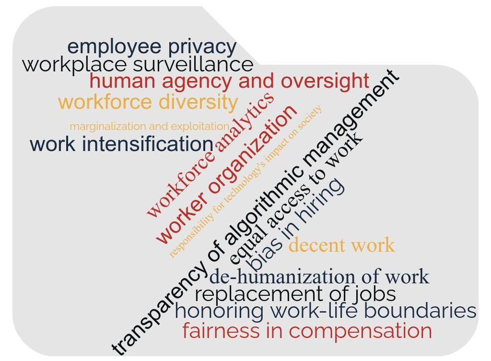
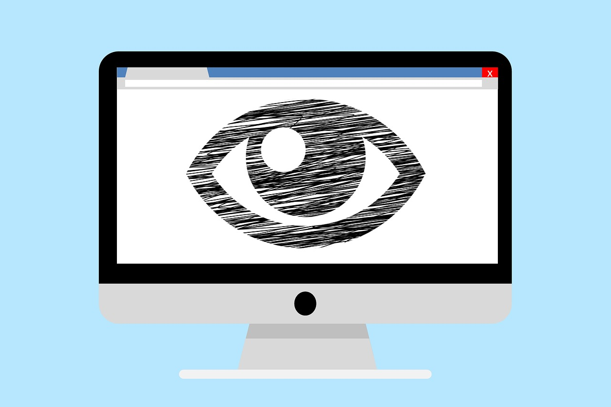

<!-- _class: lead -->

# Lecture 12 - Ethics and the future of work

---

<!-- _class: overview_part_5 -->

---

# Learning objectives

- Appreciate the ethical challenges arising in the future of digital work.
- Discuss ethical decisions in this context based on ethical theories.

---

# Ethical challenges in the future of digital work

---

# Case 1: Fair compensation

---

# Case 1: Fair Compensation – Discussion Prompts

We considered a hypothetical starting salary (e.g., 60,000 €) and a colleague, Markus, who earns significantly more (e.g., 120,000 €).

- Is this fair? Who agrees or disagrees – and why?

**Considerations:**

- **Merit:** Do outcomes reflect actual performance, or are they shaped by luck and structural advantages (*“fiction of merit”*)?  
- **Utility:** Should compensation aim to maximize overall utility—economic efficiency or collective well-being?  
- **Contract:** Is fairness primarily defined by what was agreed upon? 
- **Context:** Was the salary set under fair conditions, with input from current team members?  
- **Employer Duties:** What obligations does a fair employer have beyond honoring the contract?

---

# Ethical theories

- Utilitarian (consequentialist) ethics
- Deontological ethics
- Virtue ethics

---

# Utilitarianism

Key proponents: Jeremy Bentham, John Stuart Mill

- Ethical decisions maximize the happiness for all individuals affected.
- Only consequences are considered to judge whether a decision is right or wrong (consequentialist approach).
- Utilitarianism is a rational normative approach that resembles economic assessments of costs and benefits.
- Criticism (example): In purely utilitarian ethics, the utility (or pleasure) of many may be used to justify suffering for individuals. Immoral actions may be justified based on their consequences.

---

# Deontology

Key proponents: Immanuel Kant, John Rawls, Thomas von Aquin

- A decision is morally right if the action itself is right under a series of rules and principles.
- People have the moral obligation to follow universal rules. Consequences are not taken into account, considering that bad intentions could accidentally lead to good consequences and vice versa.
- Categorical imperative (original version): "Act only according to that maxim whereby you can at the same time will that it should become a universal law."
- Criticism: In some situations, categorical rules can lead to an excessive extent of adverse consequences.

---

# Virtue ethics

Key proponents: Socrates, Niccolò Machiavelli, David Hume

- A virtuous person should practice good habits such as honesty, temperance, and generosity.
- Virtue ethics focuses more on the good life (eudaimonia), rather than explaining which actions are morally permitted.
- Criticism: In some cases, it can be hard to judge whether an action is immoral based on virtue ethics. Virtues may change throughout history and across cultures.

---

# Case 2: Workplace surveillance

---

# Case 2: Workplace Surveillance – Discussion Prompts

We revisited a remote-working team and considered various monitoring actions by their manager — from casual checking of availability status to using machine learning to analyze behavior and automate sanctions. In addition, we considered twists, with declining team performance or individuals, who may be engaging in overemployment (holding multiple full-time jobs).

<!-- 
  - Checking availability status  
  - Noting absences  
  - Writing scripts for monitoring  
  - Taking screenshots  
  - Using ML to analyze behavior and automate sanctions

- **Twists to consider:**  
  - Team performance is declining  
  - Overemployment (individuals who accept multiple full-time jobs)
 -->

- Are these actions acceptable? Where do you draw the line—and why?

**Considerations:**

- **Utilitarianism:** Does surveillance improve performance or prevent moral hazard for the greater good?  
- **Deontology:** Do these actions violate employees' rights regardless of outcomes?  
- **Virtue ethics:** What kind of organizational character is fostered through surveillance?

<!-- - **Broader questions:** When, if ever, is surveillance justified? Should consent always be required? Are there limits surveillance should never cross? -->

**Background context:**  

- **Bentham’s Panopticon**: Visibility as a control mechanism (utilitarian roots)  
- **Orwell’s 1984**: Surveillance as societal control (dystopian warning)  
- **Privacy ethics**: “Right to be let alone” vs. collective security

---

# Case 3: Crowd-work platforms, exploitation, and the role of platform owners

---

# Case 3: Crowd-Work Platforms – Discussion Prompts

We examined ethical questions surrounding crowd-work platforms (e.g., food delivery, microwork) and the responsibilities of platform owners.

- Are these platforms fair to workers? What duties do platform owners have?

**Considerations:**

- **Utility:** Can overall utility justify negative outcomes for some workers?  
- **Deontology:** Do platforms have a duty to uphold fair contracts or act as responsible employers?  
- **Virtue ethics:** What kind of values are embedded in platform design and governance?  

<!-- 
  - Example: Honest feedback benefits clients and raises quality—even if some workers fail.
  - What if workers are treated as independent contractors?
  - Are workers treated with dignity and respect?
 -->

**Broader context:**

- **Ambiguous accountability:** Platforms often avoid direct responsibility  
- **Invisible labor:** Workers may be easily replaced, undervalued, or unseen  
- **Power asymmetry:** Platforms control data, reputation systems, and work allocation

---

# Summary

- We considered three cases: Compensation, surveillance, and crowd-work
- Ethical theories covered: Utilitarianism, duty ethics, and virtue ethics
- There are more ethical perspectives, such as discourse ethics, libertarian, or communitarian perspectives

<!-- 

---

# Materials

TODO
 -->

---

<!-- _class: overview_all -->

---
<!-- _class: centered -->

# Reminder: Please complete the evaluation!

# Next session: Questions and test exam

